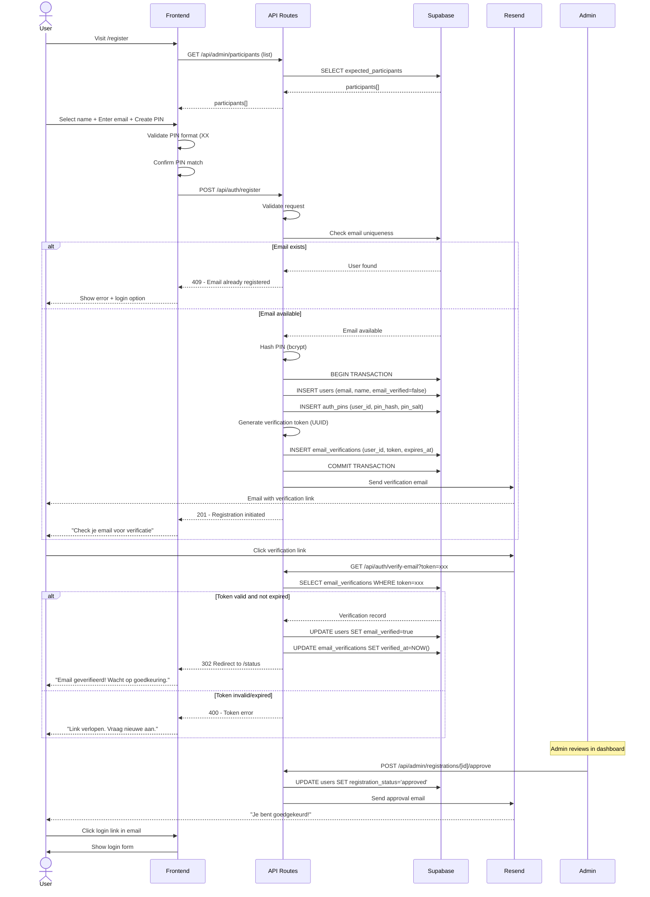
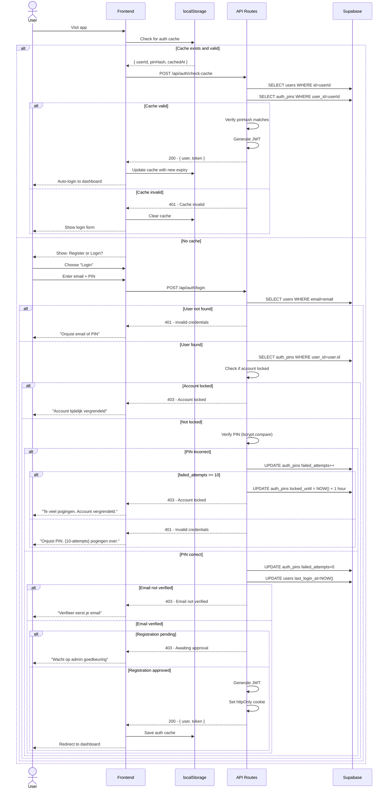
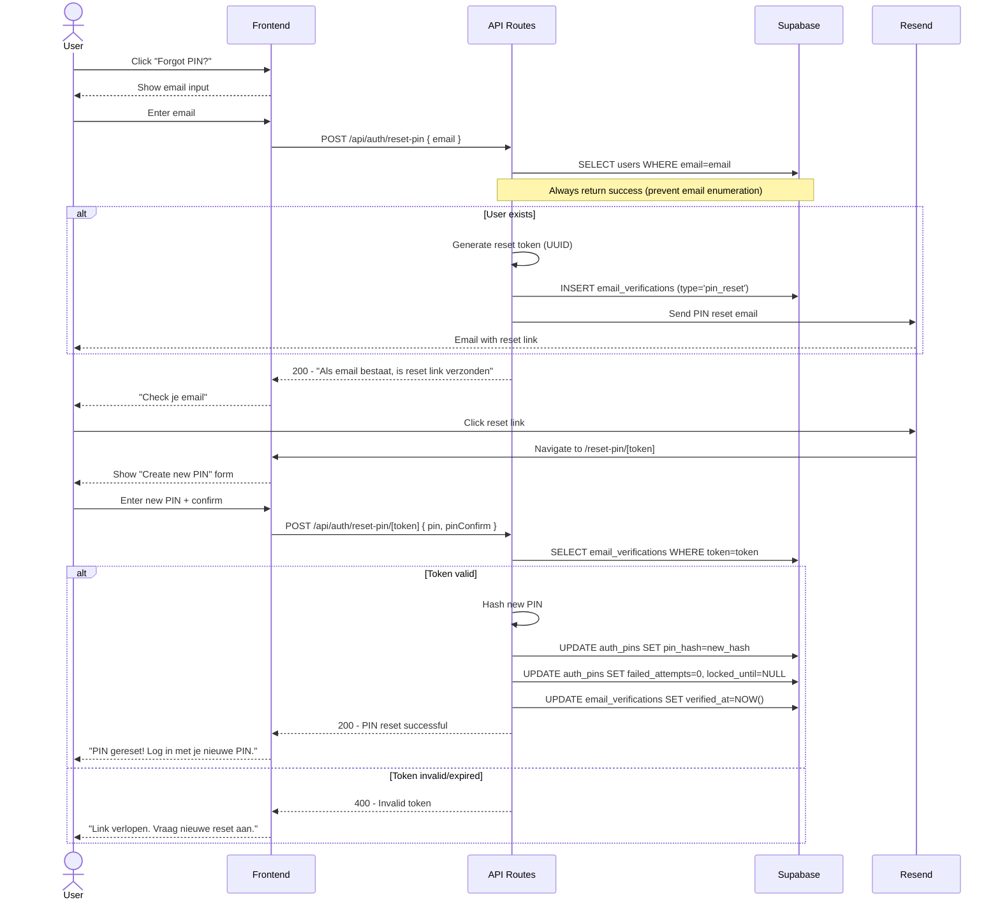

# Authenticatie Systeem - ARCHITECT Document

**Project**: Bovenkamer Winterproef
**Fase**: PACT - Architect
**Datum**: 2026-01-17
**Auteur**: PACT Architect

---

## Executive Summary

Dit document beschrijft de complete systeemarchitectuur voor het PIN-gebaseerde authenticatiesysteem van het Bovenkamer Winterproef platform. Het systeem integreert naadloos met de bestaande Next.js 14 applicatie en Supabase database, terwijl het een veilige en gebruiksvriendelijke authenticatie-ervaring biedt.

**Belangrijkste Architectuurbeslissingen**:
- Custom PIN authenticatie met bcrypt hashing (4-character format: XX##)
- Email verificatie via Resend service
- Admin approval workflow voor nieuwe registraties
- localStorage caching met 30-dagen expiratie
- httpOnly cookies voor JWT token storage (security best practice)
- Zustand state management voor auth state
- Rate limiting op IP en email niveau
- Progressive RLS policy rollout strategie

**Systeem Capaciteit**:
- Support voor ~50 deelnemers (event size)
- 67,600 unieke PIN combinaties beschikbaar
- <2 seconde response time voor auth operaties (95th percentile)
- 95%+ email deliverability target

---

## 1. System Architecture Overview

### 1.1 High-Level System Context

```
┌─────────────────────────────────────────────────────────────────┐
│                        External Systems                          │
│  ┌─────────────┐  ┌──────────────┐  ┌──────────────────────┐   │
│  │   Resend    │  │   Browser    │  │  Anthropic Claude    │   │
│  │   (Email)   │  │ (localStorage)│  │  (AI Assignment)     │   │
│  └──────┬──────┘  └──────┬───────┘  └──────────┬───────────┘   │
└─────────┼────────────────┼──────────────────────┼───────────────┘
          │                │                      │
          │                │                      │
┌─────────┴────────────────┴──────────────────────┴───────────────┐
│                   Next.js 14 Application                         │
│                                                                   │
│  ┌────────────────────────────────────────────────────────┐     │
│  │                    Frontend Layer                       │     │
│  │  ┌───────────┐  ┌───────────┐  ┌────────────────┐     │     │
│  │  │  Auth UI  │  │ Dashboard │  │ Registration   │     │     │
│  │  │Components │  │   Pages   │  │     Flow       │     │     │
│  │  └─────┬─────┘  └─────┬─────┘  └────────┬───────┘     │     │
│  └────────┼──────────────┼──────────────────┼─────────────┘     │
│           │              │                  │                    │
│  ┌────────┴──────────────┴──────────────────┴─────────────┐     │
│  │              Zustand State Management                   │     │
│  │  ┌──────────────┐  ┌────────────────────────────────┐  │     │
│  │  │  Auth Store  │  │   Registration Store           │  │     │
│  │  │  (with cache)│  │   (with persist)               │  │     │
│  │  └──────┬───────┘  └────────┬───────────────────────┘  │     │
│  └─────────┼──────────────────┼───────────────────────────┘     │
│            │                  │                                  │
│  ┌─────────┴──────────────────┴───────────────────────────┐     │
│  │                    API Routes Layer                      │     │
│  │  ┌──────────┐  ┌──────────┐  ┌──────────┐             │     │
│  │  │/api/auth/│  │/api/admin│  │/api/reg/ │             │     │
│  │  │  routes  │  │  routes  │  │  routes  │             │     │
│  │  └────┬─────┘  └────┬─────┘  └────┬─────┘             │     │
│  └───────┼─────────────┼─────────────┼────────────────────┘     │
│          │             │             │                           │
│  ┌───────┴─────────────┴─────────────┴────────────────────┐     │
│  │                  Middleware Layer                       │     │
│  │  ┌──────────────┐  ┌──────────────┐  ┌─────────────┐  │     │
│  │  │ Auth Check   │  │ Rate Limiter │  │ Feature     │  │     │
│  │  │ & JWT Verify │  │              │  │ Blocker     │  │     │
│  │  └──────────────┘  └──────────────┘  └─────────────┘  │     │
│  └──────────────────────────────────────────────────────────┘   │
└──────────────────────────────┬───────────────────────────────────┘
                               │
                               │
┌──────────────────────────────┴───────────────────────────────────┐
│                      Supabase Backend                             │
│  ┌────────────────────────────────────────────────────────┐      │
│  │                PostgreSQL Database                      │      │
│  │  ┌──────────┐  ┌───────────┐  ┌──────────────────┐    │      │
│  │  │  users   │  │auth_pins  │  │expected_         │    │      │
│  │  │          │  │           │  │participants      │    │      │
│  │  └────┬─────┘  └─────┬─────┘  └────────┬─────────┘    │      │
│  │       │              │                  │               │      │
│  │  ┌────┴────────┐  ┌──┴──────────┐  ┌───┴──────────┐   │      │
│  │  │registrations│  │email_       │  │points_ledger │   │      │
│  │  │             │  │verifications│  │              │   │      │
│  │  └─────────────┘  └─────────────┘  └──────────────┘   │      │
│  └────────────────────────────────────────────────────────┘      │
│                                                                   │
│  ┌────────────────────────────────────────────────────────┐      │
│  │              Row Level Security (RLS)                   │      │
│  │  - User isolation policies                              │      │
│  │  - Admin access policies                                │      │
│  │  - Feature-based access control                         │      │
│  └────────────────────────────────────────────────────────┘      │
└───────────────────────────────────────────────────────────────────┘
```

### 1.2 Component Architecture

**Frontend Components**:
- `AuthGate` - Entry point: Register or Login choice
- `ExpectedParticipantsSelector` - Dropdown met verwachte deelnemers
- `PINCreator` - PIN creation & confirmation UI (XX## format)
- `PINInput` - Reusable PIN input component met validatie
- `EmailVerificationPending` - Status display voor pending verification
- `RegistrationStatusBadge` - Visual status indicator (pending/approved/rejected)
- `FeatureBlockedWarning` - Warning voor geblokkeerde features

**Backend Components**:
- `AuthService` - Core authentication logic (PIN validation, hashing, JWT generation)
- `EmailService` - Email verification & notification handling
- `AdminService` - Registration approval & participant management
- `RateLimitService` - Request rate limiting (IP & email based)
- `CacheService` - localStorage management & validation

**Database Components**:
- `auth_pins` - PIN storage (hashed)
- `email_verifications` - Email verification tokens
- `expected_participants` - Pre-approved participants list
- `users` (extended) - Auth status & role fields
- `registrations` (extended) - Registration status tracking

---

## 2. Database Architecture

### 2.1 Complete Schema Definition

```sql
-- Enable extensions
CREATE EXTENSION IF NOT EXISTS "uuid-ossp";
CREATE EXTENSION IF NOT EXISTS "pgcrypto"; -- For additional crypto functions if needed

-- =============================================================================
-- AUTHENTICATION TABLES
-- =============================================================================

-- Auth PINs table - stores hashed PINs
CREATE TABLE auth_pins (
  id UUID PRIMARY KEY DEFAULT uuid_generate_v4(),
  user_id UUID REFERENCES users(id) ON DELETE CASCADE UNIQUE,
  pin_hash TEXT NOT NULL,
  pin_salt TEXT NOT NULL,
  failed_attempts INTEGER DEFAULT 0,
  locked_until TIMESTAMPTZ,
  last_attempt_at TIMESTAMPTZ,
  created_at TIMESTAMPTZ DEFAULT NOW(),
  updated_at TIMESTAMPTZ DEFAULT NOW()
);

-- Email verifications table
CREATE TABLE email_verifications (
  id UUID PRIMARY KEY DEFAULT uuid_generate_v4(),
  user_id UUID REFERENCES users(id) ON DELETE CASCADE,
  token TEXT NOT NULL UNIQUE,
  expires_at TIMESTAMPTZ NOT NULL,
  verified_at TIMESTAMPTZ,
  created_at TIMESTAMPTZ DEFAULT NOW(),

  -- Constraints
  CONSTRAINT token_not_empty CHECK (LENGTH(token) > 0),
  CONSTRAINT valid_expiry CHECK (expires_at > created_at)
);

-- Expected participants table
CREATE TABLE expected_participants (
  id UUID PRIMARY KEY DEFAULT uuid_generate_v4(),
  name TEXT NOT NULL UNIQUE,
  email_hint TEXT, -- Optional hint: "j.***@gmail.com"
  is_registered BOOLEAN DEFAULT FALSE,
  registered_by_user_id UUID REFERENCES users(id),
  created_at TIMESTAMPTZ DEFAULT NOW(),
  created_by_admin_id UUID REFERENCES users(id),
  notes TEXT,

  -- Constraints
  CONSTRAINT name_not_empty CHECK (LENGTH(TRIM(name)) > 0)
);

-- Rate limiting table
CREATE TABLE rate_limits (
  id UUID PRIMARY KEY DEFAULT uuid_generate_v4(),
  identifier TEXT NOT NULL, -- IP address or email
  identifier_type TEXT NOT NULL, -- 'ip' or 'email'
  endpoint TEXT NOT NULL, -- e.g., '/api/auth/login'
  attempt_count INTEGER DEFAULT 1,
  window_start TIMESTAMPTZ DEFAULT NOW(),
  created_at TIMESTAMPTZ DEFAULT NOW(),

  -- Composite unique constraint
  CONSTRAINT unique_rate_limit UNIQUE (identifier, identifier_type, endpoint)
);

-- =============================================================================
-- EXTENDED EXISTING TABLES
-- =============================================================================

-- Extend users table
ALTER TABLE users ADD COLUMN IF NOT EXISTS email_verified BOOLEAN DEFAULT FALSE;
ALTER TABLE users ADD COLUMN IF NOT EXISTS registration_status TEXT DEFAULT 'pending'
  CHECK (registration_status IN ('pending', 'approved', 'rejected', 'cancelled'));
ALTER TABLE users ADD COLUMN IF NOT EXISTS rejection_reason TEXT;
ALTER TABLE users ADD COLUMN IF NOT EXISTS approved_at TIMESTAMPTZ;
ALTER TABLE users ADD COLUMN IF NOT EXISTS approved_by UUID REFERENCES users(id);
ALTER TABLE users ADD COLUMN IF NOT EXISTS blocked_features TEXT[] DEFAULT '{}';
ALTER TABLE users ADD COLUMN IF NOT EXISTS last_login_at TIMESTAMPTZ;

-- Extend registrations table
ALTER TABLE registrations ADD COLUMN IF NOT EXISTS status TEXT DEFAULT 'pending'
  CHECK (status IN ('pending', 'approved', 'rejected', 'cancelled'));
ALTER TABLE registrations ADD COLUMN IF NOT EXISTS cancelled_at TIMESTAMPTZ;
ALTER TABLE registrations ADD COLUMN IF NOT EXISTS cancellation_reason TEXT;

-- =============================================================================
-- INDEXES FOR PERFORMANCE
-- =============================================================================

-- Users indexes
CREATE INDEX IF NOT EXISTS idx_users_email ON users(email);
CREATE INDEX IF NOT EXISTS idx_users_role ON users(role);
CREATE INDEX IF NOT EXISTS idx_users_registration_status ON users(registration_status);
CREATE INDEX IF NOT EXISTS idx_users_email_verified ON users(email_verified);
CREATE INDEX IF NOT EXISTS idx_users_last_login ON users(last_login_at DESC);

-- Composite index for common auth query
CREATE INDEX IF NOT EXISTS idx_users_auth_status
  ON users(email, email_verified, registration_status)
  WHERE registration_status != 'cancelled';

-- Auth PINs indexes
CREATE INDEX IF NOT EXISTS idx_auth_pins_user_id ON auth_pins(user_id);
CREATE INDEX IF NOT EXISTS idx_auth_pins_locked ON auth_pins(locked_until)
  WHERE locked_until IS NOT NULL;

-- Expected participants indexes
CREATE INDEX IF NOT EXISTS idx_expected_participants_name ON expected_participants(name);
CREATE INDEX IF NOT EXISTS idx_expected_participants_registered
  ON expected_participants(is_registered);

-- Email verifications indexes
CREATE INDEX IF NOT EXISTS idx_email_verifications_token ON email_verifications(token);
CREATE INDEX IF NOT EXISTS idx_email_verifications_user_id ON email_verifications(user_id);
CREATE INDEX IF NOT EXISTS idx_email_verifications_expires_at
  ON email_verifications(expires_at)
  WHERE verified_at IS NULL;

-- Composite index for verification lookup
CREATE INDEX IF NOT EXISTS idx_email_verifications_active
  ON email_verifications(user_id, verified_at)
  WHERE verified_at IS NULL AND expires_at > NOW();

-- Registrations indexes
CREATE INDEX IF NOT EXISTS idx_registrations_user_id ON registrations(user_id);
CREATE INDEX IF NOT EXISTS idx_registrations_status ON registrations(status);
CREATE INDEX IF NOT EXISTS idx_registrations_created_at ON registrations(created_at DESC);

-- Rate limits indexes
CREATE INDEX IF NOT EXISTS idx_rate_limits_identifier
  ON rate_limits(identifier, identifier_type, endpoint);
CREATE INDEX IF NOT EXISTS idx_rate_limits_window
  ON rate_limits(window_start DESC);

-- =============================================================================
-- TRIGGERS
-- =============================================================================

-- Auto-update updated_at on auth_pins
CREATE OR REPLACE FUNCTION update_updated_at_column()
RETURNS TRIGGER AS $$
BEGIN
  NEW.updated_at = NOW();
  RETURN NEW;
END;
$$ LANGUAGE plpgsql;

CREATE TRIGGER update_auth_pins_updated_at
  BEFORE UPDATE ON auth_pins
  FOR EACH ROW EXECUTE FUNCTION update_updated_at_column();

-- Auto-mark expected participant as registered
CREATE OR REPLACE FUNCTION mark_participant_registered()
RETURNS TRIGGER AS $$
BEGIN
  IF NEW.registration_status = 'approved' THEN
    UPDATE expected_participants
    SET is_registered = TRUE,
        registered_by_user_id = NEW.id
    WHERE LOWER(name) = LOWER(NEW.name);
  END IF;
  RETURN NEW;
END;
$$ LANGUAGE plpgsql;

CREATE TRIGGER auto_mark_participant_registered
  AFTER UPDATE OF registration_status ON users
  FOR EACH ROW
  WHEN (NEW.registration_status = 'approved' AND OLD.registration_status != 'approved')
  EXECUTE FUNCTION mark_participant_registered();

-- Cleanup expired verification tokens (run periodically)
CREATE OR REPLACE FUNCTION cleanup_expired_verifications()
RETURNS void AS $$
BEGIN
  DELETE FROM email_verifications
  WHERE verified_at IS NULL
    AND expires_at < NOW() - INTERVAL '7 days';
END;
$$ LANGUAGE plpgsql;

-- Cleanup old rate limit entries (run periodically)
CREATE OR REPLACE FUNCTION cleanup_old_rate_limits()
RETURNS void AS $$
BEGIN
  DELETE FROM rate_limits
  WHERE window_start < NOW() - INTERVAL '24 hours';
END;
$$ LANGUAGE plpgsql;
```

### 2.2 Entity Relationship Diagram

```
┌─────────────────────────┐
│    expected_participants│
│─────────────────────────│
│ id (PK)                 │
│ name (UNIQUE)           │
│ email_hint              │
│ is_registered           │
│ registered_by_user_id ──┼──┐
│ created_by_admin_id ────┼─┐│
└─────────────────────────┘ ││
                            ││
                            ││
┌─────────────────────────┐ ││
│        users            │ ││
│─────────────────────────│ ││
│ id (PK)                 │◄┘│
│ email (UNIQUE)          │  │
│ name                    │  │
│ role                    │  │
│ email_verified          │  │
│ registration_status     │  │
│ rejection_reason        │  │
│ approved_at             │  │
│ approved_by (FK) ───────┼──┘
│ blocked_features[]      │
│ last_login_at           │
│ created_at              │
└────┬────────────────┬───┘
     │                │
     │                │
┌────┴─────────────┐  │  ┌──────────────────────┐
│   auth_pins      │  │  │  email_verifications │
│──────────────────│  │  │──────────────────────│
│ id (PK)          │  │  │ id (PK)              │
│ user_id (FK,UQ)──┼──┘  │ user_id (FK) ────────┼──┐
│ pin_hash         │     │ token (UNIQUE)       │  │
│ pin_salt         │     │ expires_at           │  │
│ failed_attempts  │     │ verified_at          │  │
│ locked_until     │     │ created_at           │  │
│ last_attempt_at  │     └──────────────────────┘  │
│ created_at       │                               │
│ updated_at       │                               │
└──────────────────┘                               │
                                                   │
     ┌─────────────────────────────────────────────┘
     │
┌────┴─────────────────┐
│   registrations      │
│──────────────────────│
│ id (PK)              │
│ user_id (FK)         │
│ ... (existing cols)  │
│ status               │
│ cancelled_at         │
│ cancellation_reason  │
│ created_at           │
│ updated_at           │
└──────────────────────┘

┌──────────────────────┐
│    rate_limits       │
│──────────────────────│
│ id (PK)              │
│ identifier           │
│ identifier_type      │
│ endpoint             │
│ attempt_count        │
│ window_start         │
│ created_at           │
└──────────────────────┘
```

### 2.3 Row Level Security (RLS) Policies

**Strategy**: Progressive rollout - start permissive, tighten over time

**Phase 1: Development (Current)**
```sql
-- Enable RLS on all tables
ALTER TABLE users ENABLE ROW LEVEL SECURITY;
ALTER TABLE auth_pins ENABLE ROW LEVEL SECURITY;
ALTER TABLE expected_participants ENABLE ROW LEVEL SECURITY;
ALTER TABLE email_verifications ENABLE ROW LEVEL SECURITY;
ALTER TABLE registrations ENABLE ROW LEVEL SECURITY;
ALTER TABLE rate_limits ENABLE ROW LEVEL SECURITY;

-- Allow all (development mode)
CREATE POLICY "dev_allow_all_users" ON users FOR ALL USING (true);
CREATE POLICY "dev_allow_all_auth_pins" ON auth_pins FOR ALL USING (true);
CREATE POLICY "dev_allow_all_expected" ON expected_participants FOR ALL USING (true);
CREATE POLICY "dev_allow_all_verifications" ON email_verifications FOR ALL USING (true);
CREATE POLICY "dev_allow_all_registrations" ON registrations FOR ALL USING (true);
CREATE POLICY "dev_allow_all_rate_limits" ON rate_limits FOR ALL USING (true);
```

**Phase 2: Production (Future)**
```sql
-- Drop development policies
DROP POLICY IF EXISTS "dev_allow_all_users" ON users;
DROP POLICY IF EXISTS "dev_allow_all_auth_pins" ON auth_pins;
-- ... (drop all dev policies)

-- Users table policies
CREATE POLICY "users_select_own" ON users
  FOR SELECT USING (
    id = auth.uid() OR
    (SELECT role FROM users WHERE id = auth.uid()) = 'admin'
  );

CREATE POLICY "users_update_own" ON users
  FOR UPDATE USING (id = auth.uid())
  WITH CHECK (id = auth.uid());

CREATE POLICY "admins_manage_users" ON users
  FOR ALL USING ((SELECT role FROM users WHERE id = auth.uid()) = 'admin');

-- Auth PINs policies (users can only manage own PIN)
CREATE POLICY "auth_pins_own_only" ON auth_pins
  FOR ALL USING (user_id = auth.uid());

-- Expected participants (read-only for participants, full for admins)
CREATE POLICY "expected_participants_read" ON expected_participants
  FOR SELECT USING (true);

CREATE POLICY "expected_participants_admin_manage" ON expected_participants
  FOR ALL USING ((SELECT role FROM users WHERE id = auth.uid()) = 'admin');

-- Email verifications (users can read own, system can write)
CREATE POLICY "email_verifications_read_own" ON email_verifications
  FOR SELECT USING (user_id = auth.uid());

CREATE POLICY "email_verifications_system_write" ON email_verifications
  FOR INSERT WITH CHECK (true); -- API routes handle validation

CREATE POLICY "email_verifications_update_own" ON email_verifications
  FOR UPDATE USING (user_id = auth.uid());

-- Registrations (users can manage own, admins can view all)
CREATE POLICY "registrations_read_own" ON registrations
  FOR SELECT USING (
    user_id = auth.uid() OR
    (SELECT role FROM users WHERE id = auth.uid()) = 'admin'
  );

CREATE POLICY "registrations_manage_own" ON registrations
  FOR ALL USING (user_id = auth.uid());

-- Rate limits (system managed only)
CREATE POLICY "rate_limits_system_only" ON rate_limits
  FOR ALL USING ((SELECT role FROM users WHERE id = auth.uid()) = 'admin');
```

**Migration Plan**:
1. Week 1-2: Use Phase 1 (permissive) for development
2. Week 3: Test Phase 2 in staging environment
3. Week 4: Deploy Phase 2 to production
4. Monitor logs for policy violations
5. Adjust policies as needed

---

## 3. API Architecture

### 3.1 API Routes Structure

```
/api/
├── auth/
│   ├── check-cache/          POST - Verify cached user data
│   ├── register/             POST - Start registration flow
│   ├── login/                POST - Login with email + PIN
│   ├── verify-email/         GET  - Verify email token
│   ├── resend-verification/  POST - Resend verification email
│   ├── logout/               POST - Logout and clear session
│   ├── cancel-attendance/    POST - Mark as can't attend
│   ├── reset-pin/            POST - Request PIN reset
│   ├── reset-pin/[token]/    POST - Complete PIN reset
│   └── change-pin/           POST - Change existing PIN
│
├── admin/
│   ├── participants/         GET, POST - Manage expected participants
│   ├── participants/[id]/    DELETE, PATCH - Edit/remove participant
│   ├── registrations/        GET - List pending registrations
│   ├── registrations/[id]/
│   │   ├── approve/          POST - Approve registration
│   │   ├── reject/           POST - Reject registration
│   │   └── details/          GET - Get full registration details
│   ├── users/[id]/
│   │   ├── block-feature/    POST - Block user from feature
│   │   └── unblock-feature/  POST - Unblock user from feature
│   └── stats/                GET - Admin dashboard stats
│
└── registration/             (existing, extends with auth check)
    └── route.ts              POST, GET - Create/update registration
```

### 3.2 API Endpoint Specifications

#### 3.2.1 Auth Endpoints

**POST /api/auth/check-cache**
```typescript
// Request
{
  userId: string;
  pinHash: string;
  cachedAt: number;
}

// Response (200 OK)
{
  valid: true;
  user: {
    id: string;
    email: string;
    name: string;
    role: 'participant' | 'admin' | 'quizmaster';
    registrationStatus: 'pending' | 'approved' | 'rejected' | 'cancelled';
    emailVerified: boolean;
    blockedFeatures: string[];
  };
  token: string; // JWT for subsequent requests
}

// Response (401 Unauthorized)
{
  valid: false;
  error: 'CACHE_INVALID' | 'CACHE_EXPIRED' | 'USER_NOT_FOUND';
  message: string;
}

// Response (403 Forbidden)
{
  valid: false;
  error: 'ACCOUNT_LOCKED' | 'REGISTRATION_REJECTED';
  message: string;
  details?: {
    rejectionReason?: string;
    lockedUntil?: string;
  };
}
```

**POST /api/auth/register**
```typescript
// Request
{
  name: string;               // From expected_participants or free text
  email: string;
  pin: string;                // Format: XX##
  pinConfirm: string;
  expectedParticipantId?: string; // If selected from list
}

// Response (201 Created)
{
  success: true;
  userId: string;
  message: 'Verificatie email verzonden naar {email}';
  nextStep: 'email-verification';
}

// Response (400 Bad Request)
{
  success: false;
  error: 'VALIDATION_ERROR';
  fields: {
    pin?: string;          // "PIN moet format XX## hebben"
    pinConfirm?: string;   // "PINs komen niet overeen"
    email?: string;        // "Email is al geregistreerd"
  };
}

// Response (409 Conflict)
{
  success: false;
  error: 'PIN_TAKEN';
  message: 'Deze PIN is al in gebruik. Probeer een andere.';
  suggestion?: string; // Alternative PIN suggestion
}

// Response (429 Too Many Requests)
{
  success: false;
  error: 'RATE_LIMIT_EXCEEDED';
  message: 'Te veel registratiepogingen. Probeer over {minutes} minuten opnieuw.';
  retryAfter: number; // Seconds
}
```

**POST /api/auth/login**
```typescript
// Request
{
  email: string;
  pin: string;
}

// Response (200 OK)
{
  success: true;
  user: {
    id: string;
    email: string;
    name: string;
    role: 'participant' | 'admin' | 'quizmaster';
    registrationStatus: 'pending' | 'approved' | 'rejected' | 'cancelled';
    emailVerified: boolean;
    blockedFeatures: string[];
  };
  token: string; // JWT
  message: 'Welkom terug, {name}!';
}

// Response (401 Unauthorized)
{
  success: false;
  error: 'INVALID_CREDENTIALS';
  message: 'Onjuist email of PIN';
  attemptsRemaining?: number;
}

// Response (403 Forbidden)
{
  success: false;
  error: 'ACCOUNT_LOCKED' | 'EMAIL_NOT_VERIFIED' | 'REGISTRATION_PENDING' | 'REGISTRATION_REJECTED';
  message: string;
  details?: {
    lockedUntil?: string;
    rejectionReason?: string;
    verificationEmailSent?: boolean;
  };
}
```

**GET /api/auth/verify-email?token={token}**
```typescript
// Response (302 Redirect to /status?verified=true)

// Response (400 Bad Request - HTML page)
{
  error: 'TOKEN_INVALID' | 'TOKEN_EXPIRED' | 'ALREADY_VERIFIED';
  message: string;
}
```

**POST /api/auth/logout**
```typescript
// Request (requires Authorization header with JWT)
{}

// Response (200 OK)
{
  success: true;
  message: 'Uitgelogd';
}

// Sets httpOnly cookie to expire
```

**POST /api/auth/cancel-attendance**
```typescript
// Request (requires Authorization header)
{
  reason?: string; // Optional cancellation reason
  confirm: boolean; // Must be true
}

// Response (200 OK)
{
  success: true;
  message: 'Bedankt voor het laten weten. Hopelijk een volgende keer!';
}

// Response (400 Bad Request)
{
  success: false;
  error: 'CONFIRMATION_REQUIRED';
  message: 'Bevestig dat je niet kunt komen';
}
```

#### 3.2.2 Admin Endpoints

**GET /api/admin/participants**
```typescript
// Request (requires admin role)
// Query params: ?page=1&limit=50&filter=unregistered

// Response (200 OK)
{
  participants: Array<{
    id: string;
    name: string;
    emailHint: string | null;
    isRegistered: boolean;
    registeredByUserId: string | null;
    registeredByName: string | null;
    createdAt: string;
    notes: string | null;
  }>;
  pagination: {
    page: number;
    limit: number;
    total: number;
    totalPages: number;
  };
}
```

**POST /api/admin/participants**
```typescript
// Request (requires admin role)
{
  name: string;
  emailHint?: string;
  notes?: string;
}

// Response (201 Created)
{
  success: true;
  participant: {
    id: string;
    name: string;
    emailHint: string | null;
    isRegistered: false;
    createdAt: string;
  };
}

// Response (409 Conflict)
{
  success: false;
  error: 'DUPLICATE_NAME';
  message: 'Deze naam bestaat al in de lijst';
}
```

**GET /api/admin/registrations**
```typescript
// Request (requires admin role)
// Query params: ?status=pending&page=1&limit=20

// Response (200 OK)
{
  registrations: Array<{
    id: string;
    userId: string;
    name: string;
    email: string;
    registrationStatus: 'pending' | 'approved' | 'rejected';
    emailVerified: boolean;
    createdAt: string;
    wasExpectedParticipant: boolean;
    // Summary of registration data
    primarySkill: string;
    hasPartner: boolean;
  }>;
  pagination: {
    page: number;
    limit: number;
    total: number;
    totalPages: number;
  };
  stats: {
    pending: number;
    approved: number;
    rejected: number;
  };
}
```

**POST /api/admin/registrations/[id]/approve**
```typescript
// Request (requires admin role)
{
  sendEmail?: boolean; // Default: true
}

// Response (200 OK)
{
  success: true;
  message: 'Registratie goedgekeurd';
  emailSent: boolean;
  user: {
    id: string;
    name: string;
    email: string;
    registrationStatus: 'approved';
    approvedAt: string;
    approvedBy: string; // Admin user ID
  };
}
```

**POST /api/admin/registrations/[id]/reject**
```typescript
// Request (requires admin role)
{
  reason: string; // Required
  sendEmail?: boolean; // Default: true
}

// Response (200 OK)
{
  success: true;
  message: 'Registratie afgewezen';
  emailSent: boolean;
}

// Response (400 Bad Request)
{
  success: false;
  error: 'REASON_REQUIRED';
  message: 'Reden voor afwijzing is verplicht';
}
```

### 3.3 Authentication Flow Diagrams

#### 3.3.1 Registration Flow



#### 3.3.2 Login Flow



#### 3.3.3 PIN Reset Flow



---

## 4. State Management Architecture

### 4.1 Zustand Store Structure

```typescript
// src/lib/store.ts - Extended with auth state

import { create } from 'zustand';
import { persist } from 'zustand/middleware';

// =============================================================================
// AUTH STORE
// =============================================================================

interface AuthUser {
  id: string;
  email: string;
  name: string;
  role: 'participant' | 'admin' | 'quizmaster';
  registrationStatus: 'pending' | 'approved' | 'rejected' | 'cancelled';
  emailVerified: boolean;
  blockedFeatures: string[];
  lastLoginAt: string;
}

interface AuthCache {
  userId: string;
  pinHash: string;
  cachedAt: number;
  expiresAt: number; // cachedAt + 30 days
}

interface AuthState {
  // Current user
  user: AuthUser | null;
  token: string | null;
  isAuthenticated: boolean;
  isLoading: boolean;
  error: string | null;

  // Cache management
  cache: AuthCache | null;

  // Actions
  setAuth: (user: AuthUser, token: string) => void;
  clearAuth: () => void;
  checkCache: () => Promise<boolean>;
  login: (email: string, pin: string) => Promise<void>;
  logout: () => Promise<void>;
  refreshUser: () => Promise<void>;
  setError: (error: string | null) => void;
  setLoading: (loading: boolean) => void;
}

export const useAuthStore = create<AuthState>()(
  persist(
    (set, get) => ({
      user: null,
      token: null,
      isAuthenticated: false,
      isLoading: false,
      error: null,
      cache: null,

      setAuth: (user, token) => {
        const pinHash = ''; // Get from secure storage if needed
        const now = Date.now();
        const cache: AuthCache = {
          userId: user.id,
          pinHash, // Simplified - actual implementation may vary
          cachedAt: now,
          expiresAt: now + (30 * 24 * 60 * 60 * 1000), // 30 days
        };

        set({
          user,
          token,
          isAuthenticated: true,
          cache,
          error: null,
        });
      },

      clearAuth: () => {
        set({
          user: null,
          token: null,
          isAuthenticated: false,
          cache: null,
          error: null,
        });
      },

      checkCache: async () => {
        const { cache } = get();
        if (!cache) return false;

        const now = Date.now();
        if (now > cache.expiresAt) {
          get().clearAuth();
          return false;
        }

        set({ isLoading: true });
        try {
          const response = await fetch('/api/auth/check-cache', {
            method: 'POST',
            headers: { 'Content-Type': 'application/json' },
            body: JSON.stringify(cache),
          });

          if (response.ok) {
            const data = await response.json();
            get().setAuth(data.user, data.token);
            return true;
          } else {
            get().clearAuth();
            return false;
          }
        } catch (error) {
          console.error('Cache check failed:', error);
          get().clearAuth();
          return false;
        } finally {
          set({ isLoading: false });
        }
      },

      login: async (email, pin) => {
        set({ isLoading: true, error: null });
        try {
          const response = await fetch('/api/auth/login', {
            method: 'POST',
            headers: { 'Content-Type': 'application/json' },
            body: JSON.stringify({ email, pin }),
          });

          const data = await response.json();

          if (response.ok) {
            get().setAuth(data.user, data.token);
          } else {
            set({ error: data.message });
            throw new Error(data.message);
          }
        } catch (error) {
          set({ error: error instanceof Error ? error.message : 'Login failed' });
          throw error;
        } finally {
          set({ isLoading: false });
        }
      },

      logout: async () => {
        try {
          await fetch('/api/auth/logout', {
            method: 'POST',
            headers: {
              'Authorization': `Bearer ${get().token}`,
            },
          });
        } catch (error) {
          console.error('Logout API call failed:', error);
        } finally {
          get().clearAuth();
        }
      },

      refreshUser: async () => {
        const { token } = get();
        if (!token) return;

        try {
          const response = await fetch('/api/auth/me', {
            headers: { 'Authorization': `Bearer ${token}` },
          });

          if (response.ok) {
            const user = await response.json();
            set({ user });
          } else {
            get().clearAuth();
          }
        } catch (error) {
          console.error('User refresh failed:', error);
        }
      },

      setError: (error) => set({ error }),
      setLoading: (isLoading) => set({ isLoading }),
    }),
    {
      name: 'bovenkamer-auth',
      partialize: (state) => ({
        user: state.user,
        cache: state.cache,
        // Don't persist token - will be regenerated from cache
      }),
    }
  )
);

// =============================================================================
// EXISTING REGISTRATION STORE (Extended)
// =============================================================================

interface RegistrationState {
  // ... existing fields remain unchanged

  // Add auth integration
  requiresAuth: boolean;

  // Existing actions remain
  // Add new action:
  setRequiresAuth: (requiresAuth: boolean) => void;
}

// Modify existing store to integrate with auth
export const useRegistrationStore = create<RegistrationState>()(
  persist(
    (set) => ({
      // ... existing implementation
      requiresAuth: true,

      setRequiresAuth: (requiresAuth) => set({ requiresAuth }),
    }),
    {
      name: 'bovenkamer-registration',
      // ... existing config
    }
  )
);
```

### 4.2 State Flow Diagram

```
┌─────────────────────────────────────────────────────────────┐
│                      App Initialization                      │
└────────────────────────┬────────────────────────────────────┘
                         │
                         ▼
                ┌────────────────┐
                │ Check Auth     │
                │ Store Cache    │
                └────────┬───────┘
                         │
            ┌────────────┴────────────┐
            │                         │
            ▼                         ▼
    ┌───────────────┐         ┌──────────────┐
    │ Cache Valid   │         │ No Cache /   │
    │               │         │ Expired      │
    └───────┬───────┘         └──────┬───────┘
            │                        │
            ▼                        ▼
    ┌───────────────┐         ┌──────────────┐
    │ checkCache()  │         │ Show Auth    │
    │ API Call      │         │ Gate         │
    └───────┬───────┘         └──────┬───────┘
            │                        │
    ┌───────┴────────┐               │
    │                │               │
    ▼                ▼               ▼
┌────────┐    ┌──────────┐   ┌────────────┐
│ Valid  │    │ Invalid  │   │ User       │
│        │    │          │   │ Action     │
└───┬────┘    └────┬─────┘   └─────┬──────┘
    │              │               │
    │              │         ┌─────┴─────┐
    │              │         │           │
    │              │         ▼           ▼
    │              │    ┌──────┐   ┌───────┐
    │              │    │Login │   │Register│
    │              │    └──┬───┘   └───┬───┘
    │              │       │           │
    │              ▼       ▼           ▼
    │         ┌────────────────────────┐
    │         │  Clear Auth State      │
    │         │  Show Login Form       │
    │         └────────────┬───────────┘
    │                      │
    │                      ▼
    │         ┌────────────────────────┐
    │         │  Auth API Call         │
    │         │  (login/register)      │
    │         └────────────┬───────────┘
    │                      │
    │              ┌───────┴────────┐
    │              │                │
    │              ▼                ▼
    │         ┌─────────┐      ┌────────┐
    │         │ Success │      │ Error  │
    │         └────┬────┘      └───┬────┘
    │              │               │
    │              │               ▼
    │              │        ┌──────────┐
    │              │        │Set Error │
    │              │        │State     │
    │              │        └──────────┘
    ▼              ▼
┌──────────────────────────┐
│  setAuth(user, token)    │
│  - Update user state     │
│  - Save to cache         │
│  - Set isAuthenticated   │
└──────────┬───────────────┘
           │
           ▼
┌──────────────────────────┐
│  Navigate to Protected   │
│  Route (Dashboard)       │
└──────────────────────────┘
```

---

## 5. Security Architecture

### 5.1 Security Layers

```
┌─────────────────────────────────────────────────────────────┐
│                    Layer 7: Monitoring                       │
│  - Audit logging of all auth events                         │
│  - Anomaly detection (unusual login patterns)               │
│  - Failed attempt tracking                                   │
└────────────────────────────┬────────────────────────────────┘
                             │
┌────────────────────────────┴────────────────────────────────┐
│                  Layer 6: Rate Limiting                      │
│  - IP-based: Max 10 requests/minute per endpoint            │
│  - Email-based: Max 5 login attempts per 15 minutes         │
│  - Account lockout after 10 failed attempts                  │
└────────────────────────────┬────────────────────────────────┘
                             │
┌────────────────────────────┴────────────────────────────────┐
│                Layer 5: Authorization (RBAC)                 │
│  - Role-based access control (participant/admin/quizmaster) │
│  - Feature-level blocking capability                         │
│  - Registration status gating                                │
└────────────────────────────┬────────────────────────────────┘
                             │
┌────────────────────────────┴────────────────────────────────┐
│              Layer 4: Authentication (JWT)                   │
│  - JWT tokens in httpOnly cookies                           │
│  - Token expiration (24 hours)                               │
│  - Token refresh capability                                  │
└────────────────────────────┬────────────────────────────────┘
                             │
┌────────────────────────────┴────────────────────────────────┐
│           Layer 3: Credential Protection                     │
│  - bcrypt PIN hashing (10 rounds)                           │
│  - Unique salt per PIN                                       │
│  - Never store plaintext PINs                                │
│  - Secure PIN validation                                     │
└────────────────────────────┬────────────────────────────────┘
                             │
┌────────────────────────────┴────────────────────────────────┐
│              Layer 2: Data Protection                        │
│  - HTTPS only (enforced in production)                       │
│  - Row Level Security (RLS) in database                      │
│  - Input validation & sanitization                           │
│  - SQL injection prevention (parameterized queries)          │
└────────────────────────────┬────────────────────────────────┘
                             │
┌────────────────────────────┴────────────────────────────────┐
│           Layer 1: Infrastructure Security                   │
│  - Netlify edge functions security                           │
│  - Supabase infrastructure security                          │
│  - Environment variable protection                           │
│  - Content Security Policy headers                           │
└─────────────────────────────────────────────────────────────┘
```

### 5.2 Threat Model & Mitigations

| Threat | Impact | Likelihood | Mitigation |
|--------|--------|------------|------------|
| **Brute Force PIN Attack** | High | Medium | Rate limiting (5 attempts/15min), account lockout (10 attempts), progressive delays |
| **PIN Collision** | Medium | Low | Uniqueness constraint in DB, suggestion algorithm for alternatives |
| **Session Hijacking** | High | Low | httpOnly cookies, secure flag, SameSite=Strict, JWT expiration |
| **XSS Attacks** | High | Low | React auto-escaping, Content Security Policy, input sanitization |
| **CSRF Attacks** | Medium | Low | SameSite cookies, CSRF tokens on sensitive operations |
| **Email Enumeration** | Low | Medium | Same response for valid/invalid emails on registration/reset |
| **Token Theft** | High | Low | Short-lived tokens (24h), secure storage, HTTPS only |
| **Database Injection** | High | Very Low | Supabase parameterized queries, input validation |
| **Man-in-the-Middle** | High | Very Low | HTTPS enforced, HSTS headers |
| **Cache Poisoning** | Medium | Low | Cache validation on every use, short expiry (30 days) |
| **Denial of Service** | Medium | Low | Rate limiting, Netlify DDoS protection |
| **Insider Threat (Admin)** | Medium | Low | Audit logging, admin action notifications |

### 5.3 PIN Security Implementation

```typescript
// src/lib/auth/pin-security.ts

import * as bcrypt from 'bcryptjs';
import crypto from 'crypto';

export class PINSecurity {
  private static readonly SALT_ROUNDS = 10;
  private static readonly PIN_REGEX = /^[A-Z]{2}\d{2}$/;

  /**
   * Validate PIN format (XX##)
   */
  static validateFormat(pin: string): { valid: boolean; error?: string } {
    if (!pin) {
      return { valid: false, error: 'PIN is verplicht' };
    }

    const cleaned = pin.trim().toUpperCase();

    if (!this.PIN_REGEX.test(cleaned)) {
      return {
        valid: false,
        error: 'PIN moet 2 letters gevolgd door 2 cijfers zijn (bijv. AB12)',
      };
    }

    return { valid: true };
  }

  /**
   * Hash PIN with bcrypt
   */
  static async hashPIN(pin: string): Promise<{ hash: string; salt: string }> {
    const validation = this.validateFormat(pin);
    if (!validation.valid) {
      throw new Error(validation.error);
    }

    const cleanedPIN = pin.trim().toUpperCase();
    const salt = await bcrypt.genSalt(this.SALT_ROUNDS);
    const hash = await bcrypt.hash(cleanedPIN, salt);

    return { hash, salt };
  }

  /**
   * Verify PIN against hash
   */
  static async verifyPIN(pin: string, hash: string): Promise<boolean> {
    const validation = this.validateFormat(pin);
    if (!validation.valid) {
      return false;
    }

    const cleanedPIN = pin.trim().toUpperCase();
    return bcrypt.compare(cleanedPIN, hash);
  }

  /**
   * Generate random PIN suggestion
   */
  static generateSuggestion(): string {
    const letters = 'ABCDEFGHIJKLMNOPQRSTUVWXYZ';
    const letter1 = letters[Math.floor(Math.random() * letters.length)];
    const letter2 = letters[Math.floor(Math.random() * letters.length)];
    const digit1 = Math.floor(Math.random() * 10);
    const digit2 = Math.floor(Math.random() * 10);

    return `${letter1}${letter2}${digit1}${digit2}`;
  }

  /**
   * Check if account should be locked based on failed attempts
   */
  static shouldLockAccount(
    failedAttempts: number,
    lastAttemptAt: Date | null,
    lockedUntil: Date | null
  ): { locked: boolean; lockUntil?: Date; remainingAttempts?: number } {
    const now = new Date();

    // Check if currently locked
    if (lockedUntil && lockedUntil > now) {
      return { locked: true, lockUntil: lockedUntil };
    }

    // Check if should lock now
    if (failedAttempts >= 10) {
      const lockUntil = new Date(now.getTime() + 60 * 60 * 1000); // 1 hour
      return { locked: true, lockUntil };
    }

    return {
      locked: false,
      remainingAttempts: 10 - failedAttempts,
    };
  }

  /**
   * Generate secure random token for email verification
   */
  static generateToken(): string {
    return crypto.randomBytes(32).toString('hex');
  }
}
```

### 5.4 JWT Implementation

```typescript
// src/lib/auth/jwt.ts

import * as jose from 'jose';

export class JWTService {
  private static readonly SECRET = new TextEncoder().encode(
    process.env.JWT_SECRET || 'fallback-secret-change-in-production'
  );
  private static readonly ALGORITHM = 'HS256';
  private static readonly EXPIRATION = '24h';

  /**
   * Generate JWT token for authenticated user
   */
  static async generateToken(user: {
    id: string;
    email: string;
    role: string;
    registrationStatus: string;
  }): Promise<string> {
    const token = await new jose.SignJWT({
      sub: user.id,
      email: user.email,
      role: user.role,
      status: user.registrationStatus,
    })
      .setProtectedHeader({ alg: this.ALGORITHM })
      .setIssuedAt()
      .setExpirationTime(this.EXPIRATION)
      .setIssuer('bovenkamer-winterproef')
      .setAudience('bovenkamer-app')
      .sign(this.SECRET);

    return token;
  }

  /**
   * Verify and decode JWT token
   */
  static async verifyToken(token: string): Promise<{
    valid: boolean;
    payload?: jose.JWTPayload;
    error?: string;
  }> {
    try {
      const { payload } = await jose.jwtVerify(token, this.SECRET, {
        issuer: 'bovenkamer-winterproef',
        audience: 'bovenkamer-app',
      });

      return { valid: true, payload };
    } catch (error) {
      if (error instanceof jose.errors.JWTExpired) {
        return { valid: false, error: 'TOKEN_EXPIRED' };
      }
      return { valid: false, error: 'TOKEN_INVALID' };
    }
  }

  /**
   * Extract token from request headers or cookies
   */
  static extractToken(req: Request): string | null {
    // Check Authorization header
    const authHeader = req.headers.get('Authorization');
    if (authHeader?.startsWith('Bearer ')) {
      return authHeader.substring(7);
    }

    // Check cookies
    const cookies = req.headers.get('Cookie');
    if (cookies) {
      const match = cookies.match(/auth-token=([^;]+)/);
      if (match) {
        return match[1];
      }
    }

    return null;
  }
}
```

### 5.5 Rate Limiting Strategy

```typescript
// src/lib/auth/rate-limiter.ts

interface RateLimitConfig {
  windowMs: number; // Time window in milliseconds
  maxAttempts: number; // Max attempts in window
}

const RATE_LIMITS: Record<string, RateLimitConfig> = {
  '/api/auth/login': {
    windowMs: 15 * 60 * 1000, // 15 minutes
    maxAttempts: 5,
  },
  '/api/auth/register': {
    windowMs: 60 * 60 * 1000, // 1 hour
    maxAttempts: 3,
  },
  '/api/auth/reset-pin': {
    windowMs: 60 * 60 * 1000, // 1 hour
    maxAttempts: 3,
  },
  default: {
    windowMs: 60 * 1000, // 1 minute
    maxAttempts: 10,
  },
};

export class RateLimiter {
  /**
   * Check if request should be rate limited
   */
  static async checkLimit(
    identifier: string,
    identifierType: 'ip' | 'email',
    endpoint: string
  ): Promise<{
    allowed: boolean;
    remainingAttempts?: number;
    retryAfter?: number;
  }> {
    const config = RATE_LIMITS[endpoint] || RATE_LIMITS.default;
    const now = new Date();
    const windowStart = new Date(now.getTime() - config.windowMs);

    // Get or create rate limit record
    const { data: existingLimit } = await supabase
      .from('rate_limits')
      .select('*')
      .eq('identifier', identifier)
      .eq('identifier_type', identifierType)
      .eq('endpoint', endpoint)
      .gte('window_start', windowStart.toISOString())
      .single();

    if (!existingLimit) {
      // First attempt in window - create record
      await supabase.from('rate_limits').insert({
        identifier,
        identifier_type: identifierType,
        endpoint,
        attempt_count: 1,
        window_start: now.toISOString(),
      });

      return {
        allowed: true,
        remainingAttempts: config.maxAttempts - 1,
      };
    }

    // Check if limit exceeded
    if (existingLimit.attempt_count >= config.maxAttempts) {
      const retryAfter = Math.ceil(
        (new Date(existingLimit.window_start).getTime() +
          config.windowMs -
          now.getTime()) /
          1000
      );

      return {
        allowed: false,
        retryAfter,
      };
    }

    // Increment attempt count
    await supabase
      .from('rate_limits')
      .update({ attempt_count: existingLimit.attempt_count + 1 })
      .eq('id', existingLimit.id);

    return {
      allowed: true,
      remainingAttempts: config.maxAttempts - existingLimit.attempt_count - 1,
    };
  }

  /**
   * Get client IP from request
   */
  static getClientIP(req: Request): string {
    return (
      req.headers.get('x-forwarded-for')?.split(',')[0].trim() ||
      req.headers.get('x-real-ip') ||
      'unknown'
    );
  }
}
```

---

## 6. Error Handling Strategy

### 6.1 Error Categories

```typescript
// src/lib/errors/auth-errors.ts

export enum AuthErrorCode {
  // Validation Errors (400)
  VALIDATION_ERROR = 'VALIDATION_ERROR',
  INVALID_PIN_FORMAT = 'INVALID_PIN_FORMAT',
  PIN_MISMATCH = 'PIN_MISMATCH',
  INVALID_EMAIL = 'INVALID_EMAIL',

  // Authentication Errors (401)
  INVALID_CREDENTIALS = 'INVALID_CREDENTIALS',
  TOKEN_EXPIRED = 'TOKEN_EXPIRED',
  TOKEN_INVALID = 'TOKEN_INVALID',
  CACHE_INVALID = 'CACHE_INVALID',

  // Authorization Errors (403)
  EMAIL_NOT_VERIFIED = 'EMAIL_NOT_VERIFIED',
  REGISTRATION_PENDING = 'REGISTRATION_PENDING',
  REGISTRATION_REJECTED = 'REGISTRATION_REJECTED',
  ACCOUNT_LOCKED = 'ACCOUNT_LOCKED',
  FEATURE_BLOCKED = 'FEATURE_BLOCKED',
  INSUFFICIENT_PERMISSIONS = 'INSUFFICIENT_PERMISSIONS',

  // Conflict Errors (409)
  EMAIL_EXISTS = 'EMAIL_EXISTS',
  PIN_TAKEN = 'PIN_TAKEN',
  DUPLICATE_NAME = 'DUPLICATE_NAME',

  // Rate Limit Errors (429)
  RATE_LIMIT_EXCEEDED = 'RATE_LIMIT_EXCEEDED',

  // Server Errors (500)
  EMAIL_SEND_FAILED = 'EMAIL_SEND_FAILED',
  DATABASE_ERROR = 'DATABASE_ERROR',
  INTERNAL_ERROR = 'INTERNAL_ERROR',
}

export class AuthError extends Error {
  constructor(
    public code: AuthErrorCode,
    public message: string,
    public statusCode: number,
    public details?: Record<string, any>
  ) {
    super(message);
    this.name = 'AuthError';
  }

  toJSON() {
    return {
      error: this.code,
      message: this.message,
      ...this.details,
    };
  }
}

// Error factory functions
export const AuthErrors = {
  invalidPINFormat: () =>
    new AuthError(
      AuthErrorCode.INVALID_PIN_FORMAT,
      'PIN moet 2 letters gevolgd door 2 cijfers zijn (bijv. AB12)',
      400
    ),

  pinMismatch: () =>
    new AuthError(
      AuthErrorCode.PIN_MISMATCH,
      'PINs komen niet overeen',
      400
    ),

  invalidCredentials: (attemptsRemaining?: number) =>
    new AuthError(
      AuthErrorCode.INVALID_CREDENTIALS,
      'Onjuist email of PIN',
      401,
      attemptsRemaining !== undefined ? { attemptsRemaining } : undefined
    ),

  accountLocked: (lockedUntil: Date) =>
    new AuthError(
      AuthErrorCode.ACCOUNT_LOCKED,
      `Account tijdelijk vergrendeld tot ${lockedUntil.toLocaleTimeString('nl-NL')}`,
      403,
      { lockedUntil: lockedUntil.toISOString() }
    ),

  emailNotVerified: () =>
    new AuthError(
      AuthErrorCode.EMAIL_NOT_VERIFIED,
      'Verifieer eerst je email voordat je kunt inloggen',
      403
    ),

  registrationPending: () =>
    new AuthError(
      AuthErrorCode.REGISTRATION_PENDING,
      'Je registratie wacht op goedkeuring van de admin',
      403
    ),

  registrationRejected: (reason: string) =>
    new AuthError(
      AuthErrorCode.REGISTRATION_REJECTED,
      'Je registratie is afgewezen',
      403,
      { rejectionReason: reason }
    ),

  featureBlocked: (feature: string) =>
    new AuthError(
      AuthErrorCode.FEATURE_BLOCKED,
      `Je hebt geen toegang tot deze functie: ${feature}`,
      403,
      { blockedFeature: feature }
    ),

  emailExists: () =>
    new AuthError(
      AuthErrorCode.EMAIL_EXISTS,
      'Dit email adres is al geregistreerd. Probeer in te loggen.',
      409
    ),

  pinTaken: (suggestion?: string) =>
    new AuthError(
      AuthErrorCode.PIN_TAKEN,
      'Deze PIN is al in gebruik. Probeer een andere.',
      409,
      suggestion ? { suggestion } : undefined
    ),

  rateLimitExceeded: (retryAfter: number) =>
    new AuthError(
      AuthErrorCode.RATE_LIMIT_EXCEEDED,
      `Te veel pogingen. Probeer over ${Math.ceil(retryAfter / 60)} minuten opnieuw.`,
      429,
      { retryAfter }
    ),

  emailSendFailed: () =>
    new AuthError(
      AuthErrorCode.EMAIL_SEND_FAILED,
      'Email kon niet worden verzonden. Probeer het later opnieuw.',
      500
    ),

  databaseError: () =>
    new AuthError(
      AuthErrorCode.DATABASE_ERROR,
      'Er ging iets mis met de database. Probeer het later opnieuw.',
      500
    ),
};
```

### 6.2 Error Response Format

```typescript
// Consistent error response structure across all API endpoints

interface ErrorResponse {
  success: false;
  error: string; // Error code (e.g., 'INVALID_CREDENTIALS')
  message: string; // User-friendly Dutch message
  details?: Record<string, any>; // Additional context (optional)
  timestamp?: string; // ISO timestamp
  requestId?: string; // For debugging (optional)
}

// Example responses:

// 400 Bad Request - Validation Error
{
  "success": false,
  "error": "VALIDATION_ERROR",
  "message": "Invoer is ongeldig",
  "details": {
    "fields": {
      "pin": "PIN moet format XX## hebben",
      "email": "Email adres is ongeldig"
    }
  }
}

// 401 Unauthorized - Invalid Credentials
{
  "success": false,
  "error": "INVALID_CREDENTIALS",
  "message": "Onjuist email of PIN",
  "details": {
    "attemptsRemaining": 7
  }
}

// 403 Forbidden - Account Locked
{
  "success": false,
  "error": "ACCOUNT_LOCKED",
  "message": "Account tijdelijk vergrendeld tot 14:30",
  "details": {
    "lockedUntil": "2026-01-17T14:30:00Z"
  }
}

// 429 Too Many Requests
{
  "success": false,
  "error": "RATE_LIMIT_EXCEEDED",
  "message": "Te veel pogingen. Probeer over 12 minuten opnieuw.",
  "details": {
    "retryAfter": 720
  }
}
```

### 6.3 Client-Side Error Handling

```typescript
// src/components/auth/error-display.tsx

export function AuthErrorDisplay({ error }: { error: string | null }) {
  if (!error) return null;

  // Map error codes to user-friendly messages and actions
  const errorConfig: Record<string, {
    message: string;
    action?: string;
    actionLabel?: string
  }> = {
    INVALID_CREDENTIALS: {
      message: 'Email of PIN is onjuist',
      action: '/reset-pin',
      actionLabel: 'PIN vergeten?',
    },
    EMAIL_NOT_VERIFIED: {
      message: 'Verifieer eerst je email',
      action: '/resend-verification',
      actionLabel: 'Opnieuw verzenden',
    },
    REGISTRATION_PENDING: {
      message: 'Je registratie wacht op goedkeuring',
      action: null,
    },
    ACCOUNT_LOCKED: {
      message: 'Account tijdelijk vergrendeld',
      action: null,
    },
    RATE_LIMIT_EXCEEDED: {
      message: 'Te veel pogingen. Wacht even en probeer opnieuw.',
      action: null,
    },
  };

  const config = errorConfig[error] || {
    message: 'Er ging iets mis. Probeer het opnieuw.',
  };

  return (
    <div className="rounded-lg bg-warm-red/10 border border-warm-red p-4">
      <div className="flex items-start gap-3">
        <AlertCircle className="w-5 h-5 text-warm-red flex-shrink-0 mt-0.5" />
        <div className="flex-1">
          <p className="text-warm-red font-medium">{config.message}</p>
          {config.action && config.actionLabel && (
            <Link
              href={config.action}
              className="text-gold hover:underline text-sm mt-2 inline-block"
            >
              {config.actionLabel}
            </Link>
          )}
        </div>
      </div>
    </div>
  );
}
```

---

## 7. Component Architecture

### 7.1 Component Hierarchy

```
src/
├── app/
│   ├── auth/
│   │   ├── page.tsx                    # Auth gate (Register or Login)
│   │   ├── login/
│   │   │   └── page.tsx                # Login page
│   │   ├── register/
│   │   │   └── page.tsx                # Registration page
│   │   ├── verify-email/
│   │   │   └── page.tsx                # Email verification landing
│   │   ├── reset-pin/
│   │   │   ├── page.tsx                # Request PIN reset
│   │   │   └── [token]/
│   │   │       └── page.tsx            # Complete PIN reset
│   │   └── status/
│   │       └── page.tsx                # Registration status display
│   │
│   ├── dashboard/
│   │   └── page.tsx                    # Protected - requires approved status
│   │
│   └── middleware.ts                   # Auth & feature blocking middleware
│
├── components/
│   ├── auth/
│   │   ├── AuthGate.tsx                # Entry point: Register or Login choice
│   │   ├── LoginForm.tsx               # Email + PIN login form
│   │   ├── RegisterForm.tsx            # Multi-step registration
│   │   ├── PINInput.tsx                # Reusable PIN input (XX##)
│   │   ├── PINCreator.tsx              # PIN creation + confirmation
│   │   ├── ExpectedParticipantsSelector.tsx  # Dropdown with expected list
│   │   ├── EmailVerificationPending.tsx      # "Check your email" display
│   │   ├── RegistrationStatusBadge.tsx       # Visual status indicator
│   │   ├── FeatureBlockedWarning.tsx         # Warning for blocked features
│   │   ├── AccountLockedWarning.tsx          # Account lockout display
│   │   └── AuthErrorDisplay.tsx              # Error message display
│   │
│   ├── admin/
│   │   ├── ParticipantsList.tsx        # Expected participants management
│   │   ├── PendingRegistrations.tsx    # Approval queue
│   │   ├── ApprovalModal.tsx           # Approve/reject modal
│   │   └── FeatureBlockingPanel.tsx    # Block users from features
│   │
│   └── ui/
│       └── ... (existing UI components)
│
└── lib/
    ├── auth/
    │   ├── pin-security.ts             # PIN validation & hashing
    │   ├── jwt.ts                      # JWT generation & verification
    │   ├── rate-limiter.ts             # Rate limiting logic
    │   └── middleware.ts               # Auth middleware helpers
    │
    ├── errors/
    │   └── auth-errors.ts              # Error definitions
    │
    └── store.ts                        # Extended with auth state
```

### 7.2 Key Component Specifications

#### AuthGate Component
```typescript
// src/components/auth/AuthGate.tsx

'use client';

import { useEffect } from 'react';
import { useRouter } from 'next/navigation';
import { useAuthStore } from '@/lib/store';
import { Loader2 } from 'lucide-react';

export function AuthGate({ children }: { children: React.ReactNode }) {
  const router = useRouter();
  const { isAuthenticated, isLoading, checkCache, user } = useAuthStore();

  useEffect(() => {
    // On mount, check if we have cached auth
    checkCache();
  }, [checkCache]);

  // Loading state
  if (isLoading) {
    return (
      <div className="min-h-screen bg-deep-green flex items-center justify-center">
        <Loader2 className="w-8 h-8 text-gold animate-spin" />
      </div>
    );
  }

  // Not authenticated - show choice
  if (!isAuthenticated) {
    router.push('/auth');
    return null;
  }

  // Check email verification
  if (!user?.emailVerified) {
    router.push('/auth/verify-email');
    return null;
  }

  // Check registration status
  if (user.registrationStatus === 'pending') {
    router.push('/auth/status');
    return null;
  }

  if (user.registrationStatus === 'rejected') {
    router.push('/auth/status');
    return null;
  }

  if (user.registrationStatus === 'cancelled') {
    router.push('/auth');
    return null;
  }

  // All checks passed - render protected content
  return <>{children}</>;
}
```

#### PINInput Component
```typescript
// src/components/auth/PINInput.tsx

'use client';

import { useState, useRef, KeyboardEvent } from 'react';
import { cn } from '@/lib/utils';

interface PINInputProps {
  value: string;
  onChange: (value: string) => void;
  onComplete?: (value: string) => void;
  error?: string;
  disabled?: boolean;
  autoFocus?: boolean;
}

export function PINInput({
  value,
  onChange,
  onComplete,
  error,
  disabled,
  autoFocus,
}: PINInputProps) {
  const inputRefs = useRef<(HTMLInputElement | null)[]>([]);
  const [focused, setFocused] = useState<number | null>(null);

  const handleInputChange = (index: number, char: string) => {
    // Convert to uppercase
    const upperChar = char.toUpperCase();

    // Validate character based on position
    let valid = false;
    if (index < 2) {
      // Letters only for first two positions
      valid = /^[A-Z]$/.test(upperChar);
    } else {
      // Digits only for last two positions
      valid = /^\d$/.test(char);
    }

    if (!valid && char !== '') return;

    // Update value
    const newValue = value.split('');
    newValue[index] = upperChar;
    const updated = newValue.join('').slice(0, 4);
    onChange(updated);

    // Move to next input if character entered
    if (char && index < 3) {
      inputRefs.current[index + 1]?.focus();
    }

    // Trigger onComplete if all 4 characters entered
    if (updated.length === 4 && onComplete) {
      onComplete(updated);
    }
  };

  const handleKeyDown = (index: number, e: KeyboardEvent<HTMLInputElement>) => {
    // Backspace - clear current and move to previous
    if (e.key === 'Backspace') {
      if (!value[index] && index > 0) {
        inputRefs.current[index - 1]?.focus();
      }
      const newValue = value.split('');
      newValue[index] = '';
      onChange(newValue.join(''));
    }

    // Arrow keys navigation
    if (e.key === 'ArrowLeft' && index > 0) {
      inputRefs.current[index - 1]?.focus();
    }
    if (e.key === 'ArrowRight' && index < 3) {
      inputRefs.current[index + 1]?.focus();
    }
  };

  const handlePaste = (e: React.ClipboardEvent) => {
    e.preventDefault();
    const pasted = e.clipboardData.getData('text').toUpperCase().slice(0, 4);

    // Validate pasted content
    if (/^[A-Z]{2}\d{2}$/.test(pasted)) {
      onChange(pasted);
      if (onComplete) {
        onComplete(pasted);
      }
    }
  };

  return (
    <div>
      <div className="flex gap-2 justify-center">
        {[0, 1, 2, 3].map((index) => (
          <input
            key={index}
            ref={(el) => (inputRefs.current[index] = el)}
            type="text"
            inputMode={index < 2 ? 'text' : 'numeric'}
            maxLength={1}
            value={value[index] || ''}
            onChange={(e) => handleInputChange(index, e.target.value)}
            onKeyDown={(e) => handleKeyDown(index, e)}
            onPaste={handlePaste}
            onFocus={() => setFocused(index)}
            onBlur={() => setFocused(null)}
            disabled={disabled}
            autoFocus={autoFocus && index === 0}
            className={cn(
              'w-14 h-16 text-center text-2xl font-bold',
              'bg-dark-wood text-cream',
              'border-2 rounded-lg',
              'transition-colors duration-200',
              focused === index
                ? 'border-gold ring-2 ring-gold/20'
                : error
                ? 'border-warm-red'
                : 'border-gold/30',
              disabled && 'opacity-50 cursor-not-allowed'
            )}
            placeholder={index < 2 ? 'A' : '0'}
          />
        ))}
      </div>

      {error && (
        <p className="text-warm-red text-sm mt-2 text-center">{error}</p>
      )}

      <p className="text-cream/60 text-xs mt-3 text-center">
        {index < 2 ? '2 letters' : ''} gevolgd door 2 cijfers (bijv. AB12)
      </p>
    </div>
  );
}
```

---

## 8. Architectural Decisions Records (ADRs)

### ADR-001: Custom PIN Authentication vs. Supabase Auth

**Status**: Accepted

**Context**:
We need to implement authentication for the Bovenkamer Winterproef platform. Options include using Supabase's built-in authentication system or implementing a custom PIN-based system.

**Decision**:
Implement custom PIN authentication system (4-character format: XX##).

**Rationale**:
- Event-specific requirement for simple, memorable authentication
- Target audience prefers simple PINs over complex passwords
- 67,600 possible combinations sufficient for ~50 participants
- Easier to communicate and remember during social event
- Full control over authentication flow and UX
- Can still leverage Supabase for data storage and RLS

**Consequences**:
- (+) Simple, user-friendly authentication
- (+) Event-appropriate security level
- (+) Full control over UX
- (-) Must implement own auth logic (hashing, validation, etc.)
- (-) Cannot leverage Supabase Auth features (OAuth, 2FA, etc.)
- (-) Additional testing required

**Alternatives Considered**:
- Supabase Auth with email/password: Too complex for event context
- OAuth (Google/Facebook): Overkill for private event
- Magic links only: Requires email access at event

---

### ADR-002: JWT Storage in httpOnly Cookies

**Status**: Accepted

**Context**:
Need to decide where to store JWT tokens for authentication. Options include localStorage, sessionStorage, or httpOnly cookies.

**Decision**:
Store JWT tokens in httpOnly cookies with Secure and SameSite flags.

**Rationale**:
- httpOnly cookies not accessible via JavaScript (XSS protection)
- Secure flag ensures HTTPS-only transmission
- SameSite=Strict prevents CSRF attacks
- Automatic inclusion in requests (no manual header management)
- Best practice for security-sensitive tokens

**Consequences**:
- (+) Enhanced security against XSS attacks
- (+) CSRF protection with SameSite flag
- (+) Automatic token inclusion in requests
- (-) Slightly more complex API route setup
- (-) Cannot access token from client-side JavaScript
- (-) Need server-side middleware for every protected route

**Alternatives Considered**:
- localStorage: Vulnerable to XSS attacks
- sessionStorage: Same XSS vulnerability, lost on tab close
- In-memory only: Lost on page refresh

---

### ADR-003: Email Service Provider - Resend

**Status**: Accepted

**Context**:
Need to send transactional emails for verification, approvals, and notifications. Multiple providers available with different pricing and features.

**Decision**:
Use Resend for email delivery.

**Rationale**:
- Modern, developer-friendly API
- Generous free tier (3,000 emails/month)
- Excellent deliverability rates
- Simple React Email integration for templates
- Good documentation and support
- Sufficient for event size (~50 participants)

**Consequences**:
- (+) Easy integration and development
- (+) Free tier adequate for project scale
- (+) Modern templating with React Email
- (+) Good deliverability
- (-) Newer service (less track record than SendGrid)
- (-) Potential need to migrate if scaling significantly

**Alternatives Considered**:
- SendGrid: More mature but complex pricing, only 100 emails/day free
- Mailgun: Good but pay-as-you-go ($0.80/1k)
- Supabase Email: Limited templating, less control
- AWS SES: Requires AWS setup, more complex

---

### ADR-004: Rate Limiting Strategy

**Status**: Accepted

**Context**:
Need to prevent brute force attacks on PIN authentication while maintaining good UX for legitimate users.

**Decision**:
Implement dual-layer rate limiting:
- IP-based: 10 requests/minute per endpoint
- Email-based: 5 login attempts per 15 minutes
- Account lockout after 10 failed attempts (1 hour)

**Rationale**:
- IP limiting prevents distributed attacks
- Email limiting prevents account-specific attacks
- Account lockout provides ultimate protection
- Limits are generous for legitimate use
- Progressive delay strategy balances security and UX

**Consequences**:
- (+) Strong protection against brute force
- (+) Multiple layers of defense
- (+) Generous limits for legitimate users
- (-) Edge case: shared IPs (coffee shops, offices)
- (-) Need database table for tracking
- (-) Requires cleanup job for old rate limit records

**Alternatives Considered**:
- IP-only: Vulnerable to distributed attacks
- Email-only: Doesn't prevent random brute force
- CAPTCHA: Poor UX for mobile users at social event
- Fixed delay: Not adaptive to attack severity

---

### ADR-005: Progressive RLS Policy Rollout

**Status**: Accepted

**Context**:
Need Row Level Security on database but want to iterate quickly during development without being blocked by overly restrictive policies.

**Decision**:
Implement RLS in two phases:
- Phase 1 (Development): Permissive policies ("Allow all")
- Phase 2 (Production): Restrictive policies with proper isolation

**Rationale**:
- Allows rapid development without policy debugging
- Ensures RLS is enabled from start (can't forget later)
- Clear migration path to production security
- Reduces development friction
- Still provides basic RLS protection

**Consequences**:
- (+) Faster development iteration
- (+) RLS enabled from day one
- (+) Clear security upgrade path
- (-) Development database less secure
- (-) Must remember to migrate policies before production
- (-) Need thorough testing of Phase 2 policies

**Alternatives Considered**:
- No RLS initially: Risk of forgetting to add later
- Strict RLS from start: Slows development significantly
- Service role key bypass: Security anti-pattern

---

## 9. Implementation Roadmap

### Phase 1: Foundation (Week 1)

**Database Setup**
- [ ] Create auth_pins table
- [ ] Create expected_participants table
- [ ] Create email_verifications table
- [ ] Create rate_limits table
- [ ] Extend users table with auth fields
- [ ] Extend registrations table with status fields
- [ ] Create indexes for performance
- [ ] Set up triggers for auto-updates
- [ ] Enable RLS with permissive policies

**Core Auth Logic**
- [ ] Implement PINSecurity class (validation, hashing)
- [ ] Implement JWTService class (token generation, verification)
- [ ] Implement RateLimiter class
- [ ] Create AuthError class and error definitions
- [ ] Set up Resend email service
- [ ] Create email templates (verification, approval, rejection)

**State Management**
- [ ] Extend Zustand store with auth state
- [ ] Implement cache management logic
- [ ] Add auth actions (login, logout, checkCache)
- [ ] Integrate with existing registration store

### Phase 2: API Routes (Week 1-2)

**Auth Endpoints**
- [ ] POST /api/auth/register
- [ ] POST /api/auth/login
- [ ] POST /api/auth/check-cache
- [ ] GET /api/auth/verify-email
- [ ] POST /api/auth/resend-verification
- [ ] POST /api/auth/logout
- [ ] POST /api/auth/cancel-attendance
- [ ] POST /api/auth/reset-pin
- [ ] POST /api/auth/reset-pin/[token]

**Admin Endpoints**
- [ ] GET /api/admin/participants
- [ ] POST /api/admin/participants
- [ ] DELETE /api/admin/participants/[id]
- [ ] GET /api/admin/registrations
- [ ] POST /api/admin/registrations/[id]/approve
- [ ] POST /api/admin/registrations/[id]/reject
- [ ] POST /api/admin/users/[id]/block-feature

**Middleware**
- [ ] Create auth middleware for route protection
- [ ] Implement rate limiting middleware
- [ ] Add feature blocking checks
- [ ] Create admin role check middleware

### Phase 3: UI Components (Week 2)

**Auth Components**
- [ ] AuthGate component
- [ ] LoginForm component
- [ ] RegisterForm component
- [ ] PINInput component
- [ ] PINCreator component
- [ ] ExpectedParticipantsSelector component
- [ ] EmailVerificationPending component
- [ ] RegistrationStatusBadge component
- [ ] FeatureBlockedWarning component
- [ ] AccountLockedWarning component
- [ ] AuthErrorDisplay component

**Admin Components**
- [ ] ParticipantsList component
- [ ] PendingRegistrations component
- [ ] ApprovalModal component
- [ ] FeatureBlockingPanel component

**Pages**
- [ ] /auth page (Register or Login choice)
- [ ] /auth/login page
- [ ] /auth/register page
- [ ] /auth/verify-email page
- [ ] /auth/reset-pin page
- [ ] /auth/reset-pin/[token] page
- [ ] /auth/status page
- [ ] Update /dashboard with auth protection

### Phase 4: Integration (Week 2-3)

**Registration Flow Integration**
- [ ] Add auth gate before registration steps
- [ ] Update registration API to check auth status
- [ ] Modify registration completion to set status
- [ ] Add email verification requirement

**Feature Protection**
- [ ] Add auth check to /predictions
- [ ] Add auth check to /rate
- [ ] Add auth check to /quiz
- [ ] Implement feature blocking for Boy Boom
- [ ] Add auth check to /admin

**Email Integration**
- [ ] Test verification email delivery
- [ ] Test approval email delivery
- [ ] Test rejection email delivery
- [ ] Test PIN reset email delivery
- [ ] Monitor deliverability metrics

### Phase 5: Testing & Security (Week 3)

**Security Hardening**
- [ ] Implement RLS Phase 2 (restrictive policies)
- [ ] Add CSRF protection
- [ ] Set Content Security Policy headers
- [ ] Test rate limiting effectiveness
- [ ] Test account lockout mechanism
- [ ] Verify PIN hashing security
- [ ] Test JWT expiration and refresh

**Testing**
- [ ] Unit tests for PINSecurity
- [ ] Unit tests for JWTService
- [ ] Unit tests for RateLimiter
- [ ] Integration tests for auth flow
- [ ] E2E tests for registration → approval flow
- [ ] E2E tests for login flow
- [ ] Test email verification flow
- [ ] Test PIN reset flow
- [ ] Test feature blocking
- [ ] Load testing on auth endpoints

**Edge Cases**
- [ ] Test concurrent registration attempts
- [ ] Test PIN collision handling
- [ ] Test expired token handling
- [ ] Test account locked during login
- [ ] Test email already verified
- [ ] Test registration already approved/rejected

### Phase 6: Boy Boom Specific (Week 3)

**Setup**
- [ ] Add Boy Boom to expected_participants
- [ ] Create Boy Boom user account
- [ ] Set blocked_features = ['rate'] for Boy Boom
- [ ] Test /rate blocking for Boy Boom
- [ ] Verify Boy Boom can access other features

**Verification**
- [ ] Boy Boom cannot access /rate
- [ ] Boy Boom can access /dashboard
- [ ] Boy Boom can access /predictions
- [ ] Boy Boom can access /quiz
- [ ] Proper error message shown when blocked

### Phase 7: Deployment (Week 4)

**Environment Setup**
- [ ] Add JWT_SECRET to Netlify env vars
- [ ] Add RESEND_API_KEY to Netlify env vars
- [ ] Verify all Supabase env vars
- [ ] Test environment variable access

**Deployment**
- [ ] Deploy to Netlify staging
- [ ] Run smoke tests on staging
- [ ] Verify email delivery on staging
- [ ] Test full auth flow on staging
- [ ] Deploy to production
- [ ] Monitor logs for errors
- [ ] Set up alerting for critical errors

**Documentation**
- [ ] Update README with auth setup instructions
- [ ] Create admin guide for approval workflow
- [ ] Create user guide for registration/login
- [ ] Document troubleshooting steps
- [ ] Update API documentation

---

## 10. Success Criteria & Metrics

### 10.1 Functional Success Criteria

- ✅ Users can register by selecting from expected participants list
- ✅ Users can create 4-character PIN (XX## format)
- ✅ Email verification works with >95% deliverability
- ✅ Admin can approve/reject registrations
- ✅ Returning users auto-login from cache
- ✅ Manual login works with email + PIN
- ✅ "Can't attend" cancellation works correctly
- ✅ Boy Boom is blocked from /rate page
- ✅ PIN reset flow is functional
- ✅ Rate limiting prevents brute force
- ✅ Account lockout works after 10 failed attempts

### 10.2 Non-Functional Success Criteria

**Performance**:
- Auth operations < 2 seconds (95th percentile)
- Email delivery < 5 minutes
- Page load time < 3 seconds
- Database query time < 500ms

**Security**:
- No XSS vulnerabilities
- No SQL injection vulnerabilities
- No CSRF vulnerabilities
- All PINs properly hashed (bcrypt)
- JWT tokens in httpOnly cookies
- RLS policies enforced
- Rate limiting functional

**Usability**:
- PIN creation has clear instructions
- Error messages are helpful (Dutch)
- Registration status clearly communicated
- Mobile experience is smooth
- Desktop experience is polished

**Reliability**:
- 99.9% uptime for auth endpoints
- Email delivery success rate >95%
- Zero data loss incidents
- Automatic cache recovery on failure

### 10.3 Monitoring Metrics

**Authentication Metrics**:
- Login success rate
- Login failure reasons (wrong PIN, locked account, etc.)
- Average login time
- Cache hit rate
- PIN reset requests per day

**Registration Metrics**:
- Registration completion rate
- Email verification rate
- Time from registration to verification
- Admin approval time (avg)
- Rejection rate

**Security Metrics**:
- Failed login attempts per hour
- Accounts locked per day
- Rate limit hits per endpoint
- Suspicious activity patterns

**Email Metrics**:
- Email delivery rate
- Email open rate
- Email click-through rate (verification links)
- Bounced emails
- Spam complaints

---

## 11. Risk Mitigation Plan

| Risk | Mitigation Strategy | Contingency Plan |
|------|---------------------|------------------|
| **Email deliverability issues** | Use Resend, verify domain, monitor bounce rate | Implement admin-initiated manual verification option |
| **PIN collisions at scale** | Uniqueness constraint, suggestion algorithm | Increase PIN length to XX### if needed |
| **Database migration failures** | Test in staging, create backups, use transactions | Rollback script, restore from backup |
| **Account lockout for legitimate users** | Clear unlock instructions, admin unlock option | Admin can reset failed attempt count |
| **Cache corruption** | Validation on every use, short expiry | Auto-clear cache and force re-login |
| **Rate limiting false positives** | Generous limits, IP + email dual tracking | Admin can whitelist IPs/emails |
| **GDPR compliance issues** | Minimal data collection, clear privacy policy | Legal review before production |
| **Performance degradation** | Indexes on hot queries, caching strategies | Scale database resources, add CDN |
| **Email template rendering issues** | Test in multiple clients, fallback to plain text | Plain text version always included |
| **Admin approval bottleneck** | Email notifications to admin, batch approval UI | Auto-approve from expected participants after 24h |

---

## 12. Open Questions & Future Considerations

### Questions Requiring Decision

1. **PIN Change Frequency**: Should users be able to change their PIN? If yes, should there be a cooldown period?
   - **Recommendation**: Allow change via email verification, no cooldown

2. **Admin Onboarding**: How are admin accounts created?
   - **Recommendation**: Manually created in database with role='admin'

3. **Multi-Device Support**: Can one user be logged in on multiple devices?
   - **Recommendation**: Yes, JWT tokens are device-independent

4. **Session Timeout**: Should inactive sessions expire?
   - **Recommendation**: JWT expires after 24h, cache expires after 30 days

5. **Audit Log Retention**: How long should auth events be logged?
   - **Recommendation**: 90 days for compliance

### Future Enhancements (Post-MVP)

- **Two-Factor Authentication**: SMS or authenticator app for admins
- **OAuth Integration**: Google/Facebook login for convenience
- **Password Alternative**: Optional password in addition to PIN
- **Biometric Auth**: Face/Touch ID for mobile devices
- **Admin Dashboard Analytics**: Login patterns, registration trends
- **Email Preferences**: Users can opt-out of non-critical emails
- **Account Deletion**: GDPR-compliant data deletion flow
- **Export User Data**: GDPR-compliant data export
- **PIN Complexity Options**: Admin can configure PIN requirements
- **Custom Email Templates**: Admin can edit email templates

---

## Appendix A: Environment Variables

```bash
# .env.local (Development)

# Supabase
NEXT_PUBLIC_SUPABASE_URL=https://xxx.supabase.co
NEXT_PUBLIC_SUPABASE_PUBLISHABLE_KEY=eyJ...
SUPABASE_SECRET_KEY=sb_secret_...

# JWT
JWT_SECRET=your-super-secret-jwt-key-change-in-production

# Email (Resend)
RESEND_API_KEY=re_xxx

# App
NEXT_PUBLIC_APP_URL=http://localhost:3000

# Optional: Anthropic (for AI assignments)
ANTHROPIC_API_KEY=sk-ant-...
```

```bash
# Netlify Environment Variables (Production)

# Supabase
NEXT_PUBLIC_SUPABASE_URL=https://xxx.supabase.co
NEXT_PUBLIC_SUPABASE_PUBLISHABLE_KEY=eyJ...
SUPABASE_SECRET_KEY=sb_secret_...

# JWT (MUST BE DIFFERENT FROM DEV)
JWT_SECRET=production-secret-key-minimum-32-characters-long

# Email (Resend)
RESEND_API_KEY=re_xxx_production

# App
NEXT_PUBLIC_APP_URL=https://bovenkamer-winterproef.netlify.app

# Optional
ANTHROPIC_API_KEY=sk-ant-...
```

---

## Appendix B: Email Templates

### Verification Email (Dutch)

```typescript
// src/lib/email/templates/verification.tsx

import { Html, Head, Body, Container, Heading, Text, Button, Section } from '@react-email/components';

interface VerificationEmailProps {
  name: string;
  verificationUrl: string;
}

export function VerificationEmail({ name, verificationUrl }: VerificationEmailProps) {
  return (
    <Html>
      <Head />
      <Body style={styles.body}>
        <Container style={styles.container}>
          <Heading style={styles.heading}>
            Welkom bij de Bovenkamer Winterproef!
          </Heading>

          <Text style={styles.text}>Hallo {name},</Text>

          <Text style={styles.text}>
            Bedankt voor je registratie! Klik op de knop hieronder om je e-mailadres te bevestigen:
          </Text>

          <Section style={styles.buttonContainer}>
            <Button style={styles.button} href={verificationUrl}>
              Bevestig E-mailadres
            </Button>
          </Section>

          <Text style={styles.smallText}>
            Of kopieer deze link naar je browser:
            <br />
            {verificationUrl}
          </Text>

          <Text style={styles.smallText}>
            Deze link is 24 uur geldig.
          </Text>

          <Text style={styles.footer}>
            Je ontvangt deze email omdat je je hebt geregistreerd voor de Bovenkamer Winterproef 2026.
          </Text>
        </Container>
      </Body>
    </Html>
  );
}

const styles = {
  body: {
    backgroundColor: '#1B4332',
    fontFamily: 'Arial, sans-serif',
    padding: '20px',
  },
  container: {
    backgroundColor: '#2C1810',
    borderRadius: '8px',
    padding: '40px',
    maxWidth: '600px',
    margin: '0 auto',
  },
  heading: {
    color: '#D4AF37',
    fontFamily: 'Georgia, serif',
    fontSize: '28px',
    marginBottom: '20px',
  },
  text: {
    color: '#F5F5DC',
    fontSize: '16px',
    lineHeight: '24px',
    marginBottom: '16px',
  },
  buttonContainer: {
    textAlign: 'center' as const,
    margin: '30px 0',
  },
  button: {
    backgroundColor: '#D4AF37',
    color: '#1B4332',
    padding: '12px 30px',
    textDecoration: 'none',
    borderRadius: '4px',
    fontWeight: 'bold',
    display: 'inline-block',
  },
  smallText: {
    color: 'rgba(245, 245, 220, 0.7)',
    fontSize: '14px',
    lineHeight: '20px',
    marginBottom: '12px',
  },
  footer: {
    color: 'rgba(245, 245, 220, 0.5)',
    fontSize: '12px',
    lineHeight: '18px',
    marginTop: '30px',
    borderTop: '1px solid rgba(212, 175, 55, 0.2)',
    paddingTop: '20px',
  },
};
```

---

## Appendix C: Testing Strategy

### Unit Tests

```typescript
// tests/lib/auth/pin-security.test.ts

import { describe, it, expect } from 'vitest';
import { PINSecurity } from '@/lib/auth/pin-security';

describe('PINSecurity', () => {
  describe('validateFormat', () => {
    it('should accept valid PIN format', () => {
      const result = PINSecurity.validateFormat('AB12');
      expect(result.valid).toBe(true);
    });

    it('should reject all lowercase', () => {
      const result = PINSecurity.validateFormat('ab12');
      expect(result.valid).toBe(false);
    });

    it('should reject all digits', () => {
      const result = PINSecurity.validateFormat('1234');
      expect(result.valid).toBe(false);
    });

    it('should reject wrong length', () => {
      const result = PINSecurity.validateFormat('ABC12');
      expect(result.valid).toBe(false);
    });

    it('should auto-uppercase', () => {
      // Tested implicitly in hashPIN which calls validateFormat
      expect(PINSecurity.validateFormat('ab12').valid).toBe(false);
    });
  });

  describe('hashPIN', () => {
    it('should hash valid PIN', async () => {
      const { hash, salt } = await PINSecurity.hashPIN('AB12');
      expect(hash).toBeDefined();
      expect(salt).toBeDefined();
      expect(hash).not.toBe('AB12');
    });

    it('should throw on invalid PIN', async () => {
      await expect(PINSecurity.hashPIN('invalid')).rejects.toThrow();
    });
  });

  describe('verifyPIN', () => {
    it('should verify correct PIN', async () => {
      const { hash } = await PINSecurity.hashPIN('AB12');
      const valid = await PINSecurity.verifyPIN('AB12', hash);
      expect(valid).toBe(true);
    });

    it('should reject incorrect PIN', async () => {
      const { hash } = await PINSecurity.hashPIN('AB12');
      const valid = await PINSecurity.verifyPIN('XY99', hash);
      expect(valid).toBe(false);
    });
  });
});
```

### Integration Tests

```typescript
// tests/api/auth/login.test.ts

import { describe, it, expect, beforeEach } from 'vitest';
import { createMocks } from 'node-mocks-http';
import { POST } from '@/app/api/auth/login/route';

describe('POST /api/auth/login', () => {
  beforeEach(async () => {
    // Set up test user in database
    await setupTestUser({
      email: 'test@example.com',
      pin: 'AB12',
      emailVerified: true,
      registrationStatus: 'approved',
    });
  });

  it('should login with valid credentials', async () => {
    const { req, res } = createMocks({
      method: 'POST',
      body: {
        email: 'test@example.com',
        pin: 'AB12',
      },
    });

    const response = await POST(req);
    const data = await response.json();

    expect(response.status).toBe(200);
    expect(data.success).toBe(true);
    expect(data.user).toBeDefined();
    expect(data.token).toBeDefined();
  });

  it('should reject invalid PIN', async () => {
    const { req } = createMocks({
      method: 'POST',
      body: {
        email: 'test@example.com',
        pin: 'WRONG1',
      },
    });

    const response = await POST(req);
    const data = await response.json();

    expect(response.status).toBe(401);
    expect(data.success).toBe(false);
    expect(data.error).toBe('INVALID_CREDENTIALS');
  });

  it('should reject unverified email', async () => {
    await updateTestUser({ emailVerified: false });

    const { req } = createMocks({
      method: 'POST',
      body: {
        email: 'test@example.com',
        pin: 'AB12',
      },
    });

    const response = await POST(req);
    const data = await response.json();

    expect(response.status).toBe(403);
    expect(data.error).toBe('EMAIL_NOT_VERIFIED');
  });
});
```

---

## Document Control

| Version | Date | Author | Changes |
|---------|------|--------|---------|
| 1.0 | 2026-01-17 | PACT Architect | Initial architecture document |

---

**HANDOFF TO ORCHESTRATOR**:

Architecture phase is complete. All architectural decisions have been documented in:
`/Users/alwin/Projects/github.com/ApexChef/Bovenkamer-events/.claude/pact/auth-system-architect.md`

**Key Deliverables**:
1. ✅ System architecture overview with component diagrams
2. ✅ Complete database schema with relationships and indexes
3. ✅ API endpoint specifications (17 routes documented)
4. ✅ Authentication flow diagrams (registration, login, PIN reset)
5. ✅ State management architecture (Zustand integration)
6. ✅ Security architecture (7-layer security model)
7. ✅ Error handling strategy with error codes
8. ✅ Component hierarchy and specifications
9. ✅ 5 Architecture Decision Records (ADRs)
10. ✅ Implementation roadmap (7 phases, 3-4 weeks)
11. ✅ Success criteria and monitoring metrics
12. ✅ Risk mitigation plan

**Key Architectural Decisions**:
- Custom PIN authentication (XX## format) with bcrypt hashing
- JWT tokens stored in httpOnly cookies for security
- Resend for email service (3k emails/month free tier)
- Dual-layer rate limiting (IP + email based)
- Progressive RLS policy rollout (permissive → restrictive)
- Zustand for state management with localStorage persistence
- Next.js middleware for route protection and feature blocking

**Ready for CODE phase**: Backend and Frontend developers can now implement based on these specifications.