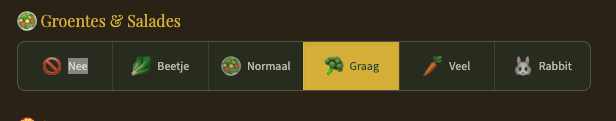

# US-019: Dynamische Prediction Vragen

## Beschrijving

Als administrator wil ik prediction vragen kunnen beheren via een admin interface, zodat ik vragen kan toevoegen, wijzigen en verwijderen zonder code aanpassingen.

## Requirements

### Vraag Types

| Type | Beschrijving | Voorbeeld |
|------|--------------|-----------|
| `slider` | Numerieke waarde met min/max | "Hoeveel flessen wijn?" (5-30) |
| `select_participant` | Dropdown met deelnemers | "Wie valt als eerste in slaap?" |
| `boolean` | Ja/Nee vraag | "Wordt er iets aangebrand?" |
| `time` | Tijdstip selectie | "Hoe laat vertrekt de laatste gast?" |
| `select_options` | Dropdown met vaste opties | "Wat wordt het populairste vlees?" |


te gebruiken voor de type boolean en select_options.


### Database Schema

```sql
CREATE TABLE prediction_questions (
  id UUID PRIMARY KEY DEFAULT uuid_generate_v4(),

  -- Vraag configuratie
  key TEXT UNIQUE NOT NULL,           -- 'wineBottles', 'firstSleeper', etc.
  label TEXT NOT NULL,                -- "Hoeveel flessen wijn?"
  type TEXT NOT NULL,                 -- 'slider', 'select_participant', 'boolean', 'time', 'select_options'
  category TEXT NOT NULL,             -- 'consumption', 'social', 'other'

  -- Type-specifieke opties (JSONB)
  options JSONB DEFAULT '{}',
  -- Voor slider: { min: 5, max: 30, unit: " flessen", hint: "..." }
  -- Voor select_options: { choices: ["varken", "rund", "kip"] }
  -- Voor time: { minHour: 19, maxHour: 6 }

  -- Puntentoekenning
  points_exact INTEGER DEFAULT 50,    -- Punten voor exact goed
  points_close INTEGER DEFAULT 25,    -- Punten voor dichtbij
  points_direction INTEGER DEFAULT 10, -- Punten voor goede richting

  -- Status
  is_active BOOLEAN DEFAULT TRUE,
  sort_order INTEGER DEFAULT 0,

  -- Meta
  created_at TIMESTAMPTZ DEFAULT NOW(),
  updated_at TIMESTAMPTZ DEFAULT NOW()
);
```

### Admin Interface

**Route:** `/admin/predictions/questions`

#### Functionaliteiten:
- [ ] Lijst van alle vragen met drag & drop sortering
- [ ] Vraag toevoegen met formulier per type
- [ ] Vraag bewerken (label, opties, punten)
- [ ] Vraag activeren/deactiveren
- [ ] Vraag verwijderen (soft delete)
- [ ] Preview van hoe de vraag eruitziet

### API Endpoints

| Endpoint | Method | Beschrijving |
|----------|--------|--------------|
| `/api/admin/prediction-questions` | GET | Lijst alle vragen |
| `/api/admin/prediction-questions` | POST | Nieuwe vraag toevoegen |
| `/api/admin/prediction-questions/[id]` | PATCH | Vraag bewerken |
| `/api/admin/prediction-questions/[id]` | DELETE | Vraag verwijderen |
| `/api/admin/prediction-questions/reorder` | POST | Volgorde aanpassen |
| `/api/prediction-questions` | GET | Actieve vragen (voor gebruikers) |

### Frontend Aanpassingen

1. **Predictions pagina** (`/predictions`)
   - Dynamisch vragen ophalen van API
   - Renderen gebaseerd op vraag type
   - Antwoorden opslaan met vraag key

2. **Admin predictions** (`/admin/predictions`)
   - Uitkomsten invullen gebaseerd op dynamische vragen
   - Puntenberekening per vraag configureerbaar

### Migratie van Bestaande Data

- Huidige hardcoded vragen converteren naar database records
- Bestaande antwoorden behouden (keys blijven gelijk)

## Acceptatiecriteria

- [ ] Admin kan nieuwe vragen toevoegen
- [ ] Admin kan vragen bewerken
- [ ] Admin kan vragen activeren/deactiveren
- [ ] Admin kan volgorde van vragen aanpassen
- [ ] Predictions pagina toont dynamische vragen
- [ ] Bestaande voorspellingen blijven werken
- [ ] Puntenberekening werkt met dynamische configuratie

## UI Schets

```
/admin/predictions/questions
┌─────────────────────────────────────────────────┐
│ Prediction Vragen                    [+ Nieuw]  │
├─────────────────────────────────────────────────┤
│ ☰ Consumptie                                    │
│   ├─ ☰ Flessen wijn (slider: 5-30)      [✓] [✏️]│
│   ├─ ☰ Kratten bier (slider: 2-10)      [✓] [✏️]│
│   └─ ☰ Kilo's vlees (slider: 2-8)       [✓] [✏️]│
│                                                 │
│ ☰ Sociaal                                       │
│   ├─ ☰ Eerste slaper (deelnemer)        [✓] [✏️]│
│   ├─ ☰ Spontane zanger (deelnemer)      [✓] [✏️]│
│   └─ ...                                        │
│                                                 │
│ ☰ Overig                                        │
│   ├─ ☰ Iets aangebrand? (ja/nee)        [✓] [✏️]│
│   └─ ...                                        │
└─────────────────────────────────────────────────┘

Vraag Toevoegen/Bewerken
┌─────────────────────────────────────────────────┐
│ Nieuwe Vraag                                    │
├─────────────────────────────────────────────────┤
│ Type:     [Slider ▼]                            │
│ Categorie: [Consumptie ▼]                       │
│ Key:      [wineBottles___________]              │
│ Label:    [Hoeveel flessen wijn?_]              │
│                                                 │
│ Slider Opties:                                  │
│ Min: [5]  Max: [30]  Unit: [flessen]            │
│ Hint: [~20 personen = 15 flessen]               │
│                                                 │
│ Punten:                                         │
│ Exact: [50]  Dichtbij: [25]  Richting: [10]     │
│                                                 │
│ Preview:                                        │
│ ┌───────────────────────────────────────────┐   │
│ │ Hoeveel flessen wijn?                     │   │
│ │ ●────────────────○ 15 flessen             │   │
│ │ ~20 personen = 15 flessen                 │   │
│ └───────────────────────────────────────────┘   │
│                                                 │
│              [Annuleren]  [Opslaan]             │
└─────────────────────────────────────────────────┘
```

## Suggesties voor Nieuwe Vragen

### Boy Boom Specifiek
- Welk cijfer krijgt Boy voor de locatie? (slider 1-10)
- Zal Boy als gastheer een toast uitbrengen? (boolean)

### BBQ
- Wat wordt het populairste vlees? (select: varken/rund/kip/vis)
- Hoeveel sauzen gaan er doorheen? (slider)

### Sociaal
- Wie maakt de beste grap van de avond? (participant)
- Wie is eerste die naar binnen gaat (kou)? (participant)
- Wie helpt het meest met opruimen? (participant)
- Wie morst als eerste? (participant)

### Timing
- Hoe laat wordt het eten geserveerd? (time)

### Weer
- Gaat het regenen of sneeuwen? (boolean)

---

*Aangemaakt: 2026-01-28*
