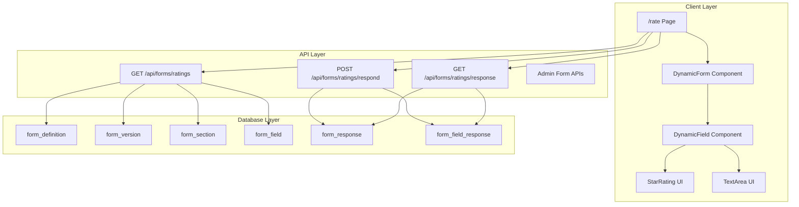

# US-020: Dynamic Form Elements - Architecture Document

**Project**: Bovenkamer Winterproef
**Phase**: Fase 1 - Ratings (Dynamic Rating Questions)
**Date**: 2026-01-29
**Status**: Architecture Complete - Ready for Implementation

---

## Executive Summary

This document provides the complete implementation architecture for making rating questions dynamic, moving from hardcoded form fields to a database-driven system. This implementation leverages the existing dynamic forms infrastructure established in the DATABASE-MODEL.md (6-table Salesforce WebForm pattern) and reuses patterns from the successful US-019 prediction questions implementation.

**Key Architectural Decisions**:

1. **Use full 6-table form system** (form_definition → form_version → form_section → form_field → form_response → form_field_response)
2. **Keep existing ratings table intact** during transition for backward compatibility
3. **Reuse DynamicQuestion component pattern** with extensions for star_rating, text_short, text_long
4. **Salesforce-style loading**: Single API call loads complete form hierarchy
5. **Salesforce-style saving**: Transactional response + field_response creation
6. **Auto-versioning**: Detect schema changes and create new versions automatically

---

## Table of Contents

1. [System Architecture](#1-system-architecture)
2. [Database Schema & Migration](#2-database-schema--migration)
3. [TypeScript Type System](#3-typescript-type-system)
4. [API Architecture](#4-api-architecture)
5. [Component Architecture](#5-component-architecture)
6. [Page Architecture](#6-page-architecture)
7. [Migration Strategy](#7-migration-strategy)
8. [Implementation Order](#8-implementation-order)
9. [Testing Strategy](#9-testing-strategy)
10. [Rollback Plan](#10-rollback-plan)

---

## 1. System Architecture

### 1.1 High-Level Architecture



### 1.2 Data Flow

**Loading Flow** (Salesforce Pattern):
```
1. User navigates to /rate
2. Page calls GET /api/forms/ratings
3. API loads: definition → active_version → sections → fields (single query with joins)
4. API returns complete form structure
5. DynamicForm component renders sections with fields
6. DynamicField renders appropriate input type per field
```

**Saving Flow** (Salesforce Pattern):
```
1. User fills form and clicks submit
2. Page calls POST /api/forms/ratings/respond with answers
3. API starts transaction
4. API creates/updates form_response record (status: submitted)
5. API upserts form_field_response for each field
6. API commits transaction
7. API returns success
8. Page shows confirmation
```

### 1.3 Component Hierarchy

```
/rate (Page)
└── DynamicForm
    └── For each section:
        └── Card
            └── For each field:
                └── DynamicField
                    ├── StarRating (if type === 'star_rating')
                    ├── TextArea (if type === 'text_short' | 'text_long')
                    ├── RadioGroup (if type === 'boolean')
                    └── [existing types from US-019]
```

---

## 2. Database Schema & Migration

### 2.1 Complete Schema (All 6 Tables)

**These tables follow the DATABASE-MODEL.md specification exactly.**

#### Table 1: `form_definition`

```sql
CREATE TABLE form_definition (
  id UUID PRIMARY KEY DEFAULT gen_random_uuid(),
  key VARCHAR(50) UNIQUE NOT NULL,
  name VARCHAR(100) NOT NULL,
  description TEXT,
  active_version_id UUID,
  created_at TIMESTAMPTZ DEFAULT NOW(),
  updated_at TIMESTAMPTZ DEFAULT NOW()
);

CREATE UNIQUE INDEX idx_form_definition_key ON form_definition(key);
```

#### Table 2: `form_version`

```sql
CREATE TABLE form_version (
  id UUID PRIMARY KEY DEFAULT gen_random_uuid(),
  form_definition_id UUID NOT NULL REFERENCES form_definition(id) ON DELETE CASCADE,
  version_number INTEGER NOT NULL,
  is_published BOOLEAN DEFAULT false,
  published_at TIMESTAMPTZ,
  changelog TEXT,
  created_at TIMESTAMPTZ DEFAULT NOW(),
  updated_at TIMESTAMPTZ DEFAULT NOW(),

  UNIQUE(form_definition_id, version_number)
);

-- FK for active_version_id (added after both tables exist)
ALTER TABLE form_definition
  ADD CONSTRAINT fk_form_definition_active_version
  FOREIGN KEY (active_version_id)
  REFERENCES form_version(id);

CREATE INDEX idx_form_version_definition ON form_version(form_definition_id);
CREATE INDEX idx_form_version_published ON form_version(form_definition_id, is_published);
```

#### Table 3: `form_section`

```sql
CREATE TABLE form_section (
  id UUID PRIMARY KEY DEFAULT gen_random_uuid(),
  form_version_id UUID NOT NULL REFERENCES form_version(id) ON DELETE CASCADE,
  key VARCHAR(50) NOT NULL,
  label VARCHAR(100) NOT NULL,
  description TEXT,
  icon VARCHAR(10),
  type VARCHAR(10) NOT NULL DEFAULT 'section',
  sort_order INTEGER DEFAULT 0,
  is_active BOOLEAN DEFAULT true,
  created_at TIMESTAMPTZ DEFAULT NOW(),
  updated_at TIMESTAMPTZ DEFAULT NOW(),

  UNIQUE(form_version_id, key),
  CONSTRAINT chk_form_section_type CHECK (type IN ('step', 'section'))
);

CREATE INDEX idx_form_section_version ON form_section(form_version_id);
CREATE INDEX idx_form_section_sort ON form_section(form_version_id, sort_order);
```

#### Table 4: `form_field`

```sql
CREATE TABLE form_field (
  id UUID PRIMARY KEY DEFAULT gen_random_uuid(),
  form_section_id UUID NOT NULL REFERENCES form_section(id) ON DELETE CASCADE,
  key VARCHAR(50) NOT NULL,
  label TEXT NOT NULL,
  description TEXT,
  placeholder TEXT,
  field_type VARCHAR(30) NOT NULL,
  options JSONB DEFAULT '{}',
  is_required BOOLEAN DEFAULT false,
  sort_order INTEGER DEFAULT 0,
  is_active BOOLEAN DEFAULT true,
  points_exact INTEGER DEFAULT 0,
  points_close INTEGER DEFAULT 0,
  points_direction INTEGER DEFAULT 0,
  created_at TIMESTAMPTZ DEFAULT NOW(),
  updated_at TIMESTAMPTZ DEFAULT NOW(),

  UNIQUE(form_section_id, key),
  CONSTRAINT chk_form_field_type CHECK (field_type IN (
    -- US-019 types
    'slider', 'select_participant', 'boolean', 'time', 'select_options',
    -- US-020 new types
    'star_rating', 'text_short', 'text_long'
  ))
);

CREATE INDEX idx_form_field_section ON form_field(form_section_id);
CREATE INDEX idx_form_field_sort ON form_field(form_section_id, sort_order);
```

#### Table 5: `form_response`

```sql
CREATE TABLE form_response (
  id UUID PRIMARY KEY DEFAULT gen_random_uuid(),
  user_id UUID NOT NULL REFERENCES users(id) ON DELETE CASCADE,
  form_version_id UUID NOT NULL REFERENCES form_version(id),
  status VARCHAR(20) DEFAULT 'draft',
  submitted_at TIMESTAMPTZ,
  total_score INTEGER DEFAULT 0,
  max_score INTEGER DEFAULT 0,
  scored_at TIMESTAMPTZ,
  created_at TIMESTAMPTZ DEFAULT NOW(),
  updated_at TIMESTAMPTZ DEFAULT NOW(),

  UNIQUE(user_id, form_version_id),
  CONSTRAINT chk_form_response_status CHECK (status IN ('draft', 'submitted', 'scored'))
);

CREATE INDEX idx_form_response_user ON form_response(user_id);
CREATE INDEX idx_form_response_version ON form_response(form_version_id);
CREATE INDEX idx_form_response_status ON form_response(status);
```

#### Table 6: `form_field_response`

```sql
CREATE TABLE form_field_response (
  id UUID PRIMARY KEY DEFAULT gen_random_uuid(),
  form_response_id UUID NOT NULL REFERENCES form_response(id) ON DELETE CASCADE,
  form_field_id UUID NOT NULL REFERENCES form_field(id),
  text TEXT,
  number NUMERIC,
  boolean BOOLEAN,
  json JSONB,
  participant_id UUID REFERENCES users(id),
  is_correct BOOLEAN,
  points_earned INTEGER DEFAULT 0,
  created_at TIMESTAMPTZ DEFAULT NOW(),
  updated_at TIMESTAMPTZ DEFAULT NOW(),

  UNIQUE(form_response_id, form_field_id)
);

CREATE INDEX idx_form_field_response_response ON form_field_response(form_response_id);
CREATE INDEX idx_form_field_response_field ON form_field_response(form_field_id);
```

### 2.2 Migration Script

**File**: `/supabase/migrations/20260129_dynamic_forms.sql`

```sql
-- ============================================================================
-- US-020: Dynamic Forms System
-- Migration: Create 6-table form system based on Salesforce WebForm pattern
-- ============================================================================

-- Step 1: Create form_definition table
CREATE TABLE IF NOT EXISTS form_definition (
  id UUID PRIMARY KEY DEFAULT gen_random_uuid(),
  key VARCHAR(50) UNIQUE NOT NULL,
  name VARCHAR(100) NOT NULL,
  description TEXT,
  active_version_id UUID,
  created_at TIMESTAMPTZ DEFAULT NOW(),
  updated_at TIMESTAMPTZ DEFAULT NOW()
);

CREATE UNIQUE INDEX IF NOT EXISTS idx_form_definition_key ON form_definition(key);

-- Step 2: Create form_version table
CREATE TABLE IF NOT EXISTS form_version (
  id UUID PRIMARY KEY DEFAULT gen_random_uuid(),
  form_definition_id UUID NOT NULL REFERENCES form_definition(id) ON DELETE CASCADE,
  version_number INTEGER NOT NULL,
  is_published BOOLEAN DEFAULT false,
  published_at TIMESTAMPTZ,
  changelog TEXT,
  created_at TIMESTAMPTZ DEFAULT NOW(),
  updated_at TIMESTAMPTZ DEFAULT NOW(),

  UNIQUE(form_definition_id, version_number)
);

CREATE INDEX IF NOT EXISTS idx_form_version_definition ON form_version(form_definition_id);
CREATE INDEX IF NOT EXISTS idx_form_version_published ON form_version(form_definition_id, is_published);

-- Step 3: Add FK for active_version_id
ALTER TABLE form_definition
  ADD CONSTRAINT fk_form_definition_active_version
  FOREIGN KEY (active_version_id)
  REFERENCES form_version(id);

-- Step 4: Create form_section table
CREATE TABLE IF NOT EXISTS form_section (
  id UUID PRIMARY KEY DEFAULT gen_random_uuid(),
  form_version_id UUID NOT NULL REFERENCES form_version(id) ON DELETE CASCADE,
  key VARCHAR(50) NOT NULL,
  label VARCHAR(100) NOT NULL,
  description TEXT,
  icon VARCHAR(10),
  type VARCHAR(10) NOT NULL DEFAULT 'section',
  sort_order INTEGER DEFAULT 0,
  is_active BOOLEAN DEFAULT true,
  created_at TIMESTAMPTZ DEFAULT NOW(),
  updated_at TIMESTAMPTZ DEFAULT NOW(),

  UNIQUE(form_version_id, key),
  CONSTRAINT chk_form_section_type CHECK (type IN ('step', 'section'))
);

CREATE INDEX IF NOT EXISTS idx_form_section_version ON form_section(form_version_id);
CREATE INDEX IF NOT EXISTS idx_form_section_sort ON form_section(form_version_id, sort_order);

-- Step 5: Create form_field table
CREATE TABLE IF NOT EXISTS form_field (
  id UUID PRIMARY KEY DEFAULT gen_random_uuid(),
  form_section_id UUID NOT NULL REFERENCES form_section(id) ON DELETE CASCADE,
  key VARCHAR(50) NOT NULL,
  label TEXT NOT NULL,
  description TEXT,
  placeholder TEXT,
  field_type VARCHAR(30) NOT NULL,
  options JSONB DEFAULT '{}',
  is_required BOOLEAN DEFAULT false,
  sort_order INTEGER DEFAULT 0,
  is_active BOOLEAN DEFAULT true,
  points_exact INTEGER DEFAULT 0,
  points_close INTEGER DEFAULT 0,
  points_direction INTEGER DEFAULT 0,
  created_at TIMESTAMPTZ DEFAULT NOW(),
  updated_at TIMESTAMPTZ DEFAULT NOW(),

  UNIQUE(form_section_id, key),
  CONSTRAINT chk_form_field_type CHECK (field_type IN (
    'slider', 'select_participant', 'boolean', 'time', 'select_options',
    'star_rating', 'text_short', 'text_long'
  ))
);

CREATE INDEX IF NOT EXISTS idx_form_field_section ON form_field(form_section_id);
CREATE INDEX IF NOT EXISTS idx_form_field_sort ON form_field(form_section_id, sort_order);

-- Step 6: Create form_response table
CREATE TABLE IF NOT EXISTS form_response (
  id UUID PRIMARY KEY DEFAULT gen_random_uuid(),
  user_id UUID NOT NULL REFERENCES users(id) ON DELETE CASCADE,
  form_version_id UUID NOT NULL REFERENCES form_version(id),
  status VARCHAR(20) DEFAULT 'draft',
  submitted_at TIMESTAMPTZ,
  total_score INTEGER DEFAULT 0,
  max_score INTEGER DEFAULT 0,
  scored_at TIMESTAMPTZ,
  created_at TIMESTAMPTZ DEFAULT NOW(),
  updated_at TIMESTAMPTZ DEFAULT NOW(),

  UNIQUE(user_id, form_version_id),
  CONSTRAINT chk_form_response_status CHECK (status IN ('draft', 'submitted', 'scored'))
);

CREATE INDEX IF NOT EXISTS idx_form_response_user ON form_response(user_id);
CREATE INDEX IF NOT EXISTS idx_form_response_version ON form_response(form_version_id);
CREATE INDEX IF NOT EXISTS idx_form_response_status ON form_response(status);

-- Step 7: Create form_field_response table
CREATE TABLE IF NOT EXISTS form_field_response (
  id UUID PRIMARY KEY DEFAULT gen_random_uuid(),
  form_response_id UUID NOT NULL REFERENCES form_response(id) ON DELETE CASCADE,
  form_field_id UUID NOT NULL REFERENCES form_field(id),
  text TEXT,
  number NUMERIC,
  boolean BOOLEAN,
  json JSONB,
  participant_id UUID REFERENCES users(id),
  is_correct BOOLEAN,
  points_earned INTEGER DEFAULT 0,
  created_at TIMESTAMPTZ DEFAULT NOW(),
  updated_at TIMESTAMPTZ DEFAULT NOW(),

  UNIQUE(form_response_id, form_field_id)
);

CREATE INDEX IF NOT EXISTS idx_form_field_response_response ON form_field_response(form_response_id);
CREATE INDEX IF NOT EXISTS idx_form_field_response_field ON form_field_response(form_field_id);

-- ============================================================================
-- Seed Data: Ratings Form
-- ============================================================================

-- Insert form_definition
INSERT INTO form_definition (key, name, description)
VALUES ('ratings', 'Boy Boom Beoordeling', 'Beoordeling van de locatie en gastheer')
ON CONFLICT (key) DO NOTHING;

-- Insert version 1
INSERT INTO form_version (form_definition_id, version_number, is_published, published_at, changelog)
SELECT
  fd.id,
  1,
  true,
  NOW(),
  'Initiele versie met 8 velden: 5 star ratings, 2 text vragen, 1 boolean + toelichting'
FROM form_definition fd
WHERE fd.key = 'ratings'
ON CONFLICT (form_definition_id, version_number) DO NOTHING;

-- Link active_version_id
UPDATE form_definition fd
SET active_version_id = fv.id
FROM form_version fv
WHERE fv.form_definition_id = fd.id
  AND fd.key = 'ratings'
  AND fv.version_number = 1;

-- Insert sections
INSERT INTO form_section (form_version_id, key, label, description, type, sort_order)
SELECT
  fv.id,
  'criteria',
  'Beoordelingscriteria',
  'Geef een score van 1-5 sterren',
  'section',
  1
FROM form_version fv
JOIN form_definition fd ON fd.id = fv.form_definition_id
WHERE fd.key = 'ratings' AND fv.version_number = 1
ON CONFLICT (form_version_id, key) DO NOTHING;

INSERT INTO form_section (form_version_id, key, label, description, type, sort_order)
SELECT
  fv.id,
  'feedback',
  'Open Vragen',
  'Optioneel maar gewaardeerd',
  'section',
  2
FROM form_version fv
JOIN form_definition fd ON fd.id = fv.form_definition_id
WHERE fd.key = 'ratings' AND fv.version_number = 1
ON CONFLICT (form_version_id, key) DO NOTHING;

INSERT INTO form_section (form_version_id, key, label, description, type, sort_order)
SELECT
  fv.id,
  'verdict',
  'Het Eindoordeel',
  'De ultieme vraag',
  'section',
  3
FROM form_version fv
JOIN form_definition fd ON fd.id = fv.form_definition_id
WHERE fd.key = 'ratings' AND fv.version_number = 1
ON CONFLICT (form_version_id, key) DO NOTHING;

-- Insert fields (criteria section)
INSERT INTO form_field (form_section_id, key, label, description, field_type, options, is_required, sort_order)
SELECT
  fs.id,
  'location_rating',
  'Locatie',
  'Ruimte, sfeer, faciliteiten',
  'star_rating',
  '{"type": "star_rating", "min": 1, "max": 5, "default": 0}'::jsonb,
  true,
  10
FROM form_section fs
JOIN form_version fv ON fv.id = fs.form_version_id
JOIN form_definition fd ON fd.id = fv.form_definition_id
WHERE fd.key = 'ratings' AND fv.version_number = 1 AND fs.key = 'criteria'
ON CONFLICT (form_section_id, key) DO NOTHING;

INSERT INTO form_field (form_section_id, key, label, description, field_type, options, is_required, sort_order)
SELECT
  fs.id,
  'hospitality_rating',
  'Gastvrijheid',
  'Ontvangst, bediening, aandacht',
  'star_rating',
  '{"type": "star_rating", "min": 1, "max": 5, "default": 0}'::jsonb,
  true,
  20
FROM form_section fs
JOIN form_version fv ON fv.id = fs.form_version_id
JOIN form_definition fd ON fd.id = fv.form_definition_id
WHERE fd.key = 'ratings' AND fv.version_number = 1 AND fs.key = 'criteria'
ON CONFLICT (form_section_id, key) DO NOTHING;

INSERT INTO form_field (form_section_id, key, label, description, field_type, options, is_required, sort_order)
SELECT
  fs.id,
  'fire_quality_rating',
  'Kwaliteit Vuurvoorziening',
  'BBQ, vuurplaats, warmte',
  'star_rating',
  '{"type": "star_rating", "min": 1, "max": 5, "default": 0}'::jsonb,
  true,
  30
FROM form_section fs
JOIN form_version fv ON fv.id = fs.form_version_id
JOIN form_definition fd ON fd.id = fv.form_definition_id
WHERE fd.key = 'ratings' AND fv.version_number = 1 AND fs.key = 'criteria'
ON CONFLICT (form_section_id, key) DO NOTHING;

INSERT INTO form_field (form_section_id, key, label, description, field_type, options, is_required, sort_order)
SELECT
  fs.id,
  'parking_rating',
  'Parkeergelegenheid',
  'Ruimte, bereikbaarheid',
  'star_rating',
  '{"type": "star_rating", "min": 1, "max": 5, "default": 0}'::jsonb,
  true,
  40
FROM form_section fs
JOIN form_version fv ON fv.id = fs.form_version_id
JOIN form_definition fd ON fd.id = fv.form_definition_id
WHERE fd.key = 'ratings' AND fv.version_number = 1 AND fs.key = 'criteria'
ON CONFLICT (form_section_id, key) DO NOTHING;

INSERT INTO form_field (form_section_id, key, label, description, field_type, options, is_required, sort_order)
SELECT
  fs.id,
  'overall_rating',
  'Algemene Organisatie',
  'Totaalindruk van de avond',
  'star_rating',
  '{"type": "star_rating", "min": 1, "max": 5, "default": 0}'::jsonb,
  true,
  50
FROM form_section fs
JOIN form_version fv ON fv.id = fs.form_version_id
JOIN form_definition fd ON fd.id = fv.form_definition_id
WHERE fd.key = 'ratings' AND fv.version_number = 1 AND fs.key = 'criteria'
ON CONFLICT (form_section_id, key) DO NOTHING;

-- Insert fields (feedback section)
INSERT INTO form_field (form_section_id, key, label, placeholder, field_type, options, is_required, sort_order)
SELECT
  fs.id,
  'best_aspect',
  'Wat was het beste aan de locatie?',
  'Bijv. de sfeer, het uitzicht, de ruimte...',
  'text_short',
  '{"type": "text_short", "maxLength": 500, "rows": 3}'::jsonb,
  false,
  10
FROM form_section fs
JOIN form_version fv ON fv.id = fs.form_version_id
JOIN form_definition fd ON fd.id = fv.form_definition_id
WHERE fd.key = 'ratings' AND fv.version_number = 1 AND fs.key = 'feedback'
ON CONFLICT (form_section_id, key) DO NOTHING;

INSERT INTO form_field (form_section_id, key, label, placeholder, field_type, options, is_required, sort_order)
SELECT
  fs.id,
  'improvement_suggestion',
  'Wat kan beter?',
  'Constructieve feedback voor de toekomst...',
  'text_short',
  '{"type": "text_short", "maxLength": 500, "rows": 3}'::jsonb,
  false,
  20
FROM form_section fs
JOIN form_version fv ON fv.id = fs.form_version_id
JOIN form_definition fd ON fd.id = fv.form_definition_id
WHERE fd.key = 'ratings' AND fv.version_number = 1 AND fs.key = 'feedback'
ON CONFLICT (form_section_id, key) DO NOTHING;

-- Insert fields (verdict section)
INSERT INTO form_field (form_section_id, key, label, field_type, options, is_required, sort_order)
SELECT
  fs.id,
  'is_worthy',
  'Is Boy Boom waardig lid van de Bovenkamer?',
  'boolean',
  '{"type": "boolean", "trueLabel": "Ja, Waardig", "falseLabel": "Nee, Onwaardig"}'::jsonb,
  true,
  10
FROM form_section fs
JOIN form_version fv ON fv.id = fs.form_version_id
JOIN form_definition fd ON fd.id = fv.form_definition_id
WHERE fd.key = 'ratings' AND fv.version_number = 1 AND fs.key = 'verdict'
ON CONFLICT (form_section_id, key) DO NOTHING;

INSERT INTO form_field (form_section_id, key, label, description, placeholder, field_type, options, is_required, sort_order)
SELECT
  fs.id,
  'worthy_explanation',
  'Toelichting',
  'Waarom wel of niet waardig?',
  'Leg uit waarom...',
  'text_long',
  '{"type": "text_long", "maxLength": 2000, "rows": 5}'::jsonb,
  false,
  20
FROM form_section fs
JOIN form_version fv ON fv.id = fs.form_version_id
JOIN form_definition fd ON fd.id = fv.form_definition_id
WHERE fd.key = 'ratings' AND fv.version_number = 1 AND fs.key = 'verdict'
ON CONFLICT (form_section_id, key) DO NOTHING;

-- ============================================================================
-- RLS Policies
-- ============================================================================

-- Anyone can read active form definitions and their versions/sections/fields
ALTER TABLE form_definition ENABLE ROW LEVEL SECURITY;
ALTER TABLE form_version ENABLE ROW LEVEL SECURITY;
ALTER TABLE form_section ENABLE ROW LEVEL SECURITY;
ALTER TABLE form_field ENABLE ROW LEVEL SECURITY;

CREATE POLICY "form_definition_read" ON form_definition FOR SELECT USING (true);
CREATE POLICY "form_version_read" ON form_version FOR SELECT USING (is_published = true);
CREATE POLICY "form_section_read" ON form_section FOR SELECT USING (is_active = true);
CREATE POLICY "form_field_read" ON form_field FOR SELECT USING (is_active = true);

-- Only admins can write to form structure
CREATE POLICY "form_definition_admin_write" ON form_definition FOR ALL
  USING (auth.jwt() ->> 'role' = 'admin');
CREATE POLICY "form_version_admin_write" ON form_version FOR ALL
  USING (auth.jwt() ->> 'role' = 'admin');
CREATE POLICY "form_section_admin_write" ON form_section FOR ALL
  USING (auth.jwt() ->> 'role' = 'admin');
CREATE POLICY "form_field_admin_write" ON form_field FOR ALL
  USING (auth.jwt() ->> 'role' = 'admin');

-- Users can only read/write their own responses
ALTER TABLE form_response ENABLE ROW LEVEL SECURITY;
ALTER TABLE form_field_response ENABLE ROW LEVEL SECURITY;

CREATE POLICY "form_response_own" ON form_response FOR ALL
  USING (user_id = (auth.jwt() ->> 'id')::uuid);
CREATE POLICY "form_field_response_own" ON form_field_response FOR ALL
  USING (
    form_response_id IN (
      SELECT id FROM form_response WHERE user_id = (auth.jwt() ->> 'id')::uuid
    )
  );

-- Admins can read all responses
CREATE POLICY "form_response_admin_read" ON form_response FOR SELECT
  USING (auth.jwt() ->> 'role' = 'admin');
CREATE POLICY "form_field_response_admin_read" ON form_field_response FOR SELECT
  USING (auth.jwt() ->> 'role' = 'admin');
```

### 2.3 Rollback Script

**File**: `/supabase/migrations/20260129_dynamic_forms_rollback.sql`

```sql
-- Rollback script for dynamic forms migration

-- Drop RLS policies
DROP POLICY IF EXISTS "form_field_response_admin_read" ON form_field_response;
DROP POLICY IF EXISTS "form_response_admin_read" ON form_response;
DROP POLICY IF EXISTS "form_field_response_own" ON form_field_response;
DROP POLICY IF EXISTS "form_response_own" ON form_response;
DROP POLICY IF EXISTS "form_field_admin_write" ON form_field;
DROP POLICY IF EXISTS "form_section_admin_write" ON form_section;
DROP POLICY IF EXISTS "form_version_admin_write" ON form_version;
DROP POLICY IF EXISTS "form_definition_admin_write" ON form_definition;
DROP POLICY IF EXISTS "form_field_read" ON form_field;
DROP POLICY IF EXISTS "form_section_read" ON form_section;
DROP POLICY IF EXISTS "form_version_read" ON form_version;
DROP POLICY IF EXISTS "form_definition_read" ON form_definition;

-- Drop tables (in reverse order of creation)
DROP TABLE IF EXISTS form_field_response CASCADE;
DROP TABLE IF EXISTS form_response CASCADE;
DROP TABLE IF EXISTS form_field CASCADE;
DROP TABLE IF EXISTS form_section CASCADE;

-- Remove FK constraint before dropping form_version
ALTER TABLE form_definition DROP CONSTRAINT IF EXISTS fk_form_definition_active_version;

DROP TABLE IF EXISTS form_version CASCADE;
DROP TABLE IF EXISTS form_definition CASCADE;
```

---

## 3. TypeScript Type System

### 3.1 New Type Definitions

**File**: `/src/types/forms.ts` (new file)

```typescript
/**
 * Dynamic Forms Type System
 * Based on Salesforce WebForm pattern
 *
 * Usage:
 * - Import from @/types/forms
 * - Use FormDefinition for form metadata
 * - Use FormField with discriminated union for field types
 * - Use FormResponse for user submissions
 */

// ============================================================================
// Form Structure Types
// ============================================================================

/**
 * Form definition (e.g., "ratings", "predictions")
 */
export interface FormDefinition {
  id: string;
  key: string;
  name: string;
  description?: string;
  active_version_id?: string;
  created_at: string;
  updated_at: string;
}

/**
 * Form version (for schema versioning)
 */
export interface FormVersion {
  id: string;
  form_definition_id: string;
  version_number: number;
  is_published: boolean;
  published_at?: string;
  changelog?: string;
  created_at: string;
  updated_at: string;
}

/**
 * Form section (grouping of fields)
 */
export interface FormSection {
  id: string;
  form_version_id: string;
  key: string;
  label: string;
  description?: string;
  icon?: string;
  type: 'step' | 'section';
  sort_order: number;
  is_active: boolean;
  created_at: string;
  updated_at: string;
}

/**
 * Form field (individual question/input)
 */
export interface FormField {
  id: string;
  form_section_id: string;
  key: string;
  label: string;
  description?: string;
  placeholder?: string;
  field_type: FormFieldType;
  options: FormFieldOptions;
  is_required: boolean;
  sort_order: number;
  is_active: boolean;
  points_exact: number;
  points_close: number;
  points_direction: number;
  created_at: string;
  updated_at: string;
}

// ============================================================================
// Field Type System
// ============================================================================

export type FormFieldType =
  // US-019 types (existing)
  | 'slider'
  | 'select_participant'
  | 'boolean'
  | 'time'
  | 'select_options'
  // US-020 types (new)
  | 'star_rating'
  | 'text_short'
  | 'text_long';

/**
 * Discriminated union of field options
 * Use type guards to narrow options based on field_type
 */
export type FormFieldOptions =
  | SliderOptions
  | SelectParticipantOptions
  | BooleanOptions
  | TimeOptions
  | SelectOptionsOptions
  | StarRatingOptions
  | TextShortOptions
  | TextLongOptions;

// Existing types from US-019
export interface SliderOptions {
  type: 'slider';
  min: number;
  max: number;
  unit: string;
  hint?: string;
  default?: number;
}

export interface SelectParticipantOptions {
  type: 'select_participant';
}

export interface BooleanOptions {
  type: 'boolean';
  trueLabel?: string;
  falseLabel?: string;
  trueEmoji?: string;
  falseEmoji?: string;
}

export interface TimeOptions {
  type: 'time';
  minHour: number;
  maxHour: number;
  default?: number;
}

export interface SelectOptionsOptions {
  type: 'select_options';
  choices: Array<{
    value: string;
    label: string;
    emoji?: string;
  }>;
}

// New types for US-020
export interface StarRatingOptions {
  type: 'star_rating';
  min: number;
  max: number;
  default?: number;
}

export interface TextShortOptions {
  type: 'text_short';
  maxLength?: number;
  rows?: number;
}

export interface TextLongOptions {
  type: 'text_long';
  maxLength?: number;
  rows?: number;
}

// ============================================================================
// Response Types
// ============================================================================

/**
 * User's response to a form version
 */
export interface FormResponse {
  id: string;
  user_id: string;
  form_version_id: string;
  status: 'draft' | 'submitted' | 'scored';
  submitted_at?: string;
  total_score: number;
  max_score: number;
  scored_at?: string;
  created_at: string;
  updated_at: string;
}

/**
 * Individual field answer
 */
export interface FormFieldResponse {
  id: string;
  form_response_id: string;
  form_field_id: string;
  text?: string;
  number?: number;
  boolean?: boolean;
  json?: any;
  participant_id?: string;
  is_correct?: boolean;
  points_earned: number;
  created_at: string;
  updated_at: string;
}

// ============================================================================
// API Request/Response Types
// ============================================================================

/**
 * Complete form structure loaded from API
 */
export interface FormStructure {
  definition: FormDefinition;
  version: FormVersion;
  sections: Array<FormSection & {
    fields: FormField[];
  }>;
}

/**
 * Request body for submitting form response
 */
export interface SubmitFormRequest {
  answers: Record<string, any>; // key: field.key, value: answer
}

/**
 * Response from form submission
 */
export interface SubmitFormResponse {
  success: boolean;
  response_id: string;
  message: string;
}

/**
 * User's current response with field values
 */
export interface UserFormResponse {
  response: FormResponse;
  answers: Record<string, any>; // key: field.key, value: answer
}

// ============================================================================
// Type Guards
// ============================================================================

export function isStarRatingOptions(options: FormFieldOptions): options is StarRatingOptions {
  return options.type === 'star_rating';
}

export function isTextShortOptions(options: FormFieldOptions): options is TextShortOptions {
  return options.type === 'text_short';
}

export function isTextLongOptions(options: FormFieldOptions): options is TextLongOptions {
  return options.type === 'text_long';
}

export function isBooleanOptions(options: FormFieldOptions): options is BooleanOptions {
  return options.type === 'boolean';
}

export function isSliderOptions(options: FormFieldOptions): options is SliderOptions {
  return options.type === 'slider';
}

export function isTimeOptions(options: FormFieldOptions): options is TimeOptions {
  return options.type === 'time';
}

export function isSelectOptionsOptions(options: FormFieldOptions): options is SelectOptionsOptions {
  return options.type === 'select_options';
}

export function isSelectParticipantOptions(options: FormFieldOptions): options is SelectParticipantOptions {
  return options.type === 'select_participant';
}
```

### 3.2 Update Existing Types

**File**: `/src/types/index.ts` (update)

```typescript
// Add export for new forms types
export * from './forms';

// Keep existing types unchanged for backward compatibility
// Rating interface stays as-is for now
```

---

## 4. API Architecture

### 4.1 Public API: Load Form Structure

**File**: `/src/app/api/forms/[key]/route.ts` (new file)

```typescript
/**
 * GET /api/forms/[key]
 * Load complete form structure (definition → version → sections → fields)
 *
 * Pattern: Salesforce-style single query with joins
 *
 * Example: GET /api/forms/ratings
 */

import { NextRequest, NextResponse } from 'next/server';
import { createServerClient } from '@/lib/supabase';
import { FormStructure } from '@/types/forms';

export async function GET(
  request: NextRequest,
  { params }: { params: { key: string } }
) {
  try {
    const { key } = params;
    const supabase = createServerClient();

    // Step 1: Load form definition with active version
    const { data: definition, error: defError } = await supabase
      .from('form_definition')
      .select('*')
      .eq('key', key)
      .single();

    if (defError || !definition) {
      return NextResponse.json(
        { error: 'Formulier niet gevonden', code: 'FORM_NOT_FOUND' },
        { status: 404 }
      );
    }

    if (!definition.active_version_id) {
      return NextResponse.json(
        { error: 'Geen actieve versie', code: 'NO_ACTIVE_VERSION' },
        { status: 404 }
      );
    }

    // Step 2: Load version
    const { data: version, error: versionError } = await supabase
      .from('form_version')
      .select('*')
      .eq('id', definition.active_version_id)
      .eq('is_published', true)
      .single();

    if (versionError || !version) {
      return NextResponse.json(
        { error: 'Versie niet gevonden', code: 'VERSION_NOT_FOUND' },
        { status: 404 }
      );
    }

    // Step 3: Load sections with fields (nested query)
    const { data: sections, error: sectionsError } = await supabase
      .from('form_section')
      .select(`
        *,
        fields:form_field(*)
      `)
      .eq('form_version_id', version.id)
      .eq('is_active', true)
      .order('sort_order', { ascending: true });

    if (sectionsError) {
      console.error('Error loading sections:', sectionsError);
      return NextResponse.json(
        { error: 'Database fout', code: 'DATABASE_ERROR' },
        { status: 500 }
      );
    }

    // Step 4: Filter and sort fields within sections
    const sectionsWithFields = (sections || []).map((section: any) => ({
      ...section,
      fields: (section.fields || [])
        .filter((f: any) => f.is_active)
        .sort((a: any, b: any) => a.sort_order - b.sort_order),
    }));

    const formStructure: FormStructure = {
      definition,
      version,
      sections: sectionsWithFields,
    };

    return NextResponse.json(formStructure);
  } catch (error) {
    console.error('Error in GET /api/forms/[key]:', error);
    return NextResponse.json(
      { error: 'Server fout', code: 'SERVER_ERROR' },
      { status: 500 }
    );
  }
}
```

### 4.2 Public API: Submit Form Response

**File**: `/src/app/api/forms/[key]/respond/route.ts` (new file)

```typescript
/**
 * POST /api/forms/[key]/respond
 * Submit form response with field answers
 *
 * Pattern: Salesforce-style transactional save
 * 1. Create/update form_response
 * 2. Upsert form_field_response for each field
 *
 * Request body:
 * {
 *   user_email: string,
 *   answers: Record<string, any>
 * }
 */

import { NextRequest, NextResponse } from 'next/server';
import { createServerClient } from '@/lib/supabase';
import { SubmitFormRequest, SubmitFormResponse } from '@/types/forms';

export async function POST(
  request: NextRequest,
  { params }: { params: { key: string } }
) {
  try {
    const { key } = params;
    const body: SubmitFormRequest & { user_email: string } = await request.json();
    const { user_email, answers } = body;

    if (!user_email || !answers) {
      return NextResponse.json(
        { error: 'Verplichte velden ontbreken', code: 'MISSING_FIELDS' },
        { status: 400 }
      );
    }

    const supabase = createServerClient();

    // Step 1: Find user
    const { data: user, error: userError } = await supabase
      .from('users')
      .select('id')
      .eq('email', user_email)
      .single();

    if (userError || !user) {
      return NextResponse.json(
        { error: 'Gebruiker niet gevonden', code: 'USER_NOT_FOUND' },
        { status: 404 }
      );
    }

    // Step 2: Load form definition
    const { data: definition, error: defError } = await supabase
      .from('form_definition')
      .select('id, active_version_id')
      .eq('key', key)
      .single();

    if (defError || !definition || !definition.active_version_id) {
      return NextResponse.json(
        { error: 'Formulier niet gevonden', code: 'FORM_NOT_FOUND' },
        { status: 404 }
      );
    }

    // Step 3: Load all fields for this form version
    const { data: fields, error: fieldsError } = await supabase
      .from('form_field')
      .select('id, key, field_type, form_section_id')
      .eq('form_section_id', supabase.rpc('get_section_ids_for_version', {
        version_id: definition.active_version_id
      }));

    // Alternative: Join through sections
    const { data: allFields } = await supabase
      .from('form_field')
      .select(`
        id,
        key,
        field_type,
        form_section!inner(form_version_id)
      `)
      .eq('form_section.form_version_id', definition.active_version_id)
      .eq('is_active', true);

    if (!allFields || allFields.length === 0) {
      return NextResponse.json(
        { error: 'Geen velden gevonden', code: 'NO_FIELDS' },
        { status: 404 }
      );
    }

    // Step 4: Create or update form_response
    const { data: existingResponse } = await supabase
      .from('form_response')
      .select('id')
      .eq('user_id', user.id)
      .eq('form_version_id', definition.active_version_id)
      .maybeSingle();

    let responseId: string;

    if (existingResponse) {
      // Update existing response
      const { data: updated, error: updateError } = await supabase
        .from('form_response')
        .update({
          status: 'submitted',
          submitted_at: new Date().toISOString(),
          updated_at: new Date().toISOString(),
        })
        .eq('id', existingResponse.id)
        .select('id')
        .single();

      if (updateError || !updated) {
        console.error('Error updating response:', updateError);
        return NextResponse.json(
          { error: 'Kon response niet updaten', code: 'UPDATE_ERROR' },
          { status: 500 }
        );
      }

      responseId = updated.id;
    } else {
      // Create new response
      const { data: created, error: createError } = await supabase
        .from('form_response')
        .insert({
          user_id: user.id,
          form_version_id: definition.active_version_id,
          status: 'submitted',
          submitted_at: new Date().toISOString(),
        })
        .select('id')
        .single();

      if (createError || !created) {
        console.error('Error creating response:', createError);
        return NextResponse.json(
          { error: 'Kon response niet aanmaken', code: 'CREATE_ERROR' },
          { status: 500 }
        );
      }

      responseId = created.id;
    }

    // Step 5: Upsert field responses
    const fieldResponses = allFields
      .filter((field: any) => answers[field.key] !== undefined)
      .map((field: any) => {
        const value = answers[field.key];
        const fieldResponse: any = {
          form_response_id: responseId,
          form_field_id: field.id,
        };

        // Map value to correct column based on field_type
        switch (field.field_type) {
          case 'star_rating':
          case 'slider':
          case 'time':
            fieldResponse.number = value;
            break;
          case 'boolean':
            fieldResponse.boolean = value;
            break;
          case 'text_short':
          case 'text_long':
          case 'select_options':
            fieldResponse.text = value;
            break;
          case 'select_participant':
            fieldResponse.participant_id = value;
            break;
          default:
            fieldResponse.text = String(value);
        }

        return fieldResponse;
      });

    if (fieldResponses.length > 0) {
      const { error: upsertError } = await supabase
        .from('form_field_response')
        .upsert(fieldResponses, {
          onConflict: 'form_response_id,form_field_id',
        });

      if (upsertError) {
        console.error('Error upserting field responses:', upsertError);
        return NextResponse.json(
          { error: 'Kon antwoorden niet opslaan', code: 'UPSERT_ERROR' },
          { status: 500 }
        );
      }
    }

    // Also save to old ratings table for backward compatibility
    if (key === 'ratings') {
      await saveToRatingsTable(supabase, user.id, answers);
    }

    const response: SubmitFormResponse = {
      success: true,
      response_id: responseId,
      message: 'Beoordeling opgeslagen',
    };

    return NextResponse.json(response);
  } catch (error) {
    console.error('Error in POST /api/forms/[key]/respond:', error);
    return NextResponse.json(
      { error: 'Server fout', code: 'SERVER_ERROR' },
      { status: 500 }
    );
  }
}

/**
 * Helper: Also save to old ratings table for backward compatibility
 */
async function saveToRatingsTable(supabase: any, userId: string, answers: Record<string, any>) {
  try {
    const ratingData = {
      user_id: userId,
      location_rating: answers.location_rating,
      hospitality_rating: answers.hospitality_rating,
      fire_quality_rating: answers.fire_quality_rating,
      parking_rating: answers.parking_rating,
      overall_rating: answers.overall_rating,
      best_aspect: answers.best_aspect || null,
      improvement_suggestion: answers.improvement_suggestion || null,
      is_worthy: answers.is_worthy,
      worthy_explanation: answers.worthy_explanation || null,
    };

    const { data: existing } = await supabase
      .from('ratings')
      .select('id')
      .eq('user_id', userId)
      .maybeSingle();

    if (existing) {
      await supabase
        .from('ratings')
        .update(ratingData)
        .eq('id', existing.id);
    } else {
      await supabase
        .from('ratings')
        .insert(ratingData);
    }
  } catch (error) {
    console.error('Error saving to ratings table (non-critical):', error);
    // Don't fail the request if backward compat save fails
  }
}
```

### 4.3 Public API: Get User Response

**File**: `/src/app/api/forms/[key]/response/route.ts` (new file)

```typescript
/**
 * GET /api/forms/[key]/response
 * Get current user's response (for pre-filling form)
 *
 * Query params:
 * - user_email: string
 */

import { NextRequest, NextResponse } from 'next/server';
import { createServerClient } from '@/lib/supabase';
import { UserFormResponse } from '@/types/forms';

export async function GET(
  request: NextRequest,
  { params }: { params: { key: string } }
) {
  try {
    const { key } = params;
    const { searchParams } = new URL(request.url);
    const userEmail = searchParams.get('user_email');

    if (!userEmail) {
      return NextResponse.json(
        { error: 'user_email query parameter verplicht', code: 'MISSING_EMAIL' },
        { status: 400 }
      );
    }

    const supabase = createServerClient();

    // Step 1: Find user
    const { data: user, error: userError } = await supabase
      .from('users')
      .select('id')
      .eq('email', userEmail)
      .single();

    if (userError || !user) {
      return NextResponse.json(
        { error: 'Gebruiker niet gevonden', code: 'USER_NOT_FOUND' },
        { status: 404 }
      );
    }

    // Step 2: Load form definition
    const { data: definition, error: defError } = await supabase
      .from('form_definition')
      .select('id, active_version_id')
      .eq('key', key)
      .single();

    if (defError || !definition || !definition.active_version_id) {
      return NextResponse.json(
        { error: 'Formulier niet gevonden', code: 'FORM_NOT_FOUND' },
        { status: 404 }
      );
    }

    // Step 3: Find user's response
    const { data: response, error: responseError } = await supabase
      .from('form_response')
      .select('*')
      .eq('user_id', user.id)
      .eq('form_version_id', definition.active_version_id)
      .maybeSingle();

    if (responseError) {
      console.error('Error loading response:', responseError);
      return NextResponse.json(
        { error: 'Database fout', code: 'DATABASE_ERROR' },
        { status: 500 }
      );
    }

    if (!response) {
      // No response yet
      return NextResponse.json({
        response: null,
        answers: {},
      });
    }

    // Step 4: Load field responses with field keys
    const { data: fieldResponses, error: fieldError } = await supabase
      .from('form_field_response')
      .select(`
        *,
        form_field!inner(key, field_type)
      `)
      .eq('form_response_id', response.id);

    if (fieldError) {
      console.error('Error loading field responses:', fieldError);
      return NextResponse.json(
        { error: 'Database fout', code: 'DATABASE_ERROR' },
        { status: 500 }
      );
    }

    // Step 5: Map to answers object
    const answers: Record<string, any> = {};
    (fieldResponses || []).forEach((fr: any) => {
      const key = fr.form_field.key;
      const fieldType = fr.form_field.field_type;

      // Extract value from correct column
      if (fr.number !== null && fr.number !== undefined) {
        answers[key] = fr.number;
      } else if (fr.boolean !== null && fr.boolean !== undefined) {
        answers[key] = fr.boolean;
      } else if (fr.text !== null && fr.text !== undefined) {
        answers[key] = fr.text;
      } else if (fr.participant_id !== null && fr.participant_id !== undefined) {
        answers[key] = fr.participant_id;
      } else if (fr.json !== null && fr.json !== undefined) {
        answers[key] = fr.json;
      }
    });

    const userResponse: UserFormResponse = {
      response,
      answers,
    };

    return NextResponse.json(userResponse);
  } catch (error) {
    console.error('Error in GET /api/forms/[key]/response:', error);
    return NextResponse.json(
      { error: 'Server fout', code: 'SERVER_ERROR' },
      { status: 500 }
    );
  }
}
```

### 4.4 Admin API: List Forms

**File**: `/src/app/api/admin/forms/route.ts` (new file)

```typescript
/**
 * GET /api/admin/forms
 * List all form definitions with stats
 *
 * Admin only
 */

import { NextRequest, NextResponse } from 'next/server';
import { createServerClient } from '@/lib/supabase';
import { getUserFromRequest, isAdmin } from '@/lib/auth/jwt';

export async function GET(request: NextRequest) {
  try {
    // Check admin authentication
    const user = await getUserFromRequest(request);
    if (!user || !isAdmin(user)) {
      return NextResponse.json(
        { error: 'Admin toegang vereist', code: 'UNAUTHORIZED' },
        { status: 403 }
      );
    }

    const supabase = createServerClient();

    // Load all form definitions
    const { data: forms, error } = await supabase
      .from('form_definition')
      .select(`
        *,
        active_version:form_version!form_definition_active_version_id_fkey(
          id,
          version_number,
          is_published
        )
      `)
      .order('key', { ascending: true });

    if (error) {
      console.error('Error loading forms:', error);
      return NextResponse.json(
        { error: 'Database fout', code: 'DATABASE_ERROR' },
        { status: 500 }
      );
    }

    // Get response counts per form
    const formsWithStats = await Promise.all(
      (forms || []).map(async (form: any) => {
        if (!form.active_version_id) {
          return { ...form, stats: { responses: 0, fields: 0, sections: 0 } };
        }

        const { count: responseCount } = await supabase
          .from('form_response')
          .select('*', { count: 'exact', head: true })
          .eq('form_version_id', form.active_version_id);

        const { count: sectionCount } = await supabase
          .from('form_section')
          .select('*', { count: 'exact', head: true })
          .eq('form_version_id', form.active_version_id)
          .eq('is_active', true);

        const { data: sections } = await supabase
          .from('form_section')
          .select('id')
          .eq('form_version_id', form.active_version_id)
          .eq('is_active', true);

        let fieldCount = 0;
        if (sections && sections.length > 0) {
          const sectionIds = sections.map((s: any) => s.id);
          const { count } = await supabase
            .from('form_field')
            .select('*', { count: 'exact', head: true })
            .in('form_section_id', sectionIds)
            .eq('is_active', true);
          fieldCount = count || 0;
        }

        return {
          ...form,
          stats: {
            responses: responseCount || 0,
            fields: fieldCount,
            sections: sectionCount || 0,
          },
        };
      })
    );

    return NextResponse.json({ forms: formsWithStats });
  } catch (error) {
    console.error('Error in GET /api/admin/forms:', error);
    return NextResponse.json(
      { error: 'Server fout', code: 'SERVER_ERROR' },
      { status: 500 }
    );
  }
}
```

---

## 5. Component Architecture

### 5.1 StarRating UI Component

**File**: `/src/components/ui/StarRating.tsx` (new file)

Extract from existing `/rate` page.

```typescript
'use client';

interface StarRatingProps {
  value: number;
  onChange: (value: number) => void;
  label?: string;
  description?: string;
  min?: number;
  max?: number;
  disabled?: boolean;
  required?: boolean;
}

export function StarRating({
  value,
  onChange,
  label,
  description,
  min = 1,
  max = 5,
  disabled = false,
  required = false,
}: StarRatingProps) {
  const stars = Array.from({ length: max - min + 1 }, (_, i) => min + i);

  return (
    <div className="space-y-2">
      {label && (
        <div>
          <p className="text-cream font-medium">
            {label}
            {required && <span className="text-warm-red ml-1">*</span>}
          </p>
          {description && (
            <p className="text-cream/50 text-sm">{description}</p>
          )}
        </div>
      )}
      <div className="flex gap-2">
        {stars.map((star) => (
          <button
            key={star}
            type="button"
            onClick={() => !disabled && onChange(star)}
            disabled={disabled}
            className={`w-10 h-10 rounded-lg border-2 transition-all ${
              star <= value
                ? 'bg-gold border-gold text-dark-wood'
                : 'bg-transparent border-gold/30 text-gold/30 hover:border-gold/60'
            } ${disabled ? 'opacity-50 cursor-not-allowed' : 'cursor-pointer'}`}
          >
            ★
          </button>
        ))}
      </div>
    </div>
  );
}
```

### 5.2 DynamicField Component

**File**: `/src/components/forms/DynamicField.tsx` (new file)

Rename and extend from `DynamicQuestion` component.

```typescript
'use client';

import { FormField, FormFieldOptions } from '@/types/forms';
import { Slider, Select, RadioGroup, TextArea } from '@/components/ui';
import { StarRating } from '@/components/ui/StarRating';
import {
  isStarRatingOptions,
  isTextShortOptions,
  isTextLongOptions,
  isBooleanOptions,
  isSliderOptions,
  isTimeOptions,
  isSelectOptionsOptions,
  isSelectParticipantOptions,
} from '@/types/forms';

interface DynamicFieldProps {
  field: FormField;
  value: any;
  onChange: (value: any) => void;
  disabled?: boolean;
  participants?: Array<{ value: string; label: string }>;
}

/**
 * DynamicField Component
 *
 * Renders a form field dynamically based on field_type
 * Supports all US-019 types + new US-020 types (star_rating, text_short, text_long)
 */
export function DynamicField({
  field,
  value,
  onChange,
  disabled = false,
  participants = [],
}: DynamicFieldProps) {
  const { field_type, options, label, description, placeholder, is_required } = field;

  switch (field_type) {
    case 'star_rating': {
      if (!isStarRatingOptions(options)) {
        return <p className="text-warm-red">Invalid options for star_rating</p>;
      }
      return (
        <StarRating
          label={label}
          description={description}
          value={value ?? options.default ?? 0}
          onChange={onChange}
          min={options.min}
          max={options.max}
          disabled={disabled}
          required={is_required}
        />
      );
    }

    case 'text_short': {
      if (!isTextShortOptions(options)) {
        return <p className="text-warm-red">Invalid options for text_short</p>;
      }
      return (
        <TextArea
          label={label}
          value={value ?? ''}
          onChange={(e) => onChange(e.target.value)}
          placeholder={placeholder}
          rows={options.rows ?? 3}
          maxLength={options.maxLength}
          disabled={disabled}
          required={is_required}
        />
      );
    }

    case 'text_long': {
      if (!isTextLongOptions(options)) {
        return <p className="text-warm-red">Invalid options for text_long</p>;
      }
      return (
        <TextArea
          label={label}
          value={value ?? ''}
          onChange={(e) => onChange(e.target.value)}
          placeholder={placeholder}
          rows={options.rows ?? 5}
          maxLength={options.maxLength}
          disabled={disabled}
          required={is_required}
        />
      );
    }

    case 'boolean': {
      if (!isBooleanOptions(options)) {
        return <p className="text-warm-red">Invalid options for boolean</p>;
      }
      const trueLabel = options.trueLabel || 'Ja';
      const falseLabel = options.falseLabel || 'Nee';
      const trueEmoji = options.trueEmoji || '✅';
      const falseEmoji = options.falseEmoji || '❌';

      return (
        <RadioGroup
          label={label}
          name={field.key}
          options={[
            { value: 'true', label: `${trueEmoji} ${trueLabel}` },
            { value: 'false', label: `${falseEmoji} ${falseLabel}` },
          ]}
          value={value === undefined ? '' : value.toString()}
          onChange={(v) => onChange(v === 'true')}
          disabled={disabled}
          required={is_required}
        />
      );
    }

    case 'slider': {
      if (!isSliderOptions(options)) {
        return <p className="text-warm-red">Invalid options for slider</p>;
      }
      const sliderValue = value ?? options.default ?? options.min;

      return (
        <Slider
          label={label}
          min={options.min}
          max={options.max}
          value={sliderValue}
          onChange={(e) => onChange(parseInt(e.target.value))}
          unit={options.unit}
          hint={options.hint}
          disabled={disabled}
          required={is_required}
        />
      );
    }

    case 'time': {
      if (!isTimeOptions(options)) {
        return <p className="text-warm-red">Invalid options for time</p>;
      }
      const timeValue = value ?? options.default ?? 10;

      return (
        <Slider
          label={label}
          min={0}
          max={22}
          value={timeValue}
          onChange={(e) => onChange(parseInt(e.target.value))}
          formatValue={formatTimeSlider}
          formatMin="19:00"
          formatMax="06:00"
          disabled={disabled}
          required={is_required}
        />
      );
    }

    case 'select_participant': {
      return (
        <Select
          label={label}
          options={participants}
          placeholder="Selecteer een deelnemer"
          value={value ?? ''}
          onChange={(e) => onChange(e.target.value)}
          disabled={disabled}
          required={is_required}
        />
      );
    }

    case 'select_options': {
      if (!isSelectOptionsOptions(options)) {
        return <p className="text-warm-red">Invalid options for select_options</p>;
      }
      const selectOptions = options.choices.map((choice) => ({
        value: choice.value,
        label: choice.emoji ? `${choice.emoji} ${choice.label}` : choice.label,
      }));

      return (
        <Select
          label={label}
          options={selectOptions}
          placeholder="Selecteer een optie"
          value={value ?? ''}
          onChange={(e) => onChange(e.target.value)}
          disabled={disabled}
          required={is_required}
        />
      );
    }

    default:
      return (
        <p className="text-warm-red">
          Onbekend veldtype: {field_type}
        </p>
      );
  }
}

/**
 * Format time slider value to HH:MM
 */
function formatTimeSlider(value: number): string {
  const totalMinutes = 19 * 60 + value * 30;
  const hours = Math.floor(totalMinutes / 60) % 24;
  const minutes = totalMinutes % 60;
  return `${hours.toString().padStart(2, '0')}:${minutes.toString().padStart(2, '0')}`;
}
```

### 5.3 DynamicForm Component

**File**: `/src/components/forms/DynamicForm.tsx` (new file)

```typescript
'use client';

import { useState, useEffect } from 'react';
import { FormStructure } from '@/types/forms';
import { DynamicField } from './DynamicField';
import { Card, CardHeader, CardTitle, CardDescription, CardContent } from '@/components/ui';
import { motion } from 'framer-motion';

interface DynamicFormProps {
  formKey: string;
  userEmail: string;
  onSubmit: (answers: Record<string, any>) => Promise<void>;
  participants?: Array<{ value: string; label: string }>;
}

/**
 * DynamicForm Component
 *
 * Loads and renders a complete form structure from the database
 * Handles loading, validation, and submission
 */
export function DynamicForm({
  formKey,
  userEmail,
  onSubmit,
  participants = [],
}: DynamicFormProps) {
  const [isLoading, setIsLoading] = useState(true);
  const [formStructure, setFormStructure] = useState<FormStructure | null>(null);
  const [answers, setAnswers] = useState<Record<string, any>>({});
  const [isSubmitting, setIsSubmitting] = useState(false);
  const [error, setError] = useState<string | null>(null);

  // Load form structure on mount
  useEffect(() => {
    const loadForm = async () => {
      try {
        setIsLoading(true);
        setError(null);

        // Load form structure
        const structureRes = await fetch(`/api/forms/${formKey}`);
        if (!structureRes.ok) {
          throw new Error('Kon formulier niet laden');
        }
        const structure: FormStructure = await structureRes.json();
        setFormStructure(structure);

        // Load existing response if any
        const responseRes = await fetch(
          `/api/forms/${formKey}/response?user_email=${encodeURIComponent(userEmail)}`
        );
        if (responseRes.ok) {
          const { answers: existingAnswers } = await responseRes.json();
          setAnswers(existingAnswers || {});
        }
      } catch (err: any) {
        console.error('Error loading form:', err);
        setError(err.message || 'Er ging iets mis');
      } finally {
        setIsLoading(false);
      }
    };

    loadForm();
  }, [formKey, userEmail]);

  const handleSubmit = async (e: React.FormEvent) => {
    e.preventDefault();

    // Validate required fields
    if (formStructure) {
      const requiredFields = formStructure.sections
        .flatMap((section) => section.fields)
        .filter((field) => field.is_required);

      const missingFields = requiredFields.filter(
        (field) => answers[field.key] === undefined || answers[field.key] === null || answers[field.key] === ''
      );

      if (missingFields.length > 0) {
        const fieldLabels = missingFields.map((f) => f.label).join(', ');
        setError(`Vul alle verplichte velden in: ${fieldLabels}`);
        return;
      }
    }

    setIsSubmitting(true);
    setError(null);

    try {
      await onSubmit(answers);
    } catch (err: any) {
      console.error('Error submitting form:', err);
      setError(err.message || 'Er ging iets mis bij het opslaan');
    } finally {
      setIsSubmitting(false);
    }
  };

  if (isLoading) {
    return (
      <div className="text-center py-12">
        <div className="w-8 h-8 border-2 border-gold/30 border-t-gold rounded-full animate-spin mx-auto mb-4" />
        <p className="text-cream/60">Formulier laden...</p>
      </div>
    );
  }

  if (error && !formStructure) {
    return (
      <div className="text-center py-12">
        <div className="w-16 h-16 bg-warm-red/20 rounded-full flex items-center justify-center mx-auto mb-4">
          <span className="text-4xl">⚠️</span>
        </div>
        <p className="text-warm-red">{error}</p>
      </div>
    );
  }

  if (!formStructure) {
    return (
      <div className="text-center py-12">
        <p className="text-cream/60">Geen formulier gevonden</p>
      </div>
    );
  }

  return (
    <form onSubmit={handleSubmit} className="space-y-6">
      {error && (
        <motion.div
          initial={{ opacity: 0, y: -10 }}
          animate={{ opacity: 1, y: 0 }}
          className="p-4 bg-warm-red/20 border border-warm-red rounded-lg"
        >
          <p className="text-warm-red text-sm">{error}</p>
        </motion.div>
      )}

      {formStructure.sections.map((section, index) => (
        <motion.div
          key={section.id}
          initial={{ opacity: 0, y: 20 }}
          animate={{ opacity: 1, y: 0 }}
          transition={{ delay: index * 0.1 }}
        >
          <Card>
            <CardHeader>
              <CardTitle>
                {section.icon && <span className="mr-2">{section.icon}</span>}
                {section.label}
              </CardTitle>
              {section.description && (
                <CardDescription>{section.description}</CardDescription>
              )}
            </CardHeader>
            <CardContent className="space-y-8">
              {section.fields.map((field) => (
                <DynamicField
                  key={field.id}
                  field={field}
                  value={answers[field.key]}
                  onChange={(value) => setAnswers({ ...answers, [field.key]: value })}
                  participants={participants}
                  disabled={isSubmitting}
                />
              ))}
            </CardContent>
          </Card>
        </motion.div>
      ))}

      <div className="flex justify-end">
        <button
          type="submit"
          disabled={isSubmitting}
          className="px-6 py-3 bg-gold text-dark-wood rounded-lg font-semibold hover:bg-gold/90 transition-colors disabled:opacity-50 disabled:cursor-not-allowed"
        >
          {isSubmitting ? 'Verzenden...' : 'Beoordeling Indienen'}
        </button>
      </div>
    </form>
  );
}
```

---

## 6. Page Architecture

### 6.1 Refactored Rate Page

**File**: `/src/app/rate/page.tsx` (refactor)

```typescript
'use client';

import { useState } from 'react';
import { useRouter } from 'next/navigation';
import Link from 'next/link';
import { Button, Card, CardContent } from '@/components/ui';
import { DynamicForm } from '@/components/forms/DynamicForm';
import { motion } from 'framer-motion';
import { useAuthStore } from '@/lib/store';

export default function RatePage() {
  const router = useRouter();
  const { user } = useAuthStore();
  const [isSubmitted, setIsSubmitted] = useState(false);

  const handleSubmit = async (answers: Record<string, any>) => {
    try {
      const response = await fetch('/api/forms/ratings/respond', {
        method: 'POST',
        headers: { 'Content-Type': 'application/json' },
        body: JSON.stringify({
          user_email: user?.email || '',
          answers,
        }),
      });

      if (!response.ok) {
        const data = await response.json();
        throw new Error(data.error || 'Kon beoordeling niet opslaan');
      }

      setIsSubmitted(true);
    } catch (error) {
      console.error('Error submitting rating:', error);
      throw error;
    }
  };

  if (isSubmitted) {
    return (
      <main className="min-h-screen py-8 px-4">
        <div className="max-w-2xl mx-auto">
          <Card>
            <CardContent className="py-12 text-center">
              <div className="w-16 h-16 bg-success-green rounded-full flex items-center justify-center mx-auto mb-4">
                <svg className="w-8 h-8 text-cream" fill="none" viewBox="0 0 24 24" stroke="currentColor">
                  <path strokeLinecap="round" strokeLinejoin="round" strokeWidth={2} d="M5 13l4 4L19 7" />
                </svg>
              </div>
              <h2 className="font-display text-2xl text-gold mb-2">Beoordeling Ingediend</h2>
              <p className="text-cream/60 mb-6">
                Uw stem is geregistreerd. De resultaten worden na de BBQ bekendgemaakt.
              </p>
              <Link href="/">
                <Button>Terug naar Home</Button>
              </Link>
            </CardContent>
          </Card>
        </div>
      </main>
    );
  }

  return (
    <main className="min-h-screen py-8 px-4">
      <div className="max-w-2xl mx-auto">
        {/* Header */}
        <div className="text-center mb-8">
          <span className="stamp text-xs mb-4 inline-block">BEOORDELING</span>
          <h1 className="font-display text-3xl font-bold text-gold mb-2">
            Boy Boom Winterproef
          </h1>
          <p className="text-cream/60">Is de kandidaat waardig?</p>
        </div>

        {/* Dynamic Form */}
        <DynamicForm
          formKey="ratings"
          userEmail={user?.email || ''}
          onSubmit={handleSubmit}
        />
      </div>
    </main>
  );
}
```

---

## 7. Migration Strategy

### 7.1 Backward Compatibility Plan

**Phase 1: Database Migration** (Zero Downtime)
1. Run migration to create 6 new tables
2. Seed ratings form with 8 fields matching current hardcoded fields
3. Old `ratings` table remains intact
4. Both systems run in parallel

**Phase 2: API Deployment** (Feature Toggle)
1. Deploy new form APIs without changing existing endpoints
2. Keep existing `/api/rating` endpoint functional
3. New save endpoint writes to BOTH systems (dual-write pattern)

**Phase 3: Frontend Rollout** (Gradual)
1. Deploy new `/rate` page using `DynamicForm`
2. If load fails, show error with manual fallback link
3. Monitor for errors

**Phase 4: Data Verification** (1 week)
1. Compare data between `ratings` table and `form_field_response`
2. Verify all submissions appear in both systems
3. Check for data discrepancies

**Phase 5: Deprecation** (Future)
1. After successful verification, stop dual-writes
2. Mark old `ratings` table as deprecated (add comment)
3. Keep table for historical data
4. Future: Migrate old ratings data to form_field_response if needed

### 7.2 Feature Toggle Strategy

Add environment variable to control rollout:

```typescript
// In /rate page
const USE_DYNAMIC_FORMS = process.env.NEXT_PUBLIC_USE_DYNAMIC_FORMS === 'true';

if (USE_DYNAMIC_FORMS) {
  // Use DynamicForm component
} else {
  // Use old hardcoded form
}
```

### 7.3 Data Validation Strategy

Create admin endpoint to verify data consistency:

**File**: `/src/app/api/admin/verify-ratings/route.ts` (new file)

```typescript
/**
 * GET /api/admin/verify-ratings
 * Verify data consistency between old ratings table and new form system
 */
export async function GET(request: NextRequest) {
  // Admin auth check

  // Load all ratings from old table
  const { data: oldRatings } = await supabase
    .from('ratings')
    .select('*');

  // Load all ratings from new system
  const { data: newResponses } = await supabase
    .from('form_response')
    .select(`
      *,
      form_field_response(*)
    `)
    .eq('form_version_id', ratingsVersionId);

  // Compare and report discrepancies
  const discrepancies = [];
  // ... comparison logic ...

  return NextResponse.json({
    total_old: oldRatings.length,
    total_new: newResponses.length,
    discrepancies,
  });
}
```

---

## 8. Implementation Order

### Phase 1: Foundation (Day 1-2)

1. ✅ Create `/src/types/forms.ts` with complete type system
2. ✅ Run database migration `20260129_dynamic_forms.sql`
3. ✅ Verify seed data in database
4. ✅ Test RLS policies

### Phase 2: API Layer (Day 3-4)

1. ✅ Implement `GET /api/forms/[key]/route.ts`
2. ✅ Implement `POST /api/forms/[key]/respond/route.ts`
3. ✅ Implement `GET /api/forms/[key]/response/route.ts`
4. ✅ Test APIs with Postman/curl

### Phase 3: UI Components (Day 5-6)

1. ✅ Extract `StarRating` component from `/rate` page
2. ✅ Create `DynamicField` component (extend from `DynamicQuestion`)
3. ✅ Create `DynamicForm` component
4. ✅ Test components in isolation (Storybook if available)

### Phase 4: Page Integration (Day 7)

1. ✅ Refactor `/rate` page to use `DynamicForm`
2. ✅ Test complete user flow (load → fill → submit)
3. ✅ Verify dual-write to both old and new systems
4. ✅ Test with feature toggle ON and OFF

### Phase 5: Admin Interface (Day 8-9)

1. ✅ Implement `GET /api/admin/forms/route.ts`
2. ✅ Create admin forms list page
3. ✅ Add ability to view responses in admin
4. ⏭️ (Future) Add ability to edit fields

### Phase 6: Testing & Validation (Day 10)

1. ✅ Unit tests for type guards
2. ✅ Integration tests for API endpoints
3. ✅ E2E tests for user flow
4. ✅ Data consistency verification
5. ✅ Performance testing (load 100+ responses)

### Phase 7: Deployment (Day 11)

1. ✅ Deploy database migration to staging
2. ✅ Deploy API and frontend to staging
3. ✅ Test in staging environment
4. ✅ Deploy to production (feature toggle OFF)
5. ✅ Enable feature toggle for beta users
6. ✅ Monitor for errors
7. ✅ Enable feature toggle for all users

---

## 9. Testing Strategy

### 9.1 Unit Tests

**File**: `/src/types/__tests__/forms.test.ts` (new file)

```typescript
import {
  isStarRatingOptions,
  isTextShortOptions,
  isTextLongOptions,
  StarRatingOptions,
  TextShortOptions,
} from '../forms';

describe('Form type guards', () => {
  it('should identify star_rating options', () => {
    const opts: StarRatingOptions = {
      type: 'star_rating',
      min: 1,
      max: 5,
    };
    expect(isStarRatingOptions(opts)).toBe(true);
  });

  it('should identify text_short options', () => {
    const opts: TextShortOptions = {
      type: 'text_short',
      maxLength: 500,
      rows: 3,
    };
    expect(isTextShortOptions(opts)).toBe(true);
  });

  // ... more tests ...
});
```

### 9.2 Integration Tests

**File**: `/tests/api/forms.test.ts` (new file)

```typescript
describe('GET /api/forms/ratings', () => {
  it('should load complete form structure', async () => {
    const response = await fetch('http://localhost:3000/api/forms/ratings');
    expect(response.status).toBe(200);

    const data = await response.json();
    expect(data.definition).toBeDefined();
    expect(data.version).toBeDefined();
    expect(data.sections).toBeInstanceOf(Array);
    expect(data.sections.length).toBeGreaterThan(0);
    expect(data.sections[0].fields).toBeInstanceOf(Array);
  });
});

describe('POST /api/forms/ratings/respond', () => {
  it('should save rating response', async () => {
    const response = await fetch('http://localhost:3000/api/forms/ratings/respond', {
      method: 'POST',
      headers: { 'Content-Type': 'application/json' },
      body: JSON.stringify({
        user_email: 'test@example.com',
        answers: {
          location_rating: 5,
          hospitality_rating: 4,
          fire_quality_rating: 5,
          parking_rating: 3,
          overall_rating: 4,
          best_aspect: 'Great atmosphere',
          is_worthy: true,
        },
      }),
    });

    expect(response.status).toBe(200);
    const data = await response.json();
    expect(data.success).toBe(true);
    expect(data.response_id).toBeDefined();
  });
});
```

### 9.3 E2E Tests

**File**: `/tests/e2e/rating-flow.test.ts` (new file)

```typescript
import { test, expect } from '@playwright/test';

test('complete rating flow', async ({ page }) => {
  // Navigate to rate page
  await page.goto('/rate');

  // Wait for form to load
  await expect(page.locator('h1')).toContainText('Boy Boom Winterproef');

  // Fill star ratings
  await page.locator('[data-testid="location_rating-star-5"]').click();
  await page.locator('[data-testid="hospitality_rating-star-4"]').click();
  await page.locator('[data-testid="fire_quality_rating-star-5"]').click();
  await page.locator('[data-testid="parking_rating-star-3"]').click();
  await page.locator('[data-testid="overall_rating-star-4"]').click();

  // Fill text fields
  await page.fill('[name="best_aspect"]', 'Great atmosphere');
  await page.fill('[name="improvement_suggestion"]', 'More parking space');

  // Select worthy verdict
  await page.locator('[data-testid="is_worthy-true"]').click();
  await page.fill('[name="worthy_explanation"]', 'Excellent host');

  // Submit
  await page.locator('button[type="submit"]').click();

  // Verify success
  await expect(page.locator('h2')).toContainText('Beoordeling Ingediend');
});
```

---

## 10. Rollback Plan

### 10.1 Immediate Rollback (within 1 hour of deploy)

If critical issues detected:

1. **Disable feature toggle**: Set `NEXT_PUBLIC_USE_DYNAMIC_FORMS=false`
2. **Redeploy frontend**: Users revert to old hardcoded form
3. **Leave database intact**: No data loss, new tables remain empty
4. **Investigate issues**: Review logs, fix bugs
5. **Re-enable when fixed**: Set toggle back to `true`

### 10.2 Full Rollback (if fundamental issues found)

If architecture is fundamentally flawed:

1. **Disable feature toggle**: Ensure old system is active
2. **Run rollback migration**: Execute `20260129_dynamic_forms_rollback.sql`
3. **Remove new API routes**: Delete `/api/forms/*` directories
4. **Remove new components**: Delete `DynamicForm`, `DynamicField`, `StarRating`
5. **Remove new types**: Delete `/src/types/forms.ts`
6. **Git revert**: Revert all commits related to US-020
7. **Analyze failure**: Document what went wrong
8. **Plan revised approach**: Re-architect if needed

### 10.3 Data Recovery

If data corruption occurs:

1. **Stop all writes**: Disable feature toggle immediately
2. **Backup current state**: `pg_dump` of affected tables
3. **Identify corrupt records**: Query for anomalies
4. **Restore from backup**: If recent backup available
5. **Manual correction**: Fix corrupt records individually
6. **Verify integrity**: Run data validation scripts
7. **Resume operations**: Re-enable system after verification

---

## Summary

This architecture document provides a complete, production-ready implementation plan for US-020 Dynamic Form Elements (Fase 1: Ratings). The design follows Salesforce WebForm patterns, reuses successful patterns from US-019, and includes comprehensive backward compatibility, testing, and rollback strategies.

**Key Implementation Files**:
- Migration: `/supabase/migrations/20260129_dynamic_forms.sql`
- Types: `/src/types/forms.ts`
- APIs: `/src/app/api/forms/[key]/*`
- Components: `/src/components/forms/DynamicField.tsx`, `/src/components/forms/DynamicForm.tsx`
- UI: `/src/components/ui/StarRating.tsx`
- Page: `/src/app/rate/page.tsx` (refactor)

**Implementation Order**: Database → API → Components → Page → Admin → Testing → Deploy

**Estimated Timeline**: 11 days for complete implementation and deployment.

---

**Architecture Date**: 2026-01-29
**Architect**: PACT Architect
**Status**: ✅ Complete - Ready for Implementation

Pass control to Orchestrator for next phase assignment.
