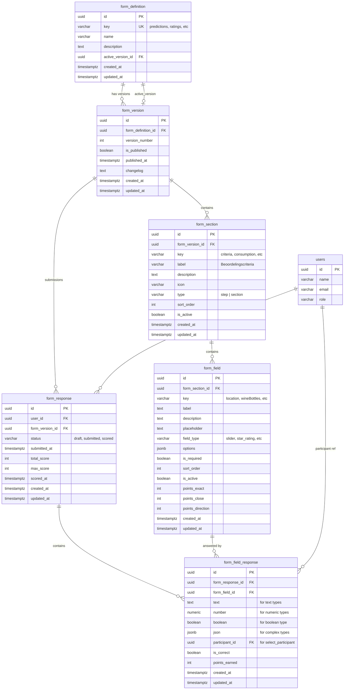
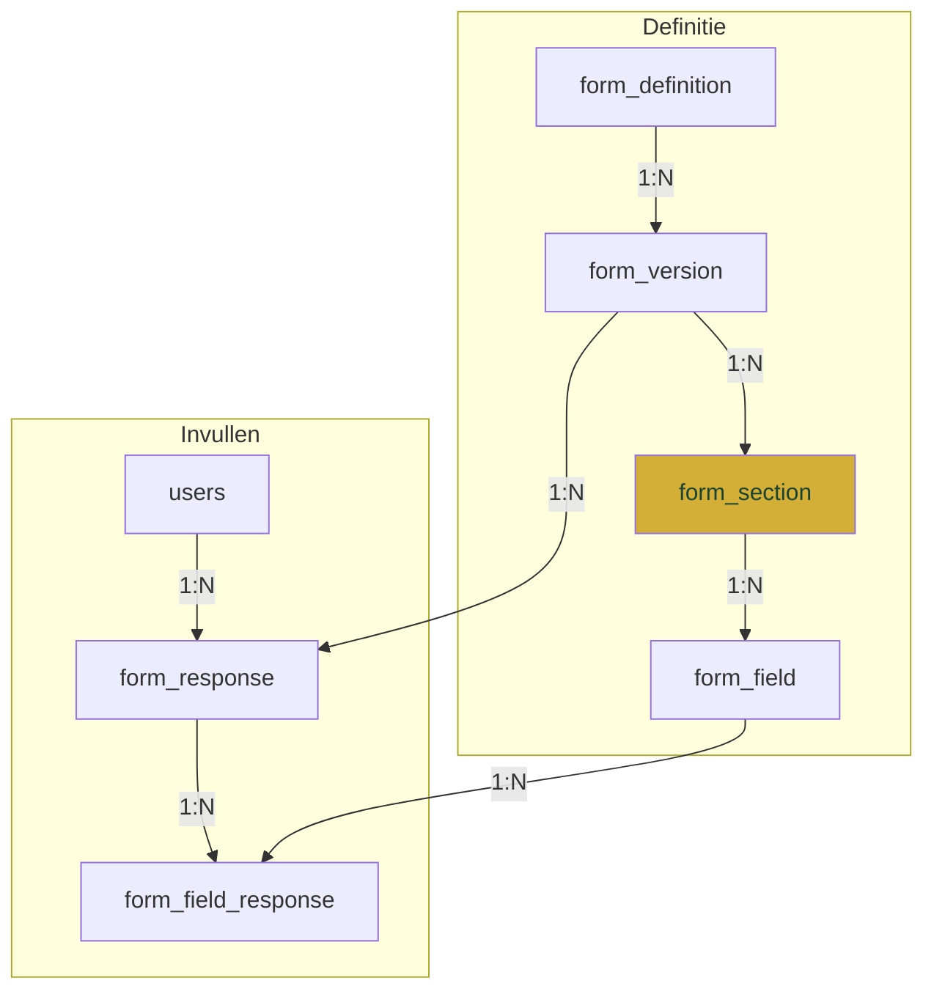

# US-020: Database Model - Dynamic Forms

> Naamgeving gebaseerd op het Salesforce WebForm patroon.
> PostgreSQL conventie: lowercase snake_case voor alle identifiers.

## Entity Relationship Diagram



## Naamgeving Mapping

| Salesforce Object | PostgreSQL Tabel | Beschrijving |
|---|---|---|
| `WebFormDefinition__c` | `form_definition` | Formulier definitie |
| `WebFormVersion__c` | `form_version` | Versioning |
| `WebFormStep__c` | `form_section` | Stappen of secties |
| `WebFormField__c` | `form_field` | Veld/vraag definitie |
| `WebFormResponse__c` | `form_response` | Ingevuld formulier |
| `WebFormFieldResponse__c` | `form_field_response` | Individueel antwoord |

---

## Tabel Definities

### 1. `form_definition`

Hoofdformulier definitie. Elk formulier in de applicatie is een record.

```sql
CREATE TABLE form_definition (
  id UUID PRIMARY KEY DEFAULT gen_random_uuid(),
  key VARCHAR(50) UNIQUE NOT NULL,
  name VARCHAR(100) NOT NULL,
  description TEXT,
  active_version_id UUID,
  created_at TIMESTAMPTZ DEFAULT NOW(),
  updated_at TIMESTAMPTZ DEFAULT NOW()
);

CREATE UNIQUE INDEX idx_form_definition_key ON form_definition(key);
```

**Voorbeelddata:**

| key | name | description |
|-----|------|-------------|
| `predictions` | Voorspellingen | Voorspellingen voor de BBQ avond |
| `ratings` | Boy Boom Beoordeling | Beoordeling van de locatie en gastheer |
| `registration_quiz` | Registratie Quiz | Persoonlijke vragen voor de quiz |
| `live_quiz` | Live Quiz | Quiz tijdens het evenement |

---

### 2. `form_version`

Versioning van formulieren. Elke keer dat de structuur wijzigt, wordt een nieuwe versie aangemaakt. Bestaande antwoorden blijven gekoppeld aan hun oorspronkelijke versie.

```sql
CREATE TABLE form_version (
  id UUID PRIMARY KEY DEFAULT gen_random_uuid(),
  form_definition_id UUID NOT NULL REFERENCES form_definition(id) ON DELETE CASCADE,
  version_number INTEGER NOT NULL,
  is_published BOOLEAN DEFAULT false,
  published_at TIMESTAMPTZ,
  changelog TEXT,
  created_at TIMESTAMPTZ DEFAULT NOW(),
  updated_at TIMESTAMPTZ DEFAULT NOW(),

  UNIQUE(form_definition_id, version_number)
);

-- FK voor active_version_id (na aanmaken beide tabellen)
ALTER TABLE form_definition
  ADD CONSTRAINT fk_form_definition_active_version
  FOREIGN KEY (active_version_id)
  REFERENCES form_version(id);

CREATE INDEX idx_form_version_definition ON form_version(form_definition_id);
CREATE INDEX idx_form_version_published ON form_version(form_definition_id, is_published);
```

**Versioning Flow:**
```
form_definition: "ratings"
├── version 1 (published, active) → sections & fields v1
├── version 2 (draft)             → sections & fields v2 (bewerken)
```

---

### 3. `form_section`

Groepering van velden binnen een versie. Kan twee types hebben:

| Type | Gebruik | Voorbeeld |
|------|---------|-----------|
| `step` | Stap in een wizard flow | Registratie stap 1, 2, 3 |
| `section` | Visuele groepering op een pagina | "Beoordelingscriteria", "Open Vragen" |

```sql
CREATE TABLE form_section (
  id UUID PRIMARY KEY DEFAULT gen_random_uuid(),
  form_version_id UUID NOT NULL REFERENCES form_version(id) ON DELETE CASCADE,
  key VARCHAR(50) NOT NULL,
  label VARCHAR(100) NOT NULL,
  description TEXT,
  icon VARCHAR(10),
  type VARCHAR(10) NOT NULL DEFAULT 'section',
  sort_order INTEGER DEFAULT 0,
  is_active BOOLEAN DEFAULT true,
  created_at TIMESTAMPTZ DEFAULT NOW(),
  updated_at TIMESTAMPTZ DEFAULT NOW(),

  UNIQUE(form_version_id, key),
  CONSTRAINT chk_form_section_type CHECK (type IN ('step', 'section'))
);

CREATE INDEX idx_form_section_version ON form_section(form_version_id);
CREATE INDEX idx_form_section_sort ON form_section(form_version_id, sort_order);
```

**Voorbeelddata (ratings):**

| key | label | type | sort_order | icon |
|-----|-------|------|------------|------|
| `criteria` | Beoordelingscriteria | section | 1 | |
| `feedback` | Open Vragen | section | 2 | |
| `verdict` | Het Eindoordeel | section | 3 | |

**Voorbeelddata (predictions):**

| key | label | type | sort_order | icon |
|-----|-------|------|------------|------|
| `consumption` | Consumptie | section | 1 | |
| `social` | Sociaal | section | 2 | |
| `other` | Overig | section | 3 | |

**Voorbeelddata (registration - wizard):**

| key | label | type | sort_order | icon |
|-----|-------|------|------------|------|
| `muziek` | Muziek | step | 1 | |
| `entertainment` | Entertainment | step | 2 | |
| `eten` | Eten | step | 3 | |
| `jeugd` | Jeugd | step | 4 | |

---

### 4. `form_field`

Individuele velden/vragen binnen een sectie.

```sql
CREATE TABLE form_field (
  id UUID PRIMARY KEY DEFAULT gen_random_uuid(),
  form_section_id UUID NOT NULL REFERENCES form_section(id) ON DELETE CASCADE,
  key VARCHAR(50) NOT NULL,
  label TEXT NOT NULL,
  description TEXT,
  placeholder TEXT,
  field_type VARCHAR(30) NOT NULL,
  options JSONB DEFAULT '{}',
  is_required BOOLEAN DEFAULT false,
  sort_order INTEGER DEFAULT 0,
  is_active BOOLEAN DEFAULT true,
  points_exact INTEGER DEFAULT 0,
  points_close INTEGER DEFAULT 0,
  points_direction INTEGER DEFAULT 0,
  created_at TIMESTAMPTZ DEFAULT NOW(),
  updated_at TIMESTAMPTZ DEFAULT NOW(),

  UNIQUE(form_section_id, key)
);

CREATE INDEX idx_form_field_section ON form_field(form_section_id);
CREATE INDEX idx_form_field_sort ON form_field(form_section_id, sort_order);
```

**Field Types:**

```typescript
type FormFieldType =
  // Numeric
  | 'slider'             // Range slider
  | 'star_rating'        // 1-5 sterren

  // Text
  | 'text_short'         // Korte tekst (max ~100 chars)
  | 'text_long'          // Textarea

  // Selection
  | 'select_options'     // Dropdown met opties
  | 'select_participant' // Dropdown met deelnemers
  | 'boolean'            // Ja/Nee

  // Special
  | 'time'               // Tijdselectie
  | 'checkbox_group'     // Multi-select
  | 'radio_group';       // Single select (styled)
```

**Voorbeelddata (ratings → section: criteria):**

| key | label | field_type | is_required | sort_order |
|-----|-------|------------|-------------|------------|
| `location` | Locatie | star_rating | true | 1 |
| `hospitality` | Gastvrijheid | star_rating | true | 2 |
| `fire_quality` | Kwaliteit Vuurvoorziening | star_rating | true | 3 |
| `parking` | Parkeergelegenheid | star_rating | true | 4 |
| `overall` | Algemene Organisatie | star_rating | true | 5 |

---

### 5. `form_response`

Eén ingevuld formulier per gebruiker per versie.

```sql
CREATE TABLE form_response (
  id UUID PRIMARY KEY DEFAULT gen_random_uuid(),
  user_id UUID NOT NULL REFERENCES users(id) ON DELETE CASCADE,
  form_version_id UUID NOT NULL REFERENCES form_version(id),
  status VARCHAR(20) DEFAULT 'draft',
  submitted_at TIMESTAMPTZ,
  total_score INTEGER DEFAULT 0,
  max_score INTEGER DEFAULT 0,
  scored_at TIMESTAMPTZ,
  created_at TIMESTAMPTZ DEFAULT NOW(),
  updated_at TIMESTAMPTZ DEFAULT NOW(),

  UNIQUE(user_id, form_version_id),
  CONSTRAINT chk_form_response_status CHECK (status IN ('draft', 'submitted', 'scored'))
);

CREATE INDEX idx_form_response_user ON form_response(user_id);
CREATE INDEX idx_form_response_version ON form_response(form_version_id);
CREATE INDEX idx_form_response_status ON form_response(status);
```

**Response Statuses:**

| Status | Betekenis |
|--------|-----------|
| `draft` | Nog niet volledig ingevuld, kan worden bewerkt |
| `submitted` | Definitief ingediend, niet meer te wijzigen |
| `scored` | Antwoorden zijn beoordeeld en punten toegekend |

---

### 6. `form_field_response`

Individueel antwoord op een veld. Meerdere opslagkolommen voor verschillende typen.

```sql
CREATE TABLE form_field_response (
  id UUID PRIMARY KEY DEFAULT gen_random_uuid(),
  form_response_id UUID NOT NULL REFERENCES form_response(id) ON DELETE CASCADE,
  form_field_id UUID NOT NULL REFERENCES form_field(id),
  text TEXT,
  number NUMERIC,
  boolean BOOLEAN,
  json JSONB,
  participant_id UUID REFERENCES users(id),
  is_correct BOOLEAN,
  points_earned INTEGER DEFAULT 0,
  created_at TIMESTAMPTZ DEFAULT NOW(),
  updated_at TIMESTAMPTZ DEFAULT NOW(),

  UNIQUE(form_response_id, form_field_id)
);

CREATE INDEX idx_form_field_response_response ON form_field_response(form_response_id);
CREATE INDEX idx_form_field_response_field ON form_field_response(form_field_id);
```

**Opslag per Field Type:**

| Field Type | Kolom | Voorbeeld |
|------------|-------|-----------|
| `text_short` | text | "Amsterdam" |
| `text_long` | text | "De sfeer was geweldig..." |
| `slider` | number | 15 |
| `star_rating` | number | 4 |
| `time` | number | 10 (= 00:00) |
| `boolean` | boolean | true |
| `select_options` | text | "champagne" |
| `select_participant` | participant_id | UUID |
| `checkbox_group` | json | ["option1", "option2"] |

---

## Query Voorbeelden

### Haal actieve velden op voor een formulier (met secties)

```sql
SELECT
  fs.key AS section_key,
  fs.label AS section_label,
  fs.type AS section_type,
  fs.icon AS section_icon,
  ff.*
FROM form_definition fd
JOIN form_version fv ON fv.id = fd.active_version_id
JOIN form_section fs ON fs.form_version_id = fv.id AND fs.is_active = true
JOIN form_field ff ON ff.form_section_id = fs.id AND ff.is_active = true
WHERE fd.key = 'ratings'
ORDER BY fs.sort_order, ff.sort_order;
```

### Haal of maak een response voor een gebruiker

```sql
INSERT INTO form_response (user_id, form_version_id, status)
SELECT $1, fd.active_version_id, 'draft'
FROM form_definition fd
WHERE fd.key = 'ratings'
ON CONFLICT (user_id, form_version_id) DO NOTHING
RETURNING id;
```

### Haal alle antwoorden van een response op

```sql
SELECT
  fs.key AS section_key,
  fs.label AS section_label,
  ff.key AS field_key,
  ff.label AS field_label,
  ff.field_type,
  ffr.text,
  ffr.number,
  ffr.boolean,
  ffr.json,
  ffr.participant_id,
  ffr.points_earned
FROM form_response fr
JOIN form_field_response ffr ON ffr.form_response_id = fr.id
JOIN form_field ff ON ff.id = ffr.form_field_id
JOIN form_section fs ON fs.id = ff.form_section_id
WHERE fr.id = $1
ORDER BY fs.sort_order, ff.sort_order;
```

### Sla een antwoord op (upsert)

```sql
INSERT INTO form_field_response (form_response_id, form_field_id, number)
VALUES ($1, $2, $3)
ON CONFLICT (form_response_id, form_field_id)
DO UPDATE SET
  number = EXCLUDED.number,
  updated_at = NOW();
```

### Submit een response

```sql
UPDATE form_response
SET status = 'submitted',
    submitted_at = NOW(),
    updated_at = NOW()
WHERE id = $1
  AND status = 'draft';
```

### Admin: Haal alle responses op voor scoring

```sql
SELECT
  fr.id,
  u.name AS user_name,
  fr.status,
  fr.submitted_at,
  fr.total_score,
  COUNT(ffr.id) AS answers_count
FROM form_response fr
JOIN users u ON u.id = fr.user_id
JOIN form_version fv ON fv.id = fr.form_version_id
JOIN form_definition fd ON fd.id = fv.form_definition_id
LEFT JOIN form_field_response ffr ON ffr.form_response_id = fr.id
WHERE fd.key = 'predictions'
  AND fr.status = 'submitted'
GROUP BY fr.id, u.name
ORDER BY fr.submitted_at;
```

---

## Migratie van Bestaande Data

### Van `prediction_questions` naar nieuw model

```sql
-- 1. form_definition
INSERT INTO form_definition (key, name, description)
VALUES ('predictions', 'Voorspellingen', 'Voorspellingen voor de BBQ avond');

-- 2. form_version
INSERT INTO form_version (form_definition_id, version_number, is_published, published_at)
SELECT id, 1, true, NOW() FROM form_definition WHERE key = 'predictions';

-- 3. Koppel active_version
UPDATE form_definition fd SET active_version_id = fv.id
FROM form_version fv WHERE fv.form_definition_id = fd.id AND fd.key = 'predictions';

-- 4. form_section (van oude category waarden)
INSERT INTO form_section (form_version_id, key, label, type, sort_order)
SELECT DISTINCT
  fv.id,
  pq.category,
  CASE pq.category
    WHEN 'consumption' THEN 'Consumptie'
    WHEN 'social' THEN 'Sociaal'
    WHEN 'other' THEN 'Overig'
  END,
  'section',
  CASE pq.category
    WHEN 'consumption' THEN 1
    WHEN 'social' THEN 2
    WHEN 'other' THEN 3
  END
FROM prediction_questions pq
CROSS JOIN (
  SELECT fv.id FROM form_version fv
  JOIN form_definition fd ON fd.id = fv.form_definition_id
  WHERE fd.key = 'predictions'
) fv;

-- 5. form_field
INSERT INTO form_field (
  form_section_id, key, label, field_type, options,
  points_exact, points_close, points_direction, is_active, sort_order
)
SELECT
  fs.id,
  pq.key,
  pq.label,
  pq.type,
  pq.options,
  pq.points_exact,
  pq.points_close,
  pq.points_direction,
  pq.is_active,
  pq.sort_order
FROM prediction_questions pq
JOIN form_section fs ON fs.key = pq.category
JOIN form_version fv ON fv.id = fs.form_version_id
JOIN form_definition fd ON fd.id = fv.form_definition_id
WHERE fd.key = 'predictions';
```

### Van `registrations.predictions` JSONB naar `form_response` + `form_field_response`

```sql
-- Stap 1: Maak form_response voor elke user
INSERT INTO form_response (user_id, form_version_id, status, submitted_at, created_at)
SELECT DISTINCT
  r.user_id,
  fd.active_version_id,
  'submitted',
  r.updated_at,
  r.created_at
FROM registrations r
JOIN form_definition fd ON fd.key = 'predictions'
WHERE r.predictions IS NOT NULL
  AND r.predictions != '{}'::jsonb
ON CONFLICT (user_id, form_version_id) DO NOTHING;

-- Stap 2: Migreer antwoorden
INSERT INTO form_field_response (form_response_id, form_field_id, number, text, boolean)
SELECT
  fr.id,
  ff.id,
  CASE
    WHEN ff.field_type IN ('slider', 'time', 'star_rating') THEN (r.predictions->ff.key)::numeric
  END,
  CASE
    WHEN ff.field_type IN ('text_short', 'text_long', 'select_options', 'select_participant')
    THEN r.predictions->>ff.key
  END,
  CASE
    WHEN ff.field_type = 'boolean' THEN (r.predictions->ff.key)::boolean
  END
FROM registrations r
JOIN form_definition fd ON fd.key = 'predictions'
JOIN form_response fr ON fr.user_id = r.user_id AND fr.form_version_id = fd.active_version_id
JOIN form_field ff ON ff.form_section_id IN (
  SELECT fs.id FROM form_section fs WHERE fs.form_version_id = fd.active_version_id
)
WHERE r.predictions IS NOT NULL
  AND r.predictions ? ff.key
ON CONFLICT (form_response_id, form_field_id) DO NOTHING;
```

---

## Relatie Overzicht



**Leesrichting:**
1. Een `form_definition` heeft meerdere `form_version`s
2. Elke `form_version` heeft meerdere `form_section`s (type: step of section)
3. Elke `form_section` heeft meerdere `form_field`s
4. Elke `form_version` kan meerdere `form_response`s hebben (1 per user)
5. Elke `form_response` heeft meerdere `form_field_response`s (1 per field)

---

## Voordelen

| Aspect | Voordeel |
|--------|----------|
| **Salesforce Alignment** | Naamgeving consistent met bewezen WebForm patroon |
| **Versioning** | Formulieren bijwerken zonder bestaande antwoorden te verliezen |
| **Sections** | Flexibele groepering: wizard steps of visuele secties |
| **Flexibiliteit** | Nieuwe formulieren toevoegen zonder code wijzigingen |
| **Data Integriteit** | Antwoorden gekoppeld aan specifieke versie |
| **Query Performance** | Genormaliseerde antwoorden, geen JSONB parsing nodig |
| **Type Safety** | Aparte kolommen per antwoord-type |
| **Response Tracking** | Status per ingevuld formulier (draft/submitted/scored) |
| **Scoring** | Punten per antwoord en totaal per response |
| **Herbruikbaar** | Zelfde structuur voor predictions, ratings, quiz, etc. |
