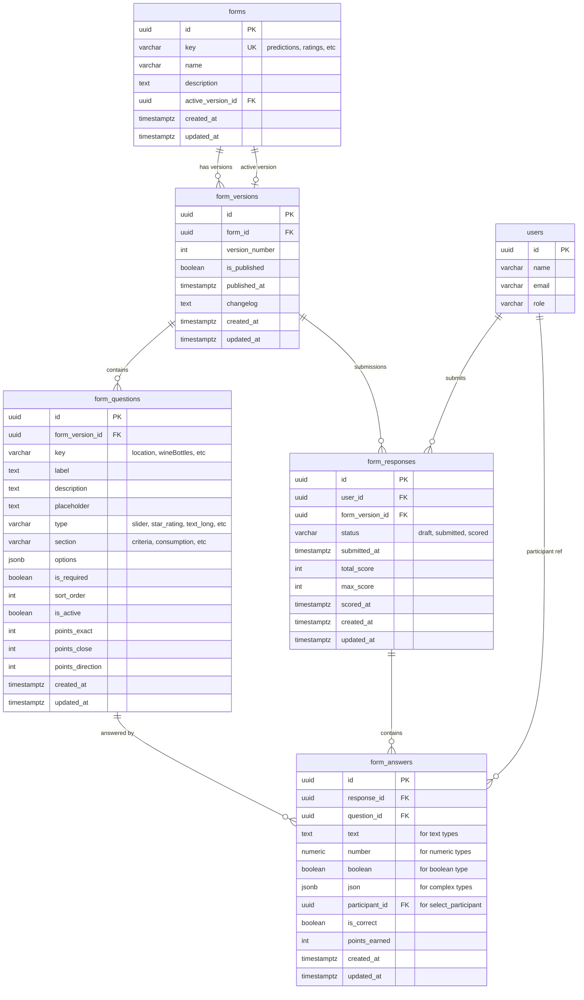
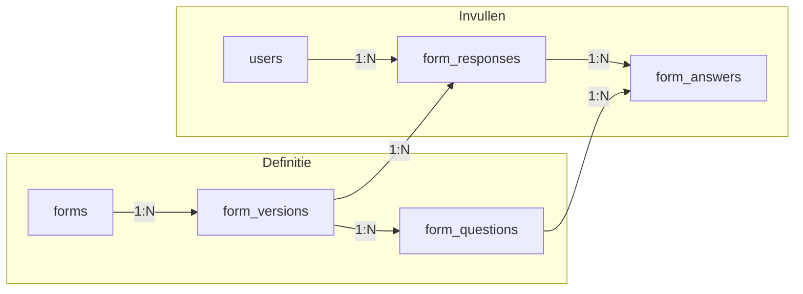

# US-020: Database Model - Dynamic Forms

## Entity Relationship Diagram



## Tabel Definities

### 1. `forms` - Hoofdformulier definitie

```sql
CREATE TABLE forms (
  id UUID PRIMARY KEY DEFAULT gen_random_uuid(),

  -- Identificatie
  key VARCHAR(50) UNIQUE NOT NULL,      -- 'predictions', 'ratings', 'registration_quiz'
  name VARCHAR(100) NOT NULL,            -- 'Voorspellingen', 'Boy Boom Beoordeling'
  description TEXT,

  -- Actieve versie
  active_version_id UUID,               -- FK naar form_versions (nullable voor nieuwe forms)

  -- Timestamps
  created_at TIMESTAMPTZ DEFAULT NOW(),
  updated_at TIMESTAMPTZ DEFAULT NOW()
);

-- Indexes
CREATE UNIQUE INDEX idx_forms_key ON forms(key);
```

**Voorbeelddata:**
| key | name | description |
|-----|------|-------------|
| predictions | Voorspellingen | Voorspellingen voor de BBQ avond |
| ratings | Boy Boom Beoordeling | Beoordeling van de locatie en gastheer |
| registration_quiz | Registratie Quiz | Persoonlijke vragen voor de quiz |

---

### 2. `form_versions` - Versioning van formulieren

```sql
CREATE TABLE form_versions (
  id UUID PRIMARY KEY DEFAULT gen_random_uuid(),

  -- Parent
  form_id UUID NOT NULL REFERENCES forms(id) ON DELETE CASCADE,

  -- Versioning
  version_number INTEGER NOT NULL,       -- 1, 2, 3, ...
  is_published BOOLEAN DEFAULT false,    -- true = kan worden ingevuld
  published_at TIMESTAMPTZ,              -- wanneer gepubliceerd

  -- Metadata
  changelog TEXT,                        -- Beschrijving van wijzigingen

  -- Timestamps
  created_at TIMESTAMPTZ DEFAULT NOW(),
  updated_at TIMESTAMPTZ DEFAULT NOW(),

  -- Constraints
  UNIQUE(form_id, version_number)
);

-- Indexes
CREATE INDEX idx_form_versions_form ON form_versions(form_id);
CREATE INDEX idx_form_versions_published ON form_versions(form_id, is_published);
```

**Versioning Flow:**
```
form: "ratings" (v1 active)
├── version 1 (published, active) ─── questions v1
├── version 2 (draft)             ─── questions v2 (bewerken)
└── version 3 (niet aangemaakt)
```

---

### 3. `form_questions` - Vragen per versie

```sql
CREATE TABLE form_questions (
  id UUID PRIMARY KEY DEFAULT gen_random_uuid(),

  -- Parent
  form_version_id UUID NOT NULL REFERENCES form_versions(id) ON DELETE CASCADE,

  -- Identificatie
  key VARCHAR(50) NOT NULL,              -- 'location', 'wineBottles', etc.

  -- Display
  label TEXT NOT NULL,                   -- Vraag tekst
  description TEXT,                      -- Extra uitleg
  placeholder TEXT,                      -- Placeholder voor input

  -- Type & Classificatie
  type VARCHAR(30) NOT NULL,             -- Question type (zie enum)
  section VARCHAR(50),                   -- Sub-groepering: 'criteria', 'consumption', etc.

  -- Type-specifieke opties
  options JSONB DEFAULT '{}',

  -- Validatie
  is_required BOOLEAN DEFAULT false,

  -- Ordering & Status
  sort_order INTEGER DEFAULT 0,
  is_active BOOLEAN DEFAULT true,

  -- Scoring (voor predictions/quiz)
  points_exact INTEGER DEFAULT 0,
  points_close INTEGER DEFAULT 0,
  points_direction INTEGER DEFAULT 0,

  -- Timestamps
  created_at TIMESTAMPTZ DEFAULT NOW(),
  updated_at TIMESTAMPTZ DEFAULT NOW(),

  -- Constraints
  UNIQUE(form_version_id, key)           -- Key moet uniek zijn binnen versie
);

-- Indexes
CREATE INDEX idx_form_questions_version ON form_questions(form_version_id);
CREATE INDEX idx_form_questions_section ON form_questions(form_version_id, section);
CREATE INDEX idx_form_questions_sort ON form_questions(form_version_id, sort_order);
```

**Question Types:**
```typescript
type FormQuestionType =
  // Numeric
  | 'slider'           // Range slider
  | 'star_rating'      // 1-5 sterren

  // Text
  | 'text_short'       // Korte tekst (max ~100 chars)
  | 'text_long'        // Textarea

  // Selection
  | 'select_options'   // Dropdown met opties
  | 'select_participant' // Dropdown met deelnemers
  | 'boolean'          // Ja/Nee

  // Special
  | 'time'             // Tijdselectie
  | 'checkbox_group'   // Multi-select
  | 'radio_group';     // Single select (styled)
```

---

### 4. `form_responses` - Ingevuld formulier per gebruiker

```sql
CREATE TABLE form_responses (
  id UUID PRIMARY KEY DEFAULT gen_random_uuid(),

  -- Relations
  user_id UUID NOT NULL REFERENCES users(id) ON DELETE CASCADE,
  form_version_id UUID NOT NULL REFERENCES form_versions(id),

  -- Status
  status VARCHAR(20) DEFAULT 'draft',    -- 'draft', 'submitted', 'scored'
  submitted_at TIMESTAMPTZ,              -- Wanneer definitief ingediend

  -- Scoring (voor predictions/quiz)
  total_score INTEGER DEFAULT 0,         -- Totaal behaalde punten
  max_score INTEGER DEFAULT 0,           -- Maximaal haalbare punten
  scored_at TIMESTAMPTZ,                 -- Wanneer gescoord

  -- Timestamps
  created_at TIMESTAMPTZ DEFAULT NOW(),
  updated_at TIMESTAMPTZ DEFAULT NOW(),

  -- Constraints
  UNIQUE(user_id, form_version_id)       -- Één response per form versie per user
);

-- Indexes
CREATE INDEX idx_form_responses_user ON form_responses(user_id);
CREATE INDEX idx_form_responses_version ON form_responses(form_version_id);
CREATE INDEX idx_form_responses_status ON form_responses(status);
```

**Response Statuses:**
| Status | Betekenis |
|--------|-----------|
| `draft` | Nog niet volledig ingevuld, kan worden bewerkt |
| `submitted` | Definitief ingediend, niet meer te wijzigen |
| `scored` | Antwoorden zijn beoordeeld en punten toegekend |

---

### 5. `form_answers` - Individuele antwoorden

```sql
CREATE TABLE form_answers (
  id UUID PRIMARY KEY DEFAULT gen_random_uuid(),

  -- Relations
  response_id UUID NOT NULL REFERENCES form_responses(id) ON DELETE CASCADE,
  question_id UUID NOT NULL REFERENCES form_questions(id),

  -- Flexible Answer Storage (één veld per type)
  text TEXT,                             -- text_short, text_long, select_options
  number NUMERIC,                        -- slider, star_rating, time
  boolean BOOLEAN,                       -- boolean
  json JSONB,                            -- checkbox_group, complex answers
  participant_id UUID                    -- select_participant
    REFERENCES users(id),

  -- Scoring (voor quiz/predictions)
  is_correct BOOLEAN,                    -- Was het antwoord correct?
  points_earned INTEGER DEFAULT 0,       -- Behaalde punten voor dit antwoord

  -- Timestamps
  created_at TIMESTAMPTZ DEFAULT NOW(),
  updated_at TIMESTAMPTZ DEFAULT NOW(),

  -- Constraints
  UNIQUE(response_id, question_id)       -- Één antwoord per vraag per response
);

-- Indexes
CREATE INDEX idx_form_answers_response ON form_answers(response_id);
CREATE INDEX idx_form_answers_question ON form_answers(question_id);
```

**Answer Storage per Type:**
| Question Type | Opslag Veld | Voorbeeld |
|---------------|-------------|-----------|
| `text_short` | text | "Amsterdam" |
| `text_long` | text | "De sfeer was geweldig..." |
| `slider` | number | 15 |
| `star_rating` | number | 4 |
| `time` | number | 10 (= 00:00) |
| `boolean` | boolean | true |
| `select_options` | text | "champagne" |
| `select_participant` | participant_id | UUID |
| `checkbox_group` | json | ["option1", "option2"] |

---

## Foreign Key met Active Version

```sql
-- Voeg FK constraint toe nadat beide tabellen bestaan
ALTER TABLE forms
  ADD CONSTRAINT fk_forms_active_version
  FOREIGN KEY (active_version_id)
  REFERENCES form_versions(id);
```

---

## Query Voorbeelden

### Haal actieve vragen op voor een formulier

```sql
SELECT fq.*
FROM forms f
JOIN form_versions fv ON fv.id = f.active_version_id
JOIN form_questions fq ON fq.form_version_id = fv.id
WHERE f.key = 'ratings'
  AND fq.is_active = true
ORDER BY fq.sort_order;
```

### Haal of maak een response voor een gebruiker

```sql
-- Get or create response
INSERT INTO form_responses (user_id, form_version_id, status)
SELECT $1, f.active_version_id, 'draft'
FROM forms f WHERE f.key = 'ratings'
ON CONFLICT (user_id, form_version_id) DO NOTHING
RETURNING id;

-- Of haal bestaande op
SELECT fr.*
FROM form_responses fr
JOIN form_versions fv ON fv.id = fr.form_version_id
JOIN forms f ON f.id = fv.form_id
WHERE fr.user_id = $1 AND f.key = 'ratings';
```

### Haal alle antwoorden van een response op

```sql
SELECT
  fq.key,
  fq.label,
  fq.type,
  fq.section,
  fa.text,
  fa.number,
  fa.boolean,
  fa.json,
  fa.participant_id,
  fa.points_earned
FROM form_responses fr
JOIN form_answers fa ON fa.response_id = fr.id
JOIN form_questions fq ON fq.id = fa.question_id
WHERE fr.id = $1
ORDER BY fq.sort_order;
```

### Sla een antwoord op (upsert)

```sql
INSERT INTO form_answers (response_id, question_id, number)
VALUES ($1, $2, $3)
ON CONFLICT (response_id, question_id)
DO UPDATE SET
  number = EXCLUDED.number,
  updated_at = NOW();
```

### Submit een response (definitief maken)

```sql
UPDATE form_responses
SET status = 'submitted',
    submitted_at = NOW(),
    updated_at = NOW()
WHERE id = $1
  AND status = 'draft';
```

### Haal alle responses op voor scoring (admin)

```sql
SELECT
  fr.id,
  u.name AS user_name,
  fr.status,
  fr.submitted_at,
  fr.total_score,
  COUNT(fa.id) AS answers_count
FROM form_responses fr
JOIN users u ON u.id = fr.user_id
JOIN form_versions fv ON fv.id = fr.form_version_id
JOIN forms f ON f.id = fv.form_id
LEFT JOIN form_answers fa ON fa.response_id = fr.id
WHERE f.key = 'predictions'
  AND fr.status = 'submitted'
GROUP BY fr.id, u.name
ORDER BY fr.submitted_at;
```

---

## Migratie van Bestaande Data

### Van `prediction_questions` naar `form_questions`

```sql
-- 1. Maak forms record
INSERT INTO forms (key, name, description)
VALUES ('predictions', 'Voorspellingen', 'Voorspellingen voor de BBQ avond');

-- 2. Maak form_version record
INSERT INTO form_versions (form_id, version_number, is_published, published_at)
SELECT id, 1, true, NOW() FROM forms WHERE key = 'predictions';

-- 3. Update forms.active_version_id
UPDATE forms f SET active_version_id = fv.id
FROM form_versions fv WHERE fv.form_id = f.id AND f.key = 'predictions';

-- 4. Migreer questions
INSERT INTO form_questions (
  form_version_id, key, label, type, section, options,
  points_exact, points_close, points_direction, is_active, sort_order
)
SELECT
  fv.id,
  pq.key,
  pq.label,
  pq.type,
  pq.category,  -- wordt section
  pq.options,
  pq.points_exact,
  pq.points_close,
  pq.points_direction,
  pq.is_active,
  pq.sort_order
FROM prediction_questions pq
CROSS JOIN (
  SELECT fv.id FROM form_versions fv
  JOIN forms f ON f.id = fv.form_id
  WHERE f.key = 'predictions'
) fv;
```

### Van `registrations.predictions` JSONB naar `form_responses` + `form_answers`

```sql
-- Stap 1: Maak form_responses voor elke user met predictions
INSERT INTO form_responses (user_id, form_version_id, status, submitted_at, created_at)
SELECT DISTINCT
  r.user_id,
  f.active_version_id,
  'submitted',
  r.updated_at,
  r.created_at
FROM registrations r
JOIN forms f ON f.key = 'predictions'
WHERE r.predictions IS NOT NULL
  AND r.predictions != '{}'::jsonb
ON CONFLICT (user_id, form_version_id) DO NOTHING;

-- Stap 2: Migreer antwoorden naar form_answers
INSERT INTO form_answers (response_id, question_id, number, text, boolean)
SELECT
  fr.id,
  fq.id,
  CASE
    WHEN fq.type IN ('slider', 'time', 'star_rating') THEN (r.predictions->fq.key)::numeric
  END,
  CASE
    WHEN fq.type IN ('text_short', 'text_long', 'select_options', 'select_participant')
    THEN r.predictions->>fq.key
  END,
  CASE
    WHEN fq.type = 'boolean' THEN (r.predictions->fq.key)::boolean
  END
FROM registrations r
JOIN forms f ON f.key = 'predictions'
JOIN form_responses fr ON fr.user_id = r.user_id AND fr.form_version_id = f.active_version_id
JOIN form_questions fq ON fq.form_version_id = f.active_version_id
WHERE r.predictions IS NOT NULL
  AND r.predictions ? fq.key
ON CONFLICT (response_id, question_id) DO NOTHING;
```

---

## Voordelen van dit Model

| Aspect | Voordeel |
|--------|----------|
| **Versioning** | Formulieren kunnen worden bijgewerkt zonder bestaande antwoorden te verliezen |
| **Flexibiliteit** | Nieuwe formulieren toevoegen zonder code wijzigingen |
| **Data Integriteit** | Antwoorden blijven gekoppeld aan specifieke versie |
| **Query Performance** | Genormaliseerde antwoorden, geen JSONB parsing nodig |
| **Type Safety** | Aparte kolommen per antwoord-type |
| **Audit Trail** | Versie historie behouden |
| **Rollback** | Actieve versie kan worden teruggedraaid |
| **Response Tracking** | Status per ingevuld formulier (draft/submitted/scored) |
| **Scoring** | Punten per antwoord én totaal per response |
| **Herbruikbaar** | Zelfde structuur voor predictions, ratings, quiz, etc. |

## Relatie Overzicht



**Leesrichting:**
1. Een `form` heeft meerdere `versions`
2. Elke `version` heeft meerdere `questions`
3. Elke `version` kan meerdere `responses` hebben (1 per user)
4. Elke `response` heeft meerdere `answers` (1 per question)
