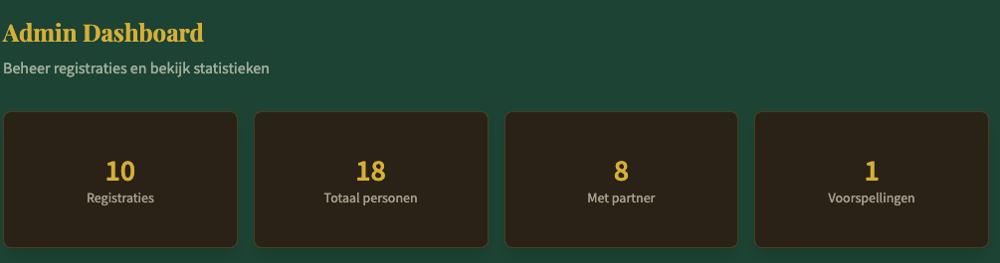

# Bugs

hier is een lijst mmet kleine bugs

* [ ] Registratie
* [ ] Wel of niet geregistreerd?
* [ ] Admin statistieken

## Registratie
Als je het registratieformulier hebt om te vragen of je komt of niet komt, en je drukt op een knop, dan wordt die gelijk gesubmit.
Terwijl er nog andere onderliggende vragen ingevuld moeten worden. 

## Wel of niet geregistreerd?

Als je je niet hebt geregistreerd dat je niet komt, kun je dus niet het eten en drinken invullen.
Je moet daar standaard wel gewoon 40 punten voor krijgen, want anders loop je achter. 

## Admin statistieken

Ik wil deze weer weergeven.

